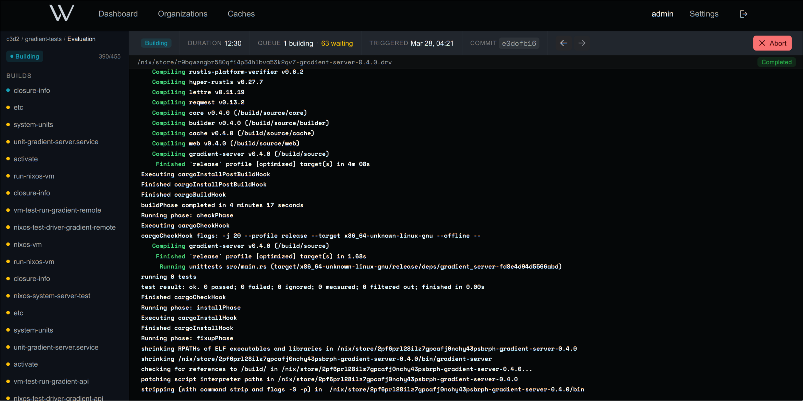

# Gradient

Gradient is a web-based Nix-based Continuous Integration (CI) system.

This project is currently in the early stages of development. We are working on the initial implementation and documentation. If you are interested in contributing, please read the [Contributing Guidelines](CONTRIBUTING.md) for more information.

## Features (planned)

- **GitHub Like UI**: has a clean and intuitive user interface that is inspired by GitHub Actions.
- **Organizations**: multiple organizations, which work independently from each other (e.g. different servers, user access).
- **API**: provides a RESTful API with API-Key management for authentication.
- **Streaming Logs**: real-time log streaming for builds.
- **Rich Project Configuration**: check all branches, pull requests, and tags.

## Look

## Contributing

We welcome contributions to this project. Please read the [Contributing Guidelines](CONTRIBUTING.md) for more information.

## License

This project is dual-licensed under the **GNU Affero General Public License v3.0** (AGPL-3.0; as published by the Free Software Foundation) and the **Wavelens License v1.0 (WL-1.0)**:

- The [GNU Affero General Public License v3.0](./LICENSES/AGPL-3.0-only.txt) is a free software license that ensures your freedom to use, modify, and distribute the software, with the condition that any modified versions of the software must also be distributed under the same license.
- The [Wavelens License v1.0 (WL-1.0)](./LICENSES/WL-1.0.txt) is a proprietary license designed for commercial use. It offers additional features and greater flexibility for businesses that do not wish to comply with the AGPL-3.0 license requirements.

Each file in this project contains a license notice at the top, indicating the applicable license(s). The license notice follows the [REUSE guidelines](https://reuse.software/) to ensure clarity and consistency. The full text of each license is available in the [LICENSES](./LICENSES/) directory.

## Copyright

Copyright (c) 2024, Wavelens UG
