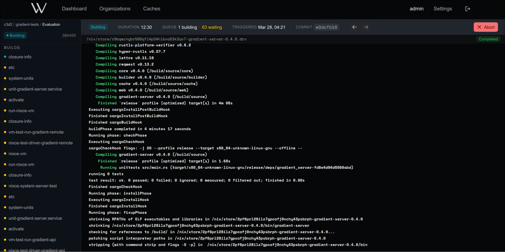

# Gradient

<p align="center">
  <a href="https://gradient.wavelens.io/organization/gradient/project/main">
    
  </a>
  <br>
  <strong>Modern Nix-CI System</strong>
</p>

---

| [🚀 Demo Instance](https://gradient.wavelens.io) | [📖 Documentation](https://wavelens.github.io/gradient) | [🔍 Options Search](https://wavelens.github.io/gradient-search) | [🛠️ API Docs](https://petstore.swagger.io/?url=https://raw.githubusercontent.com/wavelens/gradient/master/docs/gradient-api.yaml) |
| :---: | :---: | :---: | :---: |

> [!IMPORTANT]
> If you are interested in contributing, please read the [Contributing Guidelines](CONTRIBUTING.md) for more information.

## Features



- **Modern UI**: clean and intuitive user interface
- **Organizations**: multiple organizations, which work independently from each other (e.g. different workers, user access)
- **API**: provides a RESTful API with API-Key management for authentication
- **Streaming Logs**: real-time log streaming for builds
- **Rich Project Configuration**: flake updates, check all branches, pull requests, and tags
- **OAuth2 / OIDC**: integrated single-sign-on support
- **Binary Cache**: built-in Nix store cache with S3 storage backend support
- **Proto Workers**: build and evaluate Nix derivations on distributed `gradient-worker` instances over a persistent WebSocket protocol
- **Deployment Module**: Pull-Deployment via gradient-deploy module
- **Dependency Graph**: interactive visualization of Nix build dependency trees
- **Actions Integration**: GitHub App, Gitea and Gitlab Integration

## Installation

Please refer to the [Quick Start Guide](https://wavelens.github.io/gradient/quick-start/) for a step-by-step installation guide.
Add Cache for prebuilt Gradient packages (optional):
```
URL: https://gradient.wavelens.io/cache/main
Public Key: gradient.wavelens.io-main:qmxRE+saUvhNa3jqaCMWje+feVU77TjABchZrPGf7A8=
```

Extend your `flake.nix` with Gradient module:

```nix
{
  inputs.gradient.url = "github:wavelens/gradient";
  # optional, not necessary for the module
  # inputs.gradient.inputs.nixpkgs.follows = "nixpkgs";
  # inputs.gradient.inputs.flake-utils.follows = "flake-utils";

  outputs = { self, nixpkgs, gradient, ... }: let
    pkgs = import nixpkgs {
      inherit system;
      overlays = [ gradient.overlays.default ];
    };
  in {
    # change `yourhostname` to your actual hostname
    nixosConfigurations.yourhostname = nixpkgs.lib.nixosSystem {
      # customize to your system
      system = "x86_64-linux";
      modules = [
        ./configuration.nix
        gradient.nixosModules.default
        # for pull deployment use:
        gradient.nixosModules.deploy
      ];
    };
  };
}
```

Configure Gradient in your `configuration.nix`:

> [!NOTE]
> All configuration options here: [Options Search](https://wavelens.github.io/gradient-search)

```nix
{
  services.gradient = {
    enable                    = true;
    frontend.enable           = true;
    domain                    = "gradient.example.com";
    jwtSecretFile             = "/run/secrets/gradient-jwt"; # openssl rand -base64 48 > /run/secrets/gradient-jwt
    cryptSecretFile           = "/run/secrets/gradient-crypt"; # openssl rand -base64 48 > /run/secrets/gradient-crypt
    configurePostgres         = true;
    reverseProxy.nginx.enable = true; # you can also use caddy with: reverseProxy.caddy.enable = true
    reportErrors              = true; # optional: will send crash reports to us
  };

  services.gradient.worker = {
    enable    = true;
    serverUrl = "ws://127.0.0.1:3000/proto";
    workerId  = "<uuid from uuidgen>"; # if not provided, a random UUID will be generated and saved in /var/lib/gradient/worker-id
    peersFile = "/run/secrets/gradient-worker-peers"; # format: *:<token> (token is generated with `openssl rand -base64 48`)
    )
  };
}
```

## Usage
Gradient can be used via the web interface, API, and CLI.

### API

The API is a RESTful API that can be used to interact with Gradient programmatically.
OpenAPI documentation is available at `/docs/gradient-api.yaml` or via [Swagger Editor](https://petstore.swagger.io/?url=https://raw.githubusercontent.com/wavelens/gradient/master/docs/gradient-api.yaml)

### Web Interface

The web interface is the primary way to interact with Gradient. It also just uses the main API.

### CLI

The CLI is also based on the API and can be used to interact with Gradient from the command line.

Install the CLI:

```nix
{
  inputs.gradient.url = "github:wavelens/gradient";
  # optional, not necessary for the module
  # inputs.gradient.inputs.nixpkgs.follows = "nixpkgs";
  # inputs.gradient.inputs.flake-utils.follows = "flake-utils";

  outputs = { self, nixpkgs, gradient, ... }: let
    pkgs = import nixpkgs {
      inherit system;
      overlays = [ gradient.overlays.gradient-cli ];
      # or use the default overlay
    };
  in {
    # change `yourhostname` to your actual hostname
    nixosConfigurations.yourhostname = pkgs.lib.nixosSystem {
      # customize to your system
      system = "x86_64-linux";
      modules = [
        ./configuration.nix

        # or define in the configuration.nix
        {
          config = {
            environment.systemPackages = [ pkgs.gradient-cli ];
          };
        }
      ];
    };
  };
}
```

or

```sh
nix run github:wavelens/gradient#gradient-cli
```

## Pull Deployment
Gradient supports pull deployment, which allows you to deploy your code to a server by pulling it from the Gradient server. This is useful for deploying NixOS configurations to systems that don't have much compute power or should run without disturbing the system.

To use pull deployment, you need to enable the `gradient-deploy` module in your NixOS configuration. This module will set up a systemd service that will pull the latest code from the Gradient server and deploy it to your system daily at 04:00 am.

```nix
{
  system.gradient-deploy = {
    enable = true;
    server = "https://gradient.example.com";
    apiKeyFile = "/var/lib/gradient-deploy/api-key";
    project = "organization/project";
  };
}
```

After enabling the module, you can trigger a update manually by running:

```sh
sudo gradient-update
```

## Contributing

We welcome contributions to this project. Please read the [Contributing Guidelines](CONTRIBUTING.md) for more information.

## License

This project is under the **GNU Affero General Public License v3.0** (AGPL-3.0; as published by the Free Software Foundation):

The [GNU Affero General Public License v3.0 (AGPL-3.0)](./LICENSE) is a free software license that ensures your freedom to use, modify, and distribute the software, with the condition that any modified versions of the software must also be distributed under the same license.

The license notice follows the [REUSE guidelines](https://reuse.software/) to ensure clarity and consistency.

## Acknowledgements

Developed by Wavelens GmbH. Support us by contributing.
