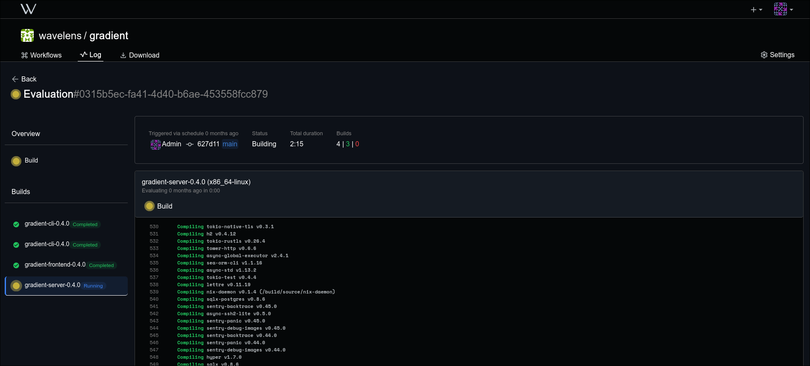

# Gradient

[Options Search](https://wavelens.github.io/gradient-search)
[Demo Instance](https://gradient.wavelens.io/api/v1/health)
[API Docs](https://petstore.swagger.io/?url=https://raw.githubusercontent.com/wavelens/gradient/master/docs/gradient-api.yaml)

Gradient is a web-based Nix-based Continuous Integration (CI) system.

> [!IMPORTANT]
> This project is currently in the early stages of development. We are working on the initial implementation and documentation. If you are interested in contributing, please read the [Contributing Guidelines](CONTRIBUTING.md) for more information.

## Features



- **Modern UI**: has a clean and intuitive user interface. (planned)
- **Organizations**: multiple organizations, which work independently from each other (e.g. different servers, user access).
- **API**: provides a RESTful API with API-Key management for authentication.
- **Streaming Logs**: real-time log streaming for builds.
- **Rich Project Configuration**: check all branches, pull requests, and tags. (planned)
- **OAuth2**: support for OAuth2 for user authentication.
- **Cache**: integrated nix store cache.
- **Remote Builds**: support for building nix derviations without having nix installed locally.
- **Deployment Module**: Support for easy Pull-Deployment.

## Installation

Add Cache for prebuilt Gradient packages (Optional):
```
URL: https://gradient.wavelens.io/cache/main
Public Key: gradient.wavelens.io-main:SPmc2Hd/plYDpxX+K1hEYJs+g6D3a9nUj0dDA4ow1vI=
```

Extend your `flake.nix` with Gradient module:

```nix
{
  inputs.gradient.url = "github:wavelens/gradient";
  # optional, not necessary for the module
  # inputs.gradient.inputs.nixpkgs.follows = "nixpkgs";
  # inputs.gradient.inputs.flake-utils.follows = "flake-utils";

  outputs = { self, nixpkgs, gradient, ... }: let
    pkgs = import nixpkgs {
      inherit system;
      overlays = [ gradient.overlays.default ];
    };
  in {
    # change `yourhostname` to your actual hostname
    nixosConfigurations.yourhostname = nixpkgs.lib.nixosSystem {
      # customize to your system
      system = "x86_64-linux";
      modules = [
        ./configuration.nix
        gradient.nixosModules.default
        # for pull deployment use:
        gradient.nixosModules.gradient-deploy
      ];
    };
  };
}
```

Configure Gradient in your `configuration.nix`:

> [!NOTE]
> All configuration options here: [Options Search](https://wavelens.github.io/gradient-search)

```nix
{
  services.gradient = {
    enable = true;
    frontend.enable = true;
    serveCache = true;
    reportErrors = true;
    configurePostgres = true;
    configureNginx = true;
    domain = "gradient.wavelens.io";

    # we recommend the use of sops-nix
    cryptSecretFile = "/var/lib/gradient/crypt-secret"; # a password base64 encoded
    jwtSecretFile = "/var/lib/gradient/jwt-secret"; # random alphanumeric string (RS256 JWT secret)
  };
}
```

## Usage
Gradient can be used via the web interface, API, and CLI.

### API

The API is a RESTful API that can be used to interact with Gradient programmatically.
OpenAPI documentation is available at `/docs/gradient-api.yaml` or via [Swagger Editor](https://petstore.swagger.io/?url=https://raw.githubusercontent.com/wavelens/gradient/master/docs/gradient-api.yaml)

### Web Interface

> [!NOTE]
> The web interface is currently under heavy development.

The web interface is the primary way to interact with Gradient. It also just uses the API.
Registration is at `/account/register`.

### CLI

The CLI is also based on the API and can be used to interact with Gradient from the command line.

Install the CLI:

```nix
{
  inputs.gradient.url = "github:wavelens/gradient";
  # optional, not necessary for the module
  # inputs.gradient.inputs.nixpkgs.follows = "nixpkgs";
  # inputs.gradient.inputs.flake-utils.follows = "flake-utils";

  outputs = { self, nixpkgs, gradient, ... }: let
    pkgs = import nixpkgs {
      inherit system;
      overlays = [ gradient.overlays.gradient-cli ];
      # or use the default overlay
    };
  in {
    # change `yourhostname` to your actual hostname
    nixosConfigurations.yourhostname = pkgs.lib.nixosSystem {
      # customize to your system
      system = "x86_64-linux";
      modules = [
        ./configuration.nix

        # or define in the configuration.nix
        {
          config = {
            environment.systemPackages = [ pkgs.gradient-cli ];
          };
        }
      ];
    };
  };
}
```

or

```sh
nix run github:wavelens/gradient#gradient-cli
```

## Pull Deployment
Gradient supports pull deployment, which allows you to deploy your code to a server by pulling it from the Gradient server. This is useful for deploying NixOS configurations to systems that don't have much compute power or should run without disturbing the system.

To use pull deployment, you need to enable the `gradient-deploy` module in your NixOS configuration. This module will set up a systemd service that will pull the latest code from the Gradient server and deploy it to your system daily at 04:00 am.

```nix
{
  services.gradient-deploy = {
    enable = true;
    server = "https://gradient.example.com";
    apiKeyFile = "/var/lib/gradient-deploy/api-key";
    project = "organization/project";
  };
}
```

After enabling the module, you can trigger a update manually by running:

```sh
sudo gradient-update
```

## Contributing

We welcome contributions to this project. Please read the [Contributing Guidelines](CONTRIBUTING.md) for more information.

## License

This project is under the **GNU Affero General Public License v3.0** (AGPL-3.0; as published by the Free Software Foundation):

The [GNU Affero General Public License v3.0 (AGPL-3.0)](./LICENSE) is a free software license that ensures your freedom to use, modify, and distribute the software, with the condition that any modified versions of the software must also be distributed under the same license.

The license notice follows the [REUSE guidelines](https://reuse.software/) to ensure clarity and consistency.

## Copyright

Copyright (c) 2025, Wavelens UG
