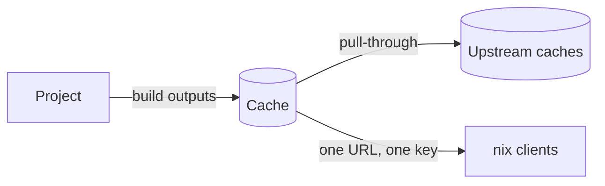

# Caches

A **cache** is a Nix binary cache built into Gradient. Projects subscribe to caches, every output a project builds lands in its subscribed caches, and `nix` on any machine substitutes from them.

## Using a Cache

The cache page shows the substituter URL and the public key to add to the Nix configuration. A public cache serves anyone; a private cache needs credentials, see [Authentication](../guides/share-a-cache.md#1-use-the-cache-on-a-machine).

Each cache announces a priority to `nix` (lower wins, default `10`) and can announce a different one to clients on the local network. Machines next to the server then prefer the Gradient cache over remote ones.

## Upstream Types

Upstream caches are set under **Settings -> Upstream Caches** on the cache page.

| Type | Upstream Cache | Modes |
|---|---|---|
| Internal | Another cache on the same Gradient instance | Read & Write, Read Only, Write Only |
| Gradient Proto | A cache on another Gradient instance, reached over that instance's cache protocol | Read & Write, Read Only, Write Only |
| HTTP | Any Nix binary cache, e.g. `cache.nixos.org` | Read Only |

- **Read & Write**: pull through and push results upstream.
- **Read Only**: pull through only.
- **Write Only**: push only.

Declared caches in [`services.gradient.state`](../reference/state.md#cachesname) take Internal and HTTP (`external` in Nix) upstream caches; Gradient Proto upstream caches are set in the UI.

## Pull-Through

A cache serves paths from its upstream caches as if the cache held them. A client asking for a missing path gets the upstream cache's copy through the cache, re-signed with the cache's own key. Clients configure one URL and one key, wherever a path came from.

## Substitution

Before building anything, Gradient decides per derivation whether a build is needed at all:

1. An output already in any cache on the instance needs no work.
2. Otherwise Gradient asks the upstream caches of the caches the project subscribes to for each output.
3. When every output is found, the build is **substituted**: a worker fetches the outputs, and nothing below the derivation is built or fetched.
4. When an output is missing, the derivation is built, and its inputs go through the same check.

Gradient only asks for derivations an evaluation actually needs. An upstream cache that stops answering is paused for a minute instead of slowing every lookup.

## Sharing

A project subscribes to a cache to push outputs there and substitute from there. Subscribing needs rights on both sides; without cache rights, the subscription becomes a request that a cache admin approves under **Subscriptions** on the cache page.

## Roles

| Role | Can |
|---|---|
| Admin | Everything, including settings, members, roles and subscriptions |
| Write | Read and upload paths |
| View | See the cache and download paths |

Custom roles combine single permissions, see [Members and Roles](../ui/members-and-roles.md#cache-roles).

## Related

- [First Project](../get-started/first-project.md): create a cache and subscribe a project
- [Share a Cache](../guides/share-a-cache.md): share a cache and authenticate clients
- [Projects and Tasks](projects-and-tasks.md): where builds come from
