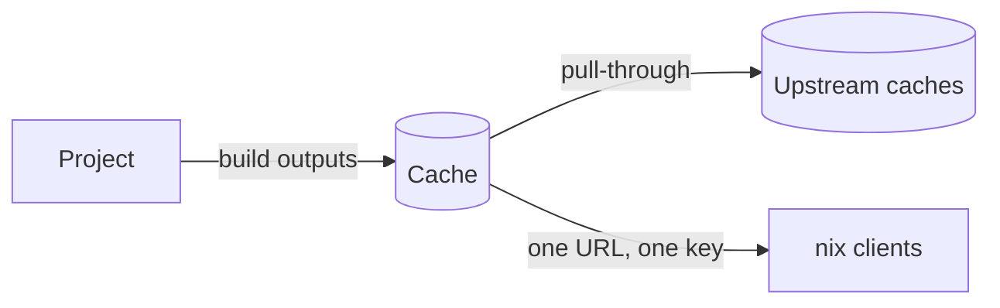

<!--
SPDX-FileCopyrightText: 2026 Wavelens GmbH <info@wavelens.io>
SPDX-License-Identifier: AGPL-3.0-only
-->

# Caches

A **cache** is a Nix binary cache built into Gradient. Projects subscribe to caches. Build outputs of a project land in every cache the project subscribed to. `nix` on any machine can substitute from those caches.

## Using a Cache

The cache page shows the substituter URL and the public key for the Nix configuration. Public caches are open to anyone. Private caches need credentials, described in [Authentication](../guides/share-a-cache.md#1-use-the-cache-on-a-machine).

Caches announce a priority to `nix`, with a default of `10`. Lower values win. A cache can announce a different priority to clients on the local network. Machines next to the server then prefer the Gradient cache over remote ones.

## Upstream Types

Upstream caches live under **Settings -> Upstream Caches** on the cache page.

| Type | Upstream Cache | Modes |
|---|---|---|
| Internal | Another cache on the same Gradient instance | Read & Write, Read Only, Write Only |
| Gradient Proto | A cache on another Gradient instance, reached over that instance's cache protocol | Read & Write, Read Only, Write Only |
| HTTP | Any Nix binary cache, e.g. `cache.nixos.org` | Read Only |

- **Read & Write**: pull through and push results upstream.
- **Read Only**: pull through only.
- **Write Only**: push only.

Declared caches in [`services.gradient.state`](../reference/state.md#cachesname) take Internal and HTTP (`external` in Nix) upstream caches. Gradient Proto upstream caches are configurable in the UI.

**Deactivate** can disable an upstream cache without removing the entry. **Activate** can turn the upstream cache back on. Inactive upstream caches keep their settings. Gradient will never query an inactive upstream cache. Paths then come from the remaining upstream caches. Declared caches also accept **Deactivate** and **Activate**. The next server start will restore the declared `active` value.

**Test** on an HTTP upstream can fetch its `nix-cache-info` over HTTP/1.1 and over HTTP/2. The test will report each result. HTTP upstream caches with broken HTTP/2 transfers switch to HTTP/1.1 for good. Such upstream caches show an **HTTP/1.1** badge.

## Pull-Through

Caches deliver paths from their upstream caches as if the cache held them. A client asking for a missing path will receive the upstream copy through the cache. The cache will re-sign that copy with its own key. Clients configure one URL and one key, wherever a path came from.

## Substitution

Gradient will decide per derivation whether a build is needed at all, before building anything.

1. Outputs already in any cache on the instance need no work.
2. Outputs missing on the instance are looked up in the upstream caches of the subscribed caches.
3. A build with every output found is **substituted**. A worker will fetch the outputs. Nothing below the derivation is built or fetched.
4. Derivations with a missing output go to a worker for building. Their inputs go through the same check.

Lookups only cover derivations an evaluation actually needs. Unresponsive upstream caches pause for a minute instead of slowing every lookup.

## Sharing

Projects subscribe to a cache for pushing outputs there and substituting from there. Subscribing needs rights on both sides. Subscriptions without cache rights turn into a request. A cache admin can approve the request under **Subscriptions** on the cache page.

## Roles

| Role | Can |
|---|---|
| Admin | Everything, including settings, members, roles and subscriptions |
| Write | Read and upload paths |
| View | See the cache and download paths |

Custom roles combine single permissions, described in [Members and Roles](../ui/members-and-roles.md#cache-roles).

## Related

- [First Project](../get-started/first-project.md): create a cache and subscribe a project
- [Share a Cache](../guides/share-a-cache.md): share a cache and authenticate clients
- [Projects and Tasks](projects-and-tasks.md): where builds come from
