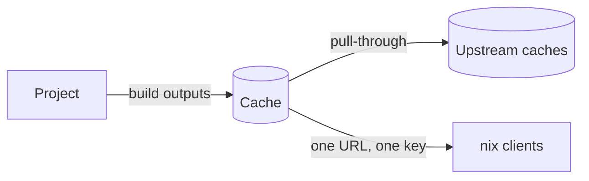

# Caches

A **cache** is a Nix binary cache built into Gradient. Projects subscribe to caches. Every build output of a project is landing in its subscribed caches. `nix` on any machine can substitute from those caches.

## Using a Cache

The cache page is showing the substituter URL and the public key for the Nix configuration. A public cache is serving anyone. A private cache is requiring credentials, described in [Authentication](../guides/share-a-cache.md#1-use-the-cache-on-a-machine).

Each cache is announcing a priority to `nix`, with lower values winning and a default of `10`. A cache can announce a different priority to clients on the local network. Machines next to the server then prefer the Gradient cache over remote ones.

## Upstream Types

Upstream caches live under **Settings -> Upstream Caches** on the cache page.

| Type | Upstream Cache | Modes |
|---|---|---|
| Internal | Another cache on the same Gradient instance | Read & Write, Read Only, Write Only |
| Gradient Proto | A cache on another Gradient instance, reached over that instance's cache protocol | Read & Write, Read Only, Write Only |
| HTTP | Any Nix binary cache, e.g. `cache.nixos.org` | Read Only |

- **Read & Write**: pull through and push results upstream.
- **Read Only**: pull through only.
- **Write Only**: push only.

Declared caches in [`services.gradient.state`](../reference/state.md#cachesname) take Internal and HTTP (`external` in Nix) upstream caches. Gradient Proto upstream caches are configurable in the UI.

**Deactivate** is disabling an upstream cache without removing the entry. **Activate** is turning the upstream cache back on. An inactive upstream cache is keeping its settings. Gradient is never querying an inactive upstream cache. Paths then come from the remaining upstream caches. A declared cache is also accepting **Deactivate** and **Activate**. The next server start is restoring the declared `active` value.

**Test** on an HTTP upstream is fetching its `nix-cache-info` over HTTP/1.1 and over HTTP/2. The test is reporting each result. Gradient is switching an HTTP upstream with broken HTTP/2 transfers to HTTP/1.1 for good. Such an upstream is showing an **HTTP/1.1** badge.

## Pull-Through

A cache is serving paths from its upstream caches as if the cache held them. A client asking for a missing path is receiving the upstream copy through the cache. The cache is re-signing that copy with its own key. Clients configure one URL and one key, wherever a path came from.

## Substitution

Gradient is deciding per derivation whether a build is needed at all, before building anything.

1. An output already in any cache on the instance is requiring no work.
2. Gradient is asking the upstream caches of the subscribed caches for each output missing on the instance.
3. A build with every output found is **substituted**. A worker is fetching the outputs. Gradient is neither building nor fetching anything below the derivation.
4. A worker is building a derivation with a missing output. Its inputs go through the same check.

Gradient is only asking for derivations actually needed by an evaluation. Gradient is pausing an unresponsive upstream cache for a minute instead of slowing every lookup.

## Sharing

Projects subscribe to a cache for pushing outputs there and substituting from there. Subscribing is requiring rights on both sides. A subscription without cache rights is turning into a request. A cache admin can approve the request under **Subscriptions** on the cache page.

## Roles

| Role | Can |
|---|---|
| Admin | Everything, including settings, members, roles and subscriptions |
| Write | Read and upload paths |
| View | See the cache and download paths |

Custom roles combine single permissions, described in [Members and Roles](../ui/members-and-roles.md#cache-roles).

## Related

- [First Project](../get-started/first-project.md): create a cache and subscribe a project
- [Share a Cache](../guides/share-a-cache.md): share a cache and authenticate clients
- [Projects and Tasks](projects-and-tasks.md): where builds come from
