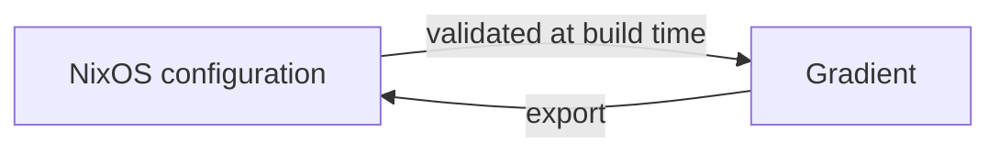

# Declarative State

Everything created in the UI can also be declared in Nix under `services.gradient.state`. Gradient applies the declared state on every start, and declared entities become read-only in the UI, so the Nix configuration stays the source of truth.

## Declarable Entities

| Entity | Includes |
|---|---|
| Users | Password or OIDC-only accounts, superusers |
| Projects | Members, SSH key, workers, cache subscriptions |
| Tasks | Repository, wildcard, triggers, actions, concurrency |
| Integrations | Forge connections for incoming events and outgoing status |
| Caches | Signing key, upstreams, members |
| Roles | Custom project and cache roles, OIDC and SCIM group mappings |
| API Keys | Scoped keys, the token hash read from a secret file |
| Workers | Project workers and base workers |

## UI-Managed and Nix-Managed

| | Created in the UI | Declared in Nix |
|---|---|---|
| Editing | In the UI and the API | Only in Nix; UI controls are visible but disabled |
| Removal | Delete button | Removed from Nix, then deleted on the next start |
| Validation | On save | While building the NixOS configuration |

Both kinds live side by side: a declared project can hold tasks created in the UI.

## Validation

`services.gradient.state.validate` (on by default) checks the declared state while the NixOS configuration builds: unknown users or projects, duplicate ids and broken references fail the build instead of the server start.

## Removal

With `services.gradient.state.delete` (on by default), users, projects and caches that disappear from the configuration are deleted from the database. Turned off, they stay and become editable in the UI.

## Export

`GET /admin/state` returns the running instance in the shape of `services.gradient.state`, to move a UI-built setup into Nix.

## Related

- [State reference](../usage/state.md): every option with examples
- [Projects and Tasks](projects-and-tasks.md): what the entities mean
