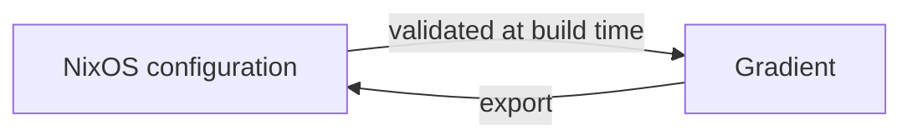

# Declarative State

Everything created in the UI can also be declared in Nix under `services.gradient.state`. Gradient applies the declared state on every start, and declared entities become read-only in the UI. The Nix configuration stays the source of truth.



## Declarable Entities

| Entity | Includes |
|---|---|
| Users | Password or OIDC-only accounts, superusers |
| Projects | Members, SSH key, workers, cache subscriptions |
| Tasks | Repository, wildcard, triggers, actions, concurrency |
| Integrations | Git host connections for incoming events and outgoing status |
| Caches | Signing key, upstream caches, members |
| Roles | Custom project and cache roles, OIDC and SCIM group mappings |
| API Keys | Scoped keys, the token hash read from a secret file |
| Workers | Project workers and base workers |

## UI-Managed and Nix-Managed

| | Created in the UI | Declared in Nix |
|---|---|---|
| Editing | In the UI and the API | Only in Nix; UI controls are visible but disabled |
| Removal | Delete button | Removed from Nix, then deleted on the next start |
| Validation | On save | While building the NixOS configuration |

Both kinds live side by side: a declared project can hold tasks created in the UI.

## Validation

`services.gradient.state.validate` (on by default) checks the declared state while the NixOS configuration builds: unknown users or projects, duplicate ids and broken references fail the build instead of the server start.

## Secrets

Secrets never go into the Nix store: every `*_file` option points at a file on the server, e.g. from sops-nix or agenix. The server reads the files on start.

| Option | Content | Generate |
|---|---|---|
| `users.<name>.password_file` | Argon2id hash of the password | `gradient hash > alice-password` |
| `projects.<name>.private_key_file` | SSH private key for cloning | `ssh-keygen -t ed25519 -N "" -C gradient-acme -f acme-ssh-key` |
| `caches.<name>.signing_key_file` | Nix signing key, base64 only | `nix-store --generate-binary-cache-key main main-key main-key.pub`, then `sed -i 's/^[^:]*://' main-key` |
| `api_keys.<name>.key_file` | SHA-256 hex digest of the token, without `GRAD` | See [API Key Files](#api-key-files) |
| `workers.<name>.token_file` | Worker registration token | `openssl rand -base64 48` |
| `integrations.<name>.secret_file` | Webhook secret shared with the Git host | `openssl rand -hex 32` |
| `integrations.<name>.access_token_file` | Git host access token | From the Git host |

- `gradient hash` prompts for the password twice and prints the hash. A password piped through `<<<` carries a trailing newline into the hash, and later sign-ins fail.
- The public half `acme-ssh-key.pub` goes to the Git host as a deploy key.
- `nix-store` writes `main:<key>`; Gradient expects the key without the `main:` prefix and derives the public key itself.
- A user without `password_file` signs in through OIDC only.

### API Key Files

The server stores only a digest of each API key. `key_file` holds that digest; clients send the token with a `GRAD` prefix.

```sh
gradient generate apikey
```

The command prints the `API token` for clients (`Authorization: Bearer GRAD...`) and the `key_file digest` to write into the `key_file`.

??? note "Without the CLI"
    ```sh
    TOKEN=$(openssl rand -hex 32)
    printf %s "$TOKEN" | sha256sum | cut -d' ' -f1 > ci-key # (1)!
    echo "GRAD$TOKEN"
    ```

    1.  `printf %s` keeps a trailing newline out of the digest.

## Removal

With `services.gradient.state.delete` (on by default), users, projects and caches that disappear from the configuration are deleted from the database. Turned off, they stay and become editable in the UI.

## Export

`GET /api/v1/admin/state` returns the running instance in the shape of `services.gradient.state`, to move a UI-built setup into Nix.

## Related

- [State reference](../reference/state.md): every option with examples
- [Projects and Tasks](projects-and-tasks.md): what the entities mean
