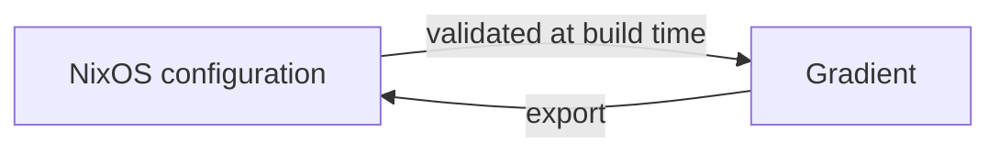

<!--
SPDX-FileCopyrightText: 2026 Wavelens GmbH <info@wavelens.io>
SPDX-License-Identifier: AGPL-3.0-only
-->

# Declarative State

Everything created in the UI can also be declared in Nix under `services.gradient.state`. Every start of Gradient will apply the declared state. Declared entities become read-only in the UI. The Nix configuration is the source of truth.



## Declarable Entities

| Entity | Content |
|---|---|
| Users | Password or OIDC-only accounts, superusers |
| Projects | Members, SSH key, workers, cache subscriptions |
| Tasks | Repository, wildcard, triggers, actions, concurrency |
| Integrations | Git host connections for incoming events and outgoing status |
| Caches | Signing key, upstream caches, members |
| Roles | Custom project and cache roles |
| Teams | Members, OIDC and SCIM groups, grants on projects and caches |
| API Keys | Scoped keys, the token hash read from a secret file |
| Workers | Project workers and team workers |

## UI-Managed and Nix-Managed

| | Created in the UI | Declared in Nix |
|---|---|---|
| Editing | In the UI and the API | Only in Nix. UI controls are visible but disabled |
| Removal | Delete button | Removed from Nix, then deleted on the next start |
| Validation | On save | While building the NixOS configuration |
| Activate / Deactivate | In the UI and the API | Also in the UI for caches, upstream caches and workers, with the declared value back on the next start |

Both kinds live side by side. A declared project can hold tasks created in the UI.

## Validation

`services.gradient.state.validate` can check the declared state during the build of the NixOS configuration. The option is on by default. Unknown users or projects, duplicate ids and broken references fail the build instead of the server start.

## Secrets

Secrets never go into the Nix store. All `*_file` options point at a file on the server, e.g. from sops-nix or agenix. The server will read the files on start.

| Option | Content | Generate |
|---|---|---|
| `users.<name>.password_file` | Argon2id hash of the password | `gradient hash > alice-password` |
| `projects.<name>.private_key_file` | SSH private key for cloning | `ssh-keygen -t ed25519 -N "" -C gradient-acme -f acme-ssh-key` |
| `caches.<name>.signing_key_file` | Nix signing key, base64 only | `nix-store --generate-binary-cache-key main main-key main-key.pub`, then `sed -i 's/^[^:]*://' main-key` |
| `api_keys.<name>.key_file` | SHA-256 hex digest of the token, without `GRAD` | See [API Key Files](#api-key-files) |
| `workers.<name>.token_file` | Worker registration token | `openssl rand -base64 48` |
| `integrations.<name>.secret_file` | Webhook secret shared with the Git host | `openssl rand -hex 32` |
| `integrations.<name>.access_token_file` | Git host access token | From the Git host |

- `gradient hash` will prompt for the password twice and print the hash. A password piped through `<<<` would carry a trailing newline into the hash. Later sign-ins then fail.
- The public half `acme-ssh-key.pub` is the deploy key on the Git host.
- `nix-store` will write `main:<key>`. The key file must hold the key without the `main:` prefix. Gradient can derive the public key itself.
- A user without `password_file` can sign in through OIDC only.

### API Key Files

The server will store only a digest of each API key. `key_file` must hold that digest. Clients send the token with a `GRAD` prefix.

```sh
gradient generate apikey
```

The command will print the `API token` for clients (`Authorization: Bearer GRAD...`). The command will also print the `key_file digest` for the `key_file`.

??? note "Without the CLI"
    ```sh
    TOKEN=$(openssl rand -hex 32)
    printf %s "$TOKEN" | sha256sum | cut -d' ' -f1 > ci-key # (1)!
    echo "GRAD$TOKEN"
    ```

    1.  `printf %s` will keep a trailing newline out of the digest.

## Removal

`services.gradient.state.delete` will delete users, projects and caches that disappear from the configuration. The option is on by default. These entities stay in the database and become editable in the UI with the option off.

## Export

`GET /api/v1/admin/state` will return the running instance in the shape of `services.gradient.state`. The export is useful for moving a UI-built setup into Nix.

## Related

- [State reference](../reference/state.md): every option with examples
- [Projects and Tasks](projects-and-tasks.md): what the entities mean
