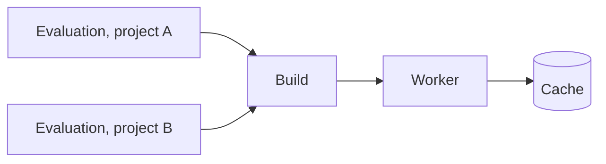

# Evaluations and Builds

An **evaluation** reads a flake at one commit and finds every derivation the task's wildcard selects. Each derivation becomes a **build**. Builds start while the evaluation is still running, and a derivation is built only once across the whole instance.

## Evaluation

| Status | Meaning |
|---|---|
| Queued | Waiting for a worker that evaluates |
| Fetching | A worker clones the repository and its flake inputs |
| Evaluating | A worker walks the flake and reports derivations in batches |
| Building | All derivations are known; builds are running |
| Waiting | No connected worker can make progress, e.g. none has the needed system or features; resumes on its own |
| Completed | Every build succeeded |
| Failed | The evaluation or at least one build failed |
| Aborted | Stopped by hand or replaced by a newer evaluation |

An evaluation skips every dependency subtree already recorded from earlier runs. **Full rewalk** in the task menu starts an evaluation that walks the whole closure again.

The evaluation page lists the builds grouped by status, each entry point above its dependencies, with the merged live log and **Abort**. Right-clicking a build opens **Graph**, **Show Job** (the [Job Board](../ui/job-board.md) dispatch), **Artefacts** and **Download Log**.

## Build

A build belongs to the derivation, not to the evaluation. Every evaluation that needs the same derivation, in any project, shares the one build and its log.

| Status | Meaning |
|---|---|
| Queued | Waiting for the dependencies or for a free worker |
| Building | Running on a worker |
| Completed | Built successfully |
| Substituted | Not built: the outputs already existed in a cache or an upstream cache |
| Failed | The builder failed or timed out; infrastructure errors (out of memory, disk full, network) are retried first |
| Dependency Failed | Not started, because a dependency failed |
| Aborted | Cancelled together with the evaluation |
| Skipped | A build-time dependency nothing needs, since the outputs above are already cached |

## Related

- [Projects and Tasks](projects-and-tasks.md): where evaluations come from
- [Overview](overview.md): workers and caches
- [First project](../get-started/first-project.md): start an evaluation
