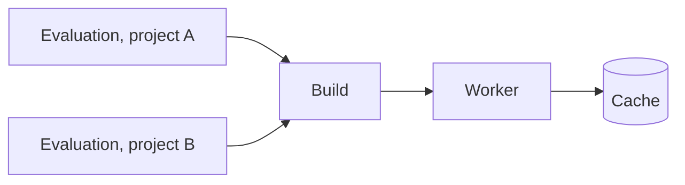

# Evaluations and Builds

**Evaluations** read a flake at one commit and find every derivation matching the task's wildcard. The derivations found this way turn into **builds**. Builds can start before the evaluation is done. The whole instance will build each derivation only once.

## Evaluation

| Status | Meaning |
|---|---|
| Queued | Waiting for an evaluating worker |
| Fetching | A worker is cloning the repository and its flake inputs |
| Evaluating | A worker is walking the flake and reporting derivations in batches |
| Building | All derivations are known. Builds are running |
| Waiting | No connected worker can make progress, e.g. no worker with the needed system or features. The evaluation will resume on its own. Builds needing a system or features absent from every connected worker abort the evaluation after 5 minutes with a warning. A task can opt into waiting for workers instead |
| Completed | Every build succeeded |
| Failed | The evaluation or at least one build failed |
| Aborted | Stopped by hand or replaced by a newer evaluation |

Evaluations skip every dependency subtree that earlier evaluations already recorded. **Full rewalk** in the task menu will start an evaluation walking the whole closure again.

The evaluation page shows the builds grouped by status, each entry point above its dependencies. The page also has the merged live log and **Abort**. A right-click on a build will open **Graph**, **Show Job** (the [Job Board](../ui/job-board.md) assignment), **Artefacts** and **Download Log**.

## Summary

**Summary** in the evaluation menu can open a report page for package maintainers. The link is shareable. Public projects need no login.

| Part | Content |
|---|---|
| Headline | Number of packages that did not build |
| **Newly failing** | Failed builds breaking a package that built in the previous evaluation |
| **Still failing** | Failed builds with every affected package already broken in the previous evaluation |
| **Failed to evaluate** | Attributes without a derivation, with the first line of the error |
| **Fixed** | Packages broken in the previous evaluation and built now |

Rows list only builds that failed themselves. Packages blocked by a failed dependency appear under that build. A row can open the build on the evaluation page. **Timed out** and **Worker fault** mark failures not caused by the package.

## Build

A build is tied to the derivation, not to the evaluation. All evaluations needing the same derivation share the one build and its log, across all projects.

| Status | Meaning |
|---|---|
| Queued | Waiting for the dependencies or for a free worker |
| Building | Running on a worker |
| Completed | Built successfully |
| Substituted | Not built. The outputs already existed in a cache or an upstream cache |
| Failed | The builder failed or timed out. Infrastructure errors (out of memory, disk full, network) get retried first |
| Dependency Failed | Not started, because a dependency failed |
| Aborted | Cancelled by hand or together with the evaluation |
| Skipped | An unneeded build-time dependency, with the outputs above already cached |

## Abort and Retry

- **Abort** on a running build can stop the build for its evaluation. Dependents in that evaluation fail, and a later evaluation can build the build again.
- **Retry** on a failed or aborted build can queue the build and the dependents failing through the build again, inside the running evaluation.
- **Retry** on a finished evaluation can start a new evaluation of the same commit, with all failed builds queued again.
- A new evaluation can queue the failed builds it names again. The task option **Retry failed builds on new evaluation** (`retry_failed_builds`, on by default) can keep permanent failures failed until a retry instead.

## Imported Derivations

A flake can read the output of a derivation during evaluation. This is import from derivation (IFD).

- The imported derivation turns into a normal build on any worker with its system.
- The evaluating worker can wait for that build and then pull the outputs from the cache.
- The task page can list the build as the entry point `other.<system>.<name>` with an **IFD** tag.
- Imported builds and their unfinished dependencies get a priority lift, see [Scheduler Policies](../reference/scheduler-policies.md).
- The attributes reading a failed import fail as well, with `import from derivation '<name>' failed: build <build id> <status>` as their error.
- Imports for a system missing from all connected workers fail after 5 minutes. A task can opt into waiting for workers instead.

## Related

- [Projects and Tasks](projects-and-tasks.md): where evaluations come from
- [Overview](overview.md): workers and caches
- [First Project](../get-started/first-project.md): start an evaluation
