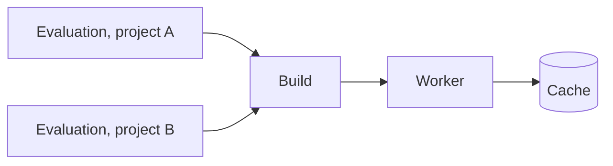

# Evaluations and Builds

**Evaluations** read a flake at one commit and find every derivation matching the task's wildcard. The derivations found this way turn into **builds**. Builds can start before the evaluation is done. The whole instance will build each derivation only once.

## Evaluation

| Status | Meaning |
|---|---|
| Queued | Waiting for an evaluating worker |
| Fetching | A worker is cloning the repository and its flake inputs |
| Evaluating | A worker is walking the flake and reporting derivations in batches |
| Building | All derivations are known. Builds are running |
| Waiting | No connected worker can make progress, e.g. no worker with the needed system or features. The evaluation will resume on its own. Builds needing a system or features absent from every connected worker abort the evaluation after 5 minutes with a warning. A task can opt into waiting for workers instead |
| Completed | Every build succeeded |
| Failed | The evaluation or at least one build failed |
| Aborted | Stopped by hand or replaced by a newer evaluation |

Evaluations skip every dependency subtree that earlier evaluations already recorded. **Full rewalk** in the task menu will start an evaluation walking the whole closure again.

The evaluation page shows the builds grouped by status, each entry point above its dependencies. The page also has the merged live log and **Abort**. A right-click on a build will open **Graph**, **Show Job** (the [Job Board](../ui/job-board.md) assignment), **Artefacts** and **Download Log**.

## Build

A build is tied to the derivation, not to the evaluation. All evaluations needing the same derivation share the one build and its log, across all projects.

| Status | Meaning |
|---|---|
| Queued | Waiting for the dependencies or for a free worker |
| Building | Running on a worker |
| Completed | Built successfully |
| Substituted | Not built. The outputs already existed in a cache or an upstream cache |
| Failed | The builder failed or timed out. Infrastructure errors (out of memory, disk full, network) get retried first |
| Dependency Failed | Not started, because a dependency failed |
| Aborted | Cancelled together with the evaluation |
| Skipped | An unneeded build-time dependency, with the outputs above already cached |

## Related

- [Projects and Tasks](projects-and-tasks.md): where evaluations come from
- [Overview](overview.md): workers and caches
- [First Project](../get-started/first-project.md): start an evaluation
