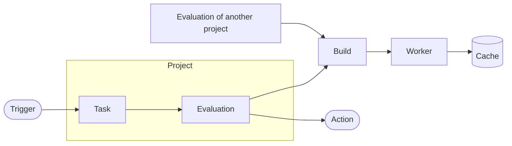

# Overview

CI in Gradient is organised around **projects**. Projects hold **tasks**. Tasks turn a flake into **evaluations**. Evaluations split into **builds**. **Workers** run the builds, and the outputs end up in **caches**.

## Building Blocks

| Concept | Role |
|---|---|
| [Project](projects-and-tasks.md#project) | Unit of access: members, roles, workers and cache subscriptions |
| [Team](teams.md) | Users and workers granted on projects and caches |
| [Task](projects-and-tasks.md#task) | One repository plus the flake outputs to build, selected by a wildcard |
| Trigger | Starting an evaluation of a task: push, pull request, polling or schedule |
| [Evaluation](evaluations-and-builds.md#evaluation) | One pass over a task at one commit, listing every derivation to build |
| [Build](evaluations-and-builds.md#build) | One derivation, built once and shared by every evaluation needing the same derivation |
| [Worker](workers.md) | A machine evaluating flakes and building derivations for the projects with the worker enabled |
| [Cache](caches.md) | A Nix binary cache storing build outputs and serving them to `nix` |
| Action | Reacting to evaluation and build events: mail, web request, Git host status, pull request |

## Shared Builds

The whole instance will build a derivation only once. Two projects depending on the same derivation share one build. The first evaluation reaching the derivation will start the build. The other evaluations wait for the same result.

## Related

- [First Project](../get-started/first-project.md): create each of these in the UI
