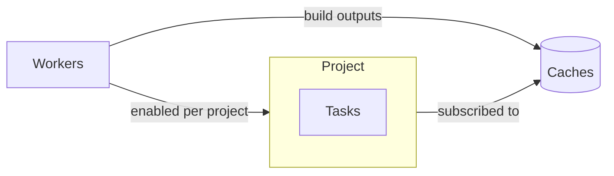

# Projects and Tasks

A **project** is grouping people, machines and caches. A **task** inside a project is naming one repository and the flake outputs to build from that repository.

## Project

- **Members and Roles**: Admin, Write, View, or custom roles built from single permissions.
- **SSH Key**: one Ed25519 key per project, generated automatically, for cloning private repositories.
- **Workers**: a worker is only receiving jobs from projects with the worker enabled.
- **Cache Subscriptions**: Gradient is pushing every build output of a project to its subscribed caches.
- **Integrations**: connections to GitHub, Gitea / Forgejo or GitLab for incoming events and outgoing status.

## Task

| Part | Purpose |
|---|---|
| Repository URL | Location of the flake |
| Evaluation Wildcard | Which flake outputs to build, see [wildcards](../reference/wildcards.md) |
| Triggers | Start condition and branch of an evaluation: push, pull request, polling (every 300 s by default) or a cron schedule |
| Actions | Follow-up steps: mail, web request, Git host status, flake update pull request |
| Flake Input Overrides | Replace a flake input for every evaluation, e.g. a newer nixpkgs |
| Keep Evaluations | How many finished evaluations stay, 30 by default |

## Concurrency

A task is limited to one active evaluation at a time. A trigger firing during a running evaluation is following the task's concurrency policy.

| Policy | Running evaluation | Running builds |
|---|---|---|
| `soft_abort` (default) | Aborted, with the new evaluation taking over | Finish, and the new evaluation is reusing their outputs |
| `hard_abort` | Aborted | Cancelled |
| `skip` | Running on | Keep running. Gradient is dropping the new event |
| `all` | Running on, with the new evaluation running alongside | Keep running |

## Related

- [First Project](../get-started/first-project.md): create a project and a task
- [Overview](overview.md): how evaluations, builds, workers and caches connect
