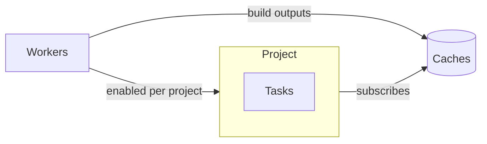

# Projects and Tasks

A **project** groups people, machines and caches; a **task** inside a project names one repository and the flake outputs to build from that repository.

## Project

- **Members and Roles**: Admin, Write, View, or custom roles built from single permissions.
- **SSH Key**: one Ed25519 key per project, generated automatically, for cloning private repositories.
- **Workers**: a worker only receives jobs from projects that enable the worker.
- **Cache Subscriptions**: every output a project builds is pushed to its subscribed caches.
- **Integrations**: connections to GitHub, Gitea / Forgejo or GitLab for incoming events and outgoing status.

## Task

| Part | Purpose |
|---|---|
| Repository URL | Where the flake lives |
| Evaluation Wildcard | Which flake outputs to build, see [wildcards](../reference/wildcards.md) |
| Triggers | When an evaluation starts and on which branch: push, pull request, polling (every 300 s by default) or a cron schedule |
| Actions | What happens after: mail, web request, Git host status, flake update pull request |
| Flake Input Overrides | Replace a flake input for every evaluation, e.g. a newer nixpkgs |
| Keep Evaluations | How many finished evaluations stay, 30 by default |

## Concurrency

A task has one active evaluation at a time. A trigger that fires during a running evaluation follows the task's concurrency policy:

| Policy | Running evaluation | Running builds |
|---|---|---|
| `soft_abort` (default) | Aborted, the new one takes over | Finish, and the new evaluation reuses their outputs |
| `hard_abort` | Aborted | Cancelled |
| `skip` | Keeps running | Keep running; the new event is dropped |
| `all` | Keeps running, the new one starts alongside | Keep running |

## Related

- [First Project](../get-started/first-project.md): create a project and a task
- [Overview](overview.md): how evaluations, builds, workers and caches connect
