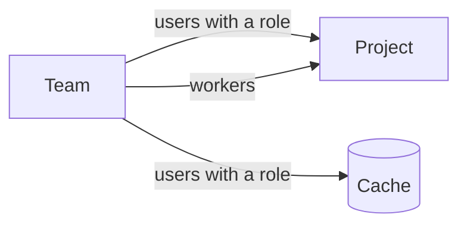

<!--
SPDX-FileCopyrightText: 2026 Wavelens GmbH <info@wavelens.io>
SPDX-License-Identifier: AGPL-3.0-only
-->

# Teams

A **team** is a group of users and workers. One grant on a project or cache can cover every person and machine of a team. Teams never own projects or caches.

## Members

| Role | Rights |
|---|---|
| Admin | Change settings, members, invitations, workers and grants. Approve requests. Delete the team |
| Member | See the team page |

- **Invitations**: an Admin can invite a user by name. The user can join after accepting under `Settings -> My Invites`. A superuser can add members directly.
- **Last Admin**: teams always have at least one Admin. Removing or demoting the last Admin is refused.
- **Creation**: who may create teams is up to `permissions.createTeam`. The creator is the first Admin.

## Grants

A grant is one team's access to one project or cache.

| Target | Grant | Effect |
|---|---|---|
| Project | Users with a role | Members get that role in the project |
| Project | Workers | Team workers take the project's jobs |
| Cache | Users with a role | Members get that cache role |

Users with a direct role and a team role get the permissions of both. Team access is still in place after removing the direct membership.

## Requests

Grants need agreement from the project or cache side and from the team.

| Caller | Result |
|---|---|
| Members & Roles rights on the project or cache, and Admin in the team | Active grant at once |
| Members & Roles rights only | Pending request on the team page, until approval by a team Admin |
| Either side | Can remove the grant |

Only a team Admin can turn on the team's workers in an existing grant.

## Team Workers

A team worker is registered once on the team's **Workers** page. One team worker can take jobs from every project granting the team's workers.

- **Peers file**: one token line, `<team id>:<token>` or `*:<token>`, see the [peers file](../guides/remote-worker.md#peers-file).
- **Caches**: granted projects without a [cache subscription](caches.md) get no team workers.
- **Removal**: running jobs of the affected projects end when a grant, the team or the worker is removed.

## New Projects

The team settings can grant every new project the team's users with a role, its workers, or both. Only superusers can set these fields. The [local worker](workers.md#access) is a worker of the state-declared team `server`, granted to every new project this way.

## Single Sign-On

A team can follow an identity provider group. [Single Sign-On](../guides/sso.md) has the setup.

- `oidc_group`: users of that group join on sign-in. They leave once the group is gone from their claim.
- `scim_group`: the provider can write the team's members directly.

Only superusers set these two fields.

## Mail and Dashboard

- **Mail actions**: `team:<name>` as a `send_mail` recipient can reach every verified member of a team granted with users on the project. See [Actions](../guides/actions.md).
- **Dashboard**: tasks of team projects rank after starred and active tasks, and before tasks of direct memberships.

## Related

- [Projects and Tasks](projects-and-tasks.md): the project side of a grant
- [Workers](workers.md): project workers, team workers and the local worker
- [Declarative State](../reference/state.md#teamsname): teams as NixOS options
