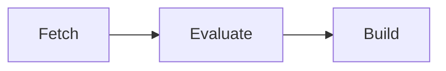

# Workers

A **worker** is a machine running `gradient-worker`. The worker connects to the server, takes the jobs the projects that enable the worker have queued, and sends the results back. The server itself runs no Nix; every clone, evaluation and build happens on a worker.

## Capabilities

Each worker advertises which of the three job kinds the worker takes:

| Capability | Job |
|---|---|
| Fetch | Clone the repository and download the flake inputs |
| Evaluate | Walk the flake and report derivations |
| Build | Build derivations and upload the outputs |

One machine can take all three, or the kinds can be split, e.g. a large-memory machine for evaluation and several smaller builders.

## Matching Builds

A build only goes to a worker that supports the derivation's system (e.g. `aarch64-linux`) and every required system feature (e.g. `kvm`, `big-parallel`). Systems come from `worker.system.architectures` (default: the host platform); features are detected from the local Nix unless `worker.system.features` sets them.

Among the matching workers, the scheduler scores each queued job and steers heavy builds and evaluations away from workers without enough free memory for the predicted peak, learned from earlier runs. `services.gradient.worker.build.metrics` records the per-build measurements this prediction needs.

## Zones

Workers in one datacenter share a zone label, `services.gradient.worker.zone` (default: none). A [cluster job](../contributors/scheduler/clusters.md) that needs a fast interconnect starts all members in one zone; all workers without a zone share one unnamed zone.

`services.gradient.worker.endpoint` is the address the other members of a cluster reach the worker at. The server hands every member the endpoints of the others when the cluster starts.

## Access

| Kind | Registered | Serves |
|---|---|---|
| Project worker | Under one project | That project |
| Base worker | On the server, visible in every project | Every project that enables the worker |
| Local worker | On the server host, automatically | Every project, enabled by default |

A worker only receives jobs from projects that have a cache subscription.

## Base Workers

A base worker is a server-level worker, declared in [`services.gradient.state.workers`](../reference/state.md#workersname), that shows up in every project's worker list. Projects can enable or disable a base worker, but cannot edit or delete one.

| Setting | Effect |
|---|---|
| `projects` | Projects that start with the worker enabled; others opt in from the UI |
| `auto_enable` | Every project enables the worker on creation; a project that turns the worker off stays off |
| `enabled` | Global switch; off hides the worker from every project |
| `authorize_against` | A fixed UUID the worker authenticates as, instead of one token line per project |

The local worker is a base worker with `auto_enable`. A project that registers its own worker under the same worker ID hides the base worker in that project.

## Ephemeral Workers

A worker in a throwaway VM can announce that the worker is draining: the server stops sending new jobs, the running jobs finish, and the VM can be replaced by a fresh one.

## Related

- [Quick Start](../get-started/quick-start.md): the local worker
- [Add a Remote Worker](../guides/remote-worker.md): add build machines
- [Evaluations and Builds](evaluations-and-builds.md): what workers run
