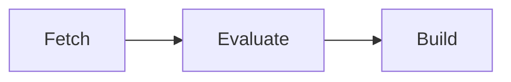

# Workers

A **worker** is a machine running `gradient-worker`. The worker connects to the server, takes the jobs the projects that enable the worker have queued, and sends the results back. The server itself runs no Nix; every clone, evaluation and build happens on a worker.

## Capabilities

Each worker advertises which of the three job kinds the worker takes:

| Capability | Job |
|---|---|
| Fetch | Clone the repository and download the flake inputs |
| Evaluate | Walk the flake and report derivations |
| Build | Build derivations and upload the outputs |

One machine can take all three, or the kinds can be split, e.g. a large-memory machine for evaluation and several smaller builders.

## Matching Builds

A build only goes to a worker that supports the derivation's system (e.g. `aarch64-linux`) and every required system feature (e.g. `kvm`, `big-parallel`). Workers detect both from their local Nix daemon.

Among the matching workers, the scheduler scores each queued job and steers heavy builds and evaluations away from workers without enough free memory for the predicted peak, learned from earlier runs. `services.gradient.worker.build.metrics` records the per-build measurements this prediction needs.

## Access

| Kind | Registered | Serves |
|---|---|---|
| Project worker | Under one project | That project |
| Base worker | On the server, visible in every project | Every project that enables the worker |
| Local worker | On the server host, automatically | Every project, enabled by default |

A worker only receives jobs from projects that have a cache subscription.

## Ephemeral Workers

A worker in a throwaway VM can announce that the worker is draining: the server stops sending new jobs, the running jobs finish, and the VM can be replaced by a fresh one.

## Related

- [Quick start](../get-started/quick-start.md): the local worker
- [Remote workers](../configuration.md#remote-workers): add build machines
- [Evaluations and Builds](evaluations-and-builds.md): what workers run
