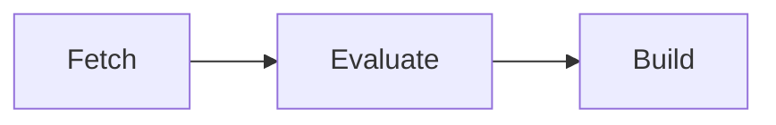

# Workers

A **worker** is a machine running `gradient-worker`. The worker is connecting to the server and taking jobs queued by projects with the worker enabled. The worker is sending the results back. The server itself is running no Nix. Every clone, evaluation and build is taking place on a worker.

## Capabilities

Each worker is advertising which of the three job kinds the worker can take.

| Capability | Job |
|---|---|
| Fetch | Clone the repository and download the flake inputs |
| Evaluate | Walk the flake and report derivations |
| Build | Build derivations and upload the outputs |

One machine can take all three, or the kinds can be split, e.g. a large-memory machine for evaluation and several smaller builders.

## Matching Builds

A build is only going to a worker supporting the derivation's system (e.g. `aarch64-linux`) and every required system feature (e.g. `kvm`, `big-parallel`). Systems come from `worker.system.architectures`, with the host platform as default. The worker is detecting features from the local Nix. `worker.system.features` can override the detected features.

The scheduler is scoring each queued job among the matching workers. The scheduler is steering heavy builds and evaluations away from workers lacking free memory for the predicted peak. Earlier builds are the source of this prediction. `services.gradient.worker.build.metrics` is recording the per-build measurements behind this prediction.

## Zones

Workers in one datacenter share a zone label, `services.gradient.worker.zone` (default: none). A [cluster job](../contributors/scheduler/clusters.md) needing a fast interconnect is starting all members in one zone. All workers without a zone share one unnamed zone.

`services.gradient.worker.endpoint` is the address the other members of a cluster reach the worker at. The server is handing every member the endpoints of the others at cluster start.

## Access

| Kind | Registered | Serving |
|---|---|---|
| Project worker | Under one project | That project |
| Base worker | On the server, visible in every project | Every project with the worker enabled |
| Local worker | On the server host, automatically | Every project, enabled by default |

A worker is only receiving jobs from projects with a cache subscription.

## Base Workers

A base worker is a server-level worker declared in [`services.gradient.state.workers`](../reference/state.md#workersname). Every project's worker list is showing the base worker. Projects can enable or disable a base worker, but cannot edit or delete one.

| Setting | Effect |
|---|---|
| `projects` | Projects starting with the worker enabled. Other projects opt in from the UI |
| `auto_enable` | Every project is enabling the worker on creation. A project turning the worker off is staying off |
| `enabled` | Global switch. Off is hiding the worker from every project |
| `authorize_against` | A fixed UUID for worker authentication, instead of one token line per project |

The local worker is a base worker with `auto_enable`. A project registering its own worker under the same worker ID is hiding the base worker in that project.

## Ephemeral Workers

A worker in a throwaway VM can announce draining. The server is then no longer sending new jobs. The running jobs finish. A fresh VM can then replace the old one.

## Related

- [Quick Start](../get-started/quick-start.md): the local worker
- [Add a Remote Worker](../guides/remote-worker.md): add build machines
- [Evaluations and Builds](evaluations-and-builds.md): what workers run
