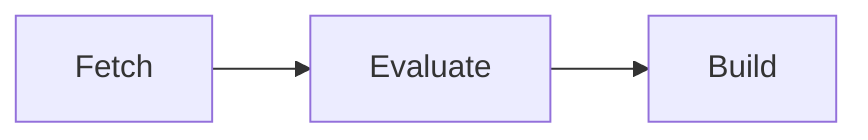

<!--
SPDX-FileCopyrightText: 2026 Wavelens GmbH <info@wavelens.io>
SPDX-License-Identifier: AGPL-3.0-only
-->

# Workers

A **worker** is a machine running `gradient-worker`. Workers connect to the server and take jobs queued by projects with the worker enabled. Results go back to the server. The server itself has no Nix. Every clone, evaluation and build is the job of a worker.

## Capabilities

Workers advertise which of the three job kinds they can take.

| Capability | Job |
|---|---|
| Fetch | Clone the repository and download the flake inputs |
| Evaluate | Walk the flake and report derivations |
| Build | Build derivations and upload the outputs |

One machine can take all three, or the kinds can be split, e.g. a large-memory machine for evaluation and a few smaller builders.

## Matching Builds

Builds only go to workers supporting the derivation's system (e.g. `aarch64-linux`) and every required system feature (e.g. `kvm`, `big-parallel`). Systems come from `worker.system.architectures`, with the host platform as default. Features come from the local Nix of the worker. `worker.system.features` can override the detected features.

The scheduler will score each queued job among the matching workers. The scheduler will also keep heavy builds and evaluations away from workers lacking free memory for the predicted peak. Earlier builds are the source of this prediction. `services.gradient.worker.build.metrics` can record the per-build measurements behind this prediction.

## Zones

Workers in one datacenter share a zone label, `services.gradient.worker.zone` (default: none). A [cluster job](../contributors/scheduler/clusters.md) needing a fast interconnect will start all members in one zone. All workers without a zone share one unnamed zone.

`services.gradient.worker.endpoint` is the address the other members of a cluster reach the worker at. The server will hand every member the endpoints of the others at cluster start.

## Access

| Kind | Registered | Serving |
|---|---|---|
| Project worker | Under one project | That project |
| Team worker | Under one [team](teams.md) | Every project granting the team's workers |
| Local worker | On the server host, automatically | Every new project, as a worker of the state-declared team `server` |

Workers only receive jobs from projects with a cache subscription.

## Team Workers

A team worker is part of one [team](teams.md), with one token for the whole team. Granted projects list the team worker read-only. Changes take place on the team's **Workers** page.

| Setting | Effect |
|---|---|
| Grant with workers | Team worker active in the project |
| `new_projects.workers` | Team workers granted to every new project |
| `enabled` | Global switch for the worker in every granted project |

A worker ID is either a team worker or a set of project registrations, never both.

## Worker Stop

Any worker can stop at any time, a throwaway VM included. A stop can lose no job.

- The stopping worker will announce draining. The server will then send no new jobs.
- The worker will abort its running jobs.
- The server will queue those jobs again for other workers.

## Related

- [Quick Start](../get-started/quick-start.md): the local worker
- [Add a Remote Worker](../guides/remote-worker.md): add build machines
- [Evaluations and Builds](evaluations-and-builds.md): what workers run
