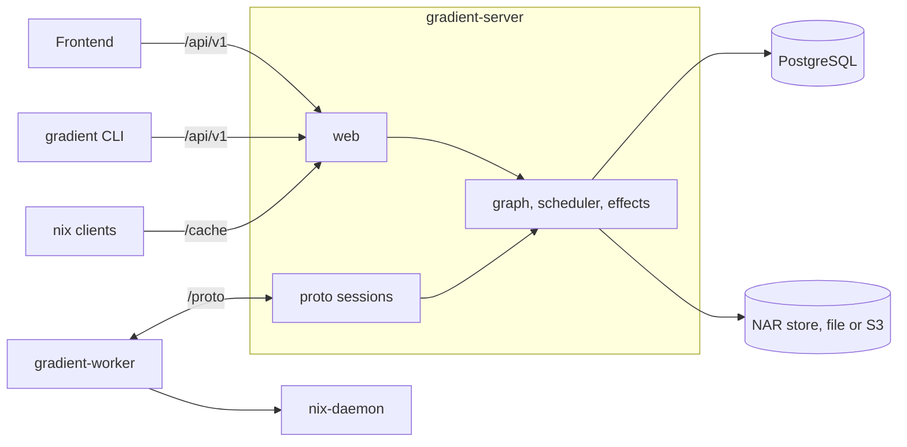

# Architecture

Gradient is a Rust server, a Rust worker, an Angular frontend and a Rust CLI. The database and the NAR store belong to the server. The server has no connection to a Nix daemon. Workers perform every store operation.



## Binaries

| Binary | Crate | Role |
|---|---|---|
| `gradient-server` | `backend/` (root) | HTTP API, binary cache, worker sessions, scheduler |
| `gradient-worker` | `gradient-worker` | Fetch, evaluate and build against a local `nix-daemon` |
| `gradient` | `cli/` | Command-line client for the REST API |
| `gradient-sql-gate` | `backend/` (feature `sql-gate`) | Explaining every registered statement, see [Tests](tests.md#sql-plan-check) |
| `gradient-daemon` | `gradient-daemon` (feature `mock`) | Nix daemon protocol server with a mock store, for VM tests |
| `gradient-proxy` | Separate, closed-source repository | [Federation](proto/federation.md) gateway |

## Server

The server is one process. Long-lived server tasks run under a supervision tree (`gradient_util::supervision`, on ractor), started from the shared `Shutdown` coordinator. Subsystems register children with `Shutdown::supervise` or `supervise_now`.

```text
root
├── graph                                actor: sole writer of the graph and the cache index; stopped last
├── scheduler                            supervisor
│   ├── scheduler-core                   actor: WorkerPool and JobTracker behind messages
│   ├── trigger-dispatch                 every 5 s
│   ├── eval-dispatch                    5 s tick, woken by every created evaluation
│   ├── build-dispatch                   actor: 5 s tick, kicks, startable-set resync every 60 s
│   ├── cluster-dispatch                 5 s tick, woken when a worker finds no single job
│   └── upstream-probe                   every 1 s: asks upstream caches about shared builds newly wanted
├── sessions                             supervisor: one actor per worker connection
├── worker-sample, instance-metrics      metrics passes
├── worker-liveness, graph-consistency,
│   graph-stuck-reheal                   absent when disabled
├── eval-completion-watchdog,
│   stranded-build-sweep,
│   abandoned-dispatch-sweep             every 60 s
├── cache-maintenance, sign-sweep,
│   debug-index, eval-cache-sweep        cache sweeps
├── effects                              actor: sends pending deliveries; effects-workers factory beneath
├── retention (hourly), rollup,
│   cache_metric_flush, otlp-snapshot    metrics pipeline; otlp-snapshot only with an OTLP endpoint
└── outbound-connect                     every 15 s: dials workers with a registered URL
```

| Actor | Owned State | Details |
|---|---|---|
| `graph` | Every request-path write to `derivation*`, `build_job`, `build_attempt`, `cached_path`, and the retires of maintenance | [Shared Builds](scheduler/shared-builds.md) |
| `scheduler-core` | `WorkerPool` and the candidate cache (`JobTracker`). `Scheduler` is a facade, one message per method | [Capabilities and Assignment](proto/capabilities-and-dispatch.md) |
| `SessionActor` | One worker connection. The reader will hand the actor frames in order, up to 64 unanswered. TCP backpressure will hold any frame beyond that | [Connection](proto/connection.md) |
| `effects` | Pending deliveries (`pending_delivery`): 8 workers, 6 attempts with backoff doubling from 30 s (capped at 15 min), then dead letter | [Events and Webhooks](../reference/events.md) |

- **Pull-based assignment:** A claim is a `dispatched_job` insert in Postgres (`gradient_db::scheduling::assignment_record::claim_assignment`). The scheduler actor can only cache candidates.
- **Session signals:** The scheduler can reach a session only through `SessionPort` (`Offers`, `Reauth`, `Abort`, `Close`). A burst of enqueues will collapse into one offer per generation.
- **Off-session RPCs:** The reader will start `CacheQuery` and `QueryKnownDerivations` as tracked tasks the moment they arrive. The session will start `WorkerMetrics` the same way. A slow frame can never hold back a lookup the worker needs. Log chunks go through a per-session lane, flushed before a job's completion. A respawned core actor will get every live session and its jobs back from the sessions supervisor.
- **State:** The parts of `AppState` (alias `ServerState`) are three pools (`worker_db`, `web_db`, `cache_db`), `RuntimeConfig` and the NAR store. Other parts of `AppState` are `UploadAdmission`, the graph handle and the event bus. The `startable_set` and `probe_requests` channels for build-dispatch and the probe are part of the state too.
- **Events:** Events are typed (`gradient_types::events::Event`) and are flowing two ways. The in-process `EventBus` will feed live sockets and `/api/v1/metrics/events`, with a slow subscriber skipping. `gradient_db::deliveries::events::record` will write durable pending deliveries (`pending_delivery` rows) in the caller's transaction. The `effects` actor will spread these rows out into action and webhook deliveries.
- **Uploads:** Uploads are admitted before any byte can move. Uploads share one server-wide count and byte budget for admission, round-robin across sessions, FIFO within one, small uploads first. See [Transfer](proto/transfer.md#upload) and [NAR Storage](internals/nar-storage.md).

### Supervision Rules

- A panicking or exiting child is respawned after a backoff of 1 s doubling to 60 s. The backoff is reset after five healthy minutes.
- A pass over its budget is cancelled in place and will tick again afterwards.
- Restarts, errors, timeouts and the last good pass per child are on the `/api/v1/board/health` endpoint.
- Work outliving a request must run as a tracked task. Shutdown will drain these tasks. Bare `tokio::spawn` is a clippy error in the backend workspace.

## Worker

- Connecting to the server at `/proto`, or accepting connections with the `discoverable` option.
- Running flake jobs (fetch, evaluate) and build jobs ([Jobs](proto/jobs.md)).
- Evaluating in a subprocess pool ([Eval Worker Setup](eval-worker.md)).
- Talking to the local `nix-daemon` through harmonia and holding GC roots for the worker's builds.
- Never signing. Signatures for every cached path come from the server ([Cache Serving](internals/cache-serving.md)).

## Crates

Every backend crate is `backend/gradient-<name>`. The workspace root is `gradient-server`.

| Group | Crate | Role |
|---|---|---|
| Server state | `core` | `AppState`, upstream narinfo lookup and sources |
| | `db` | Every query and the graph repair pass over the pools, plus `DbContext` |
| | `entity` | SeaORM entities, one module per table |
| | `migration` | SeaORM migrator |
| | `graph` | The graph writer |
| | `effects` | The effects actor |
| Scheduling | `scheduler` | Scheduler actor, assignment passes, upstream probe |
| | `pool` | Worker registry, capability aggregate, scoring rules |
| Protocol | `wire` | Protocol types, framing, handshake, dial and accept |
| | `proto` | Server side: sessions, NAR transfer, signing, assignment handlers |
| | `worker-client` | Peer side: connection, reconnect, reply correlation. Shared by worker and proxy |
| HTTP | `web` | Axum API and the binary cache endpoints |
| | `git-host` | Reporters per Git host, webhook parsing, signature checks |
| Background | `cache` | Cache sweeps: maintenance, signing backfill, debug index, eval cache, deep GC |
| | `ci` | Triggers, `apply_trigger`, evaluation creation, Git host checks |
| | `state` | Declarative state DTOs and apply |
| | `notify` | Email through `EmailSender` |
| | `report` | Diagnostic report extractor |
| Storage and Nix | `storage` | NAR and log storage (file or S3), upload admission, partial transfers, passthrough, hot cache |
| | `sources` | Store paths, the daemon pool, git and SSH sources, cache keys, the `flake.lock` updater |
| | `derivation` | `.drv` parsing |
| | `eval` | Flake evaluator, used by the worker and `gradient eval` |
| Binaries | `worker` | `gradient-worker` |
| | `daemon` | Mock Nix daemon for VM tests |
| Shared | `types` | IDs, runtime config, events, entity aliases |
| | `util` | Shutdown, supervision, HTTP clients, logging, metrics setup |
| | `test-support` | Shared test fixtures, see [Tests](tests.md#shared-harness) |

**Entity aliases** (`gradient-types/src/entity_aliases.rs`): `MFoo` model, `AFoo` active model, `EFoo` entity, `CFoo` column.

## Database

- PostgreSQL 18 or newer is the only database. Migrations live in `backend/gradient-migration/src/`. The server will apply them at startup ([Migrations](migrations.md)).
- Graph transactions aborted by a deadlock or serialization failure get at most three attempts. Passes outside the graph writer are not retried and repeat on their next tick.
- Advisory locks in namespace `643` (`gradient_db::graph::shared_build_guard`) and hash-ordered row locks keep counter seeds and state changes consistent ([Shared Builds](scheduler/shared-builds.md)).
- Postgres must allow a `max_locks_per_transaction` value of at least 256. The server will log an error below that.
- Timestamps are `NaiveDateTime` in UTC. The `NULL_TIME` value (`1970-01-01 00:00:00`) can mean "never".
- `backend/clippy.toml` will forbid `reqwest::Client::new` and raw `Statement` construction. Statements go through `gradient_db::sql!` for the plan check.

## Frontend

- A standalone Angular 22 app in `frontend/`, talking only to the REST API, built to static files and delivered through nginx or Caddy.
- Standalone components with signals, the in-repo `gr-ui` layer on `@angular/cdk`, Apache ECharts, SCSS variables from `_variables.scss`. See the [Frontend Style Guide](frontend-style-guide.md).

## CLI

- A separate workspace in `cli/`: the `gradient-cli` package (binary `gradient`) and `connector`, the typed REST client.
- The optional `eval` feature has a path dependency on `backend/gradient-eval` for local evaluation.
- The configuration file is `$XDG_CONFIG_HOME/gradient/config.toml` (`~/.config/gradient/config.toml`). An existing legacy native path on macOS will stay in use.

## Related

- [Internals](internals/index.md): Git host webhooks, NAR storage, cache serving, graph queries, authentication
- [Scheduler](scheduler/index.md) and [Proto](proto/index.md)
