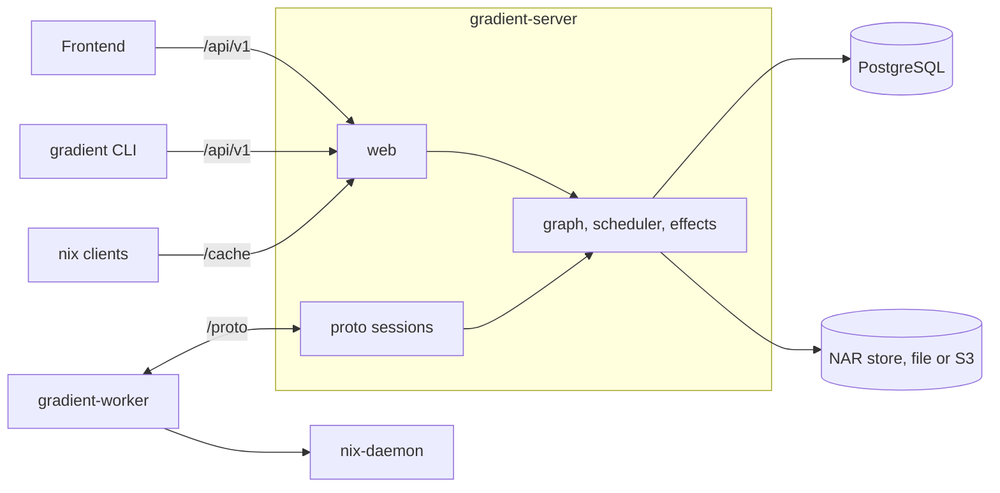

# Architecture

Gradient is a Rust server, a Rust worker, an Angular frontend and a Rust CLI. The server owns the database and the NAR store and never talks to a Nix daemon; workers do every store operation.



## Binaries

| Binary | Crate | Role |
|---|---|---|
| `gradient-server` | `backend/` (root) | HTTP API, binary cache, worker sessions, scheduler |
| `gradient-worker` | `gradient-worker` | Fetch, evaluate and build against a local `nix-daemon` |
| `gradient` | `cli/` | Command-line client for the REST API |
| `gradient-sql-gate` | `backend/` (feature `sql-gate`) | Explains every registered statement, see [Tests](tests.md#sql-plan-gate) |
| `gradient-daemon` | `gradient-daemon` (feature `mock`) | Nix daemon protocol server with a mock store, for VM tests |
| `gradient-proxy` | Separate, closed-source repository | [Federation](proto/federation.md) gateway |

## Server

The server is one process. Its long-lived work runs under a supervision tree (`gradient_util::supervision`, on ractor), started from the shared `Shutdown` coordinator; subsystems register children with `Shutdown::supervise` or `supervise_now`.

```text
root
├── graph                                actor: sole writer of the graph and the cache index; stopped last
├── scheduler                            supervisor
│   ├── scheduler-core                   actor: WorkerPool and JobTracker behind messages
│   ├── trigger-dispatch, eval-dispatch  every 5 s
│   ├── build-dispatch                   actor: 5 s tick, kicks, ready-set resync every 60 s
│   └── upstream-probe                   every 1 s: asks upstreams about newly demanded anchors
├── sessions                             supervisor: one actor per worker connection
├── worker-sample, instance-metrics      metrics passes
├── worker-liveness, graph-consistency,
│   graph-stuck-reheal                   absent when disabled
├── eval-completion-watchdog,
│   stranded-build-sweep,
│   abandoned-dispatch-sweep             every 60 s
├── cache-maintenance, sign-sweep,
│   debug-index, eval-cache-sweep        cache sweeps
├── effects                              actor: delivers outbox rows; effects-workers factory beneath
├── retention (hourly), rollup,
│   cache_metric_flush, otlp-snapshot    metrics pipeline; otlp-snapshot only with an OTLP endpoint
└── outbound-connect                     every 15 s: dials workers with a registered URL
```

| Actor | Owns | Details |
|---|---|---|
| `graph` | Every request-path write to `derivation*`, `build_job`, `build_attempt`, `cached_path`, and the retires of maintenance | [Build Anchors](scheduler/build-anchors.md) |
| `scheduler-core` | `WorkerPool` and the candidate cache (`JobTracker`); `Scheduler` is a facade, one message per method | [Capabilities and Dispatch](proto/capabilities-and-dispatch.md) |
| `SessionActor` | One worker connection; the reader hands it frames in order, up to 64 unanswered, then TCP backpressure holds | [Connection](proto/connection.md) |
| `effects` | Outbox delivery: 8 workers, 6 attempts with backoff doubling from 30 s (capped at 15 min), then dead letter | [Events and Webhooks](../reference/events.md) |

- **Pull-based dispatch:** a claim is a `dispatched_job` insert in Postgres (`gradient_db::claim_dispatch`); the scheduler actor only caches candidates.
- **Session signals:** the scheduler reaches a session only through `SessionPort` (`Offers`, `Reauth`, `Abort`, `Drain`, `Close`); a burst of enqueues collapses into one offer per generation.
- **Off-session RPCs:** the reader starts `CacheQuery` and `QueryKnownDerivations` as tracked tasks the moment they arrive, and the session starts `WorkerMetrics` the same way, so a slow frame never holds back a lookup the worker waits on. Log chunks go through a per-session lane, flushed before a job's completion. A respawned core actor gets every live session and its jobs back from the sessions supervisor.
- **State:** `AppState` (alias `ServerState`) holds three pools (`worker_db`, `web_db`, `cache_db`), `RuntimeConfig`, the NAR store, `UploadAdmission`, the graph handle, the event bus, `ready_set` and `probe_requests` channels for build-dispatch and the probe.
- **Events** are typed (`gradient_types::events::Event`) and flow two ways: the in-process `EventBus` for live sockets and `/api/v1/metrics/events` (a slow subscriber skips), and durable `outbox` rows written by `gradient_db::events::record` in the caller's transaction, fanned out by `effects` into action and webhook deliveries.
- **Uploads** are admitted before a byte moves: one server-wide count and byte budget, round-robin across sessions, FIFO within one, small uploads first. See [Transfer](proto/transfer.md#upload) and [NAR Storage](internals/nar-storage.md).

**Supervision rules:**

- A child that panics or exits is respawned after a backoff of 1 s doubling to 60 s, reset after five healthy minutes.
- A pass over its budget is cancelled in place and ticks again.
- Restarts, errors, timeouts and the last good pass per child are on `/api/v1/board/health`.
- Work that outlives a request runs as a tracked task: shutdown drains the task. Bare `tokio::spawn` is a clippy error in the backend workspace.

## Worker

- Connects to the server at `/proto`, or accepts connections with `discoverable`.
- Runs flake jobs (fetch, evaluate) and build jobs, see [Jobs](proto/jobs.md). Evaluation runs in a subprocess pool, see [Eval Worker Setup](eval-worker.md).
- Talks to the local `nix-daemon` through harmonia and keeps GC roots for what it builds.
- Never signs: the server signs every cached path, see [Cache Serving](internals/cache-serving.md).

## Crates

Every backend crate is `backend/gradient-<name>`; the workspace root is `gradient-server`.

| Group | Crate | Role |
|---|---|---|
| Server state | `core` | `AppState`, upstream narinfo lookup and sources |
| | `db` | Every query and the graph reconciler, over the pools; `DbContext` |
| | `entity` | SeaORM entities, one module per table |
| | `migration` | SeaORM migrator |
| | `graph` | The graph actor |
| | `effects` | The effects actor |
| Scheduling | `scheduler` | Scheduler actor, dispatch passes, upstream probe |
| | `pool` | Worker registry, capability aggregate, scoring rules |
| Protocol | `wire` | Protocol types, framing, handshake, dial and accept |
| | `proto` | Server side: sessions, NAR transfer, signing, dispatch handlers |
| | `worker-client` | Peer side: connection, reconnect, reply correlation; shared by worker and proxy |
| HTTP | `web` | Axum API and the binary cache endpoints |
| | `forge` | Per-forge reporters, webhook parsing, signature checks |
| Background | `cache` | Cache sweeps: maintenance, signing backfill, debug index, eval cache, deep GC |
| | `ci` | Triggers, `apply_trigger`, evaluation creation, forge checks |
| | `state` | Declarative state DTOs and apply |
| | `notify` | Email through `EmailSender` |
| | `report` | Diagnostic report extractor |
| Storage and Nix | `storage` | NAR and log storage (file or S3), upload admission, partial transfers, relay, hot cache |
| | `sources` | Store paths, the daemon pool, git and SSH sources, cache keys, the `flake.lock` updater |
| | `derivation` | `.drv` parsing |
| | `eval` | Flake evaluator, used by the worker and `gradient eval` |
| Binaries | `worker` | `gradient-worker` |
| | `daemon` | Mock Nix daemon for VM tests |
| Shared | `types` | IDs, runtime config, events, entity aliases |
| | `util` | Shutdown, supervision, HTTP clients, logging, metrics setup |
| | `test-support` | Shared test fixtures, see [Tests](tests.md#shared-harness) |

**Entity aliases** (`gradient-types/src/entity_aliases.rs`): `MFoo` model, `AFoo` active model, `EFoo` entity, `CFoo` column.

## Database

- PostgreSQL 18 or newer is the only database. Migrations live in `backend/gradient-migration/src/` and run at startup, see [Migrations](migrations.md).
- Graph transactions aborted by a deadlock or serialization failure run at most three times; passes outside the graph actor are not retried and repeat on their next tick.
- Advisory locks in namespace `643` (`gradient_db::anchor_guard`) and hash-ordered row locks keep counter seeds and flips consistent, see [Build Anchors](scheduler/build-anchors.md).
- Postgres needs `max_locks_per_transaction` of at least 256; the server logs an error below that.
- Timestamps are `NaiveDateTime` in UTC; `NULL_TIME` (`1970-01-01 00:00:00`) means "never".
- `backend/clippy.toml` forbids `reqwest::Client::new` and raw `Statement` construction: statements go through `gradient_db::sql!` for the plan gate.

## Frontend

- A standalone Angular 22 app in `frontend/`, talking only to the REST API, built to static files and served by nginx or Caddy.
- Standalone components with signals, the in-repo `gr-ui` layer on `@angular/cdk`, Apache ECharts, SCSS variables from `_variables.scss`. See the [Frontend Style Guide](frontend-style-guide.md).

## CLI

- A separate workspace in `cli/`: the `gradient-cli` package (binary `gradient`) and `connector`, the typed REST client.
- The optional `eval` feature path-depends on `backend/gradient-eval` for local evaluation.
- Configuration lives in `$XDG_CONFIG_HOME/gradient/config.toml` (`~/.config/gradient/config.toml`); macOS keeps an existing legacy native path.

## Related

- [Internals](internals/index.md): forge hooks, NAR storage, cache serving, graph queries, authentication
- [Scheduler](scheduler/index.md) and [Proto](proto/index.md)
