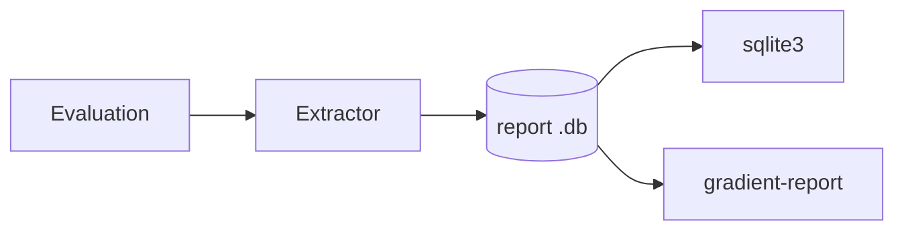

<!--
SPDX-FileCopyrightText: 2026 Wavelens GmbH <info@wavelens.io>
SPDX-License-Identifier: AGPL-3.0-only
-->

# Diagnostic Reports

A diagnostic report is one SQLite file with tables never shown in the UI. These are assignment conditions on `derivation_build`, the attempt history behind a self-heal loop, disconnect reasons, upstream probe metrics and the resolved server settings. Generation and attachment are part of [Report a Bug](../guides/diagnostic-report.md). The file's contents and the way to read the data are the topic of this page.



## Code

| Part | Path | Role |
|---|---|---|
| Extractor | `backend/gradient-report` | Writing the SQLite file: `schema.rs` (tables, `SCHEMA_VERSION`), `extract.rs`, `redact.rs`, `logs.rs`, `config_snapshot.rs` |
| Inspector | `nix/tools/report-inspector` | The `gradient-report` tool: Python stdlib only, running on any maintainer machine. Pytest suite in `tests/`, executed by the package build |

## Anonymisation

- Stable pseudonyms, not deletion. Equal inputs map to the same token within one report (`repo-a1b2`, `worker-7f3c`). Dependency reasoning will still work.
- A fresh salt per report. Two reports of one instance cannot be correlated. The salt is never written.
- Free text (build logs, commit messages) is rewritten against every pseudonym in one pass, shared across all logs.
- The rewrite cost will grow with the report size, not size times package count.
- Nix store **hashes always stay**. They are one-way and let a maintainer check a path against a public cache.

| API parameter | Default without the parameter |
|---|---|
| `anonymize_identities` | `true` |
| `anonymize_packages` | `false` |
| `include_logs` | `true` |
| `include_instance` | `true`, requiring `manageWorkers` |

The dialog will always send all four explicitly.

## Never Exported

- API keys, sessions, device-authorization records, worker token hashes, upstream cache keys, password hashes and Git host credentials are absent, not redacted.
- Every exported column is named in the extractor. A table gaining a secret column later cannot start exporting that column.
- The `cached_path_signature` export can only hold the presence of a signature, never the signature.

## Scope

The `report_manifest` table will record per table the rows included against the rows existing, the scope and the filter. A report without logs will say so and can never look like an evaluation without logs.

| Scope | Tables |
|---|---|
| This evaluation only | The evaluation's own rows, `dispatched_job`, `dispatched_job_phase` |
| Shared builds | `build_attempt`, `phase_event`, `derivation`, `derivation_build`, `derivation_output`, `derivation_dependency`: rows made for other evaluations of the same derivation, older attempts included |
| Whole instance | `worker_registration`, `team_worker`, `upstream_metric` |
| This project | `team_project` |
| This evaluation's derivations, while it ran | `derivation_metric` |
| Workers of this evaluation | `worker_connection`, `worker_sample`, from creation until finish or the report |

- The `scope` column is worth reading before trusting a count.
- `worker_connection` and `worker_sample` carry no project. Their telemetry rows describe the worker.
- `worker_registration` is empty under a fleet of team workers. The names are in `team_worker`.

## Closure Boundary

The start counters count edges. The far end of every edge is in the file. An absent row will then show that the *instance* never had the path, not a skipped export.

| Table | Contents |
|---|---|
| `derivation`, `derivation_build`, `derivation_output` | The evaluation's derivations **and their direct dependencies** |
| `derivation_dependency` | The evaluation's own edges with `kind`, both ends exported |
| `cached_path` | Those derivations' outputs **and every path they reference** |
| `build_job` | The evaluation's jobs **and every job an exported attempt was running under** |

- One hop is enough. The `blocking_deps` counter will count one per build edge and read the dependency's own shared build, outputs and cached paths.
- Deeper levels are summarised in the dependency's stored `blocking_deps`.
- `missing_runtime_deps` is the same count over the runtime dependencies (`derivation_dependency.kind IN (1, 2)`).
- A dependency row without a `build_job` row is evidence, not work of its own. The `why-stuck` command can tell the two apart this way.
- The `build_job` table can reach past the evaluation. The substitute-miss budget is scoped per `(shared build, evaluation)` through `build_attempt.build_job`.

## Queries

Any SQLite client can open the file.

**Substitute-miss loops** per shared build and evaluation.

```sh
sqlite3 report.db \
  'SELECT d.name, j.evaluation, count(*) AS misses
     FROM build_attempt a
     JOIN build_job j ON j.id = a.build_job
     JOIN derivation_build db ON db.id = a.derivation_build
     JOIN derivation d ON d.id = db.derivation
    WHERE a.reason = 0
    GROUP BY 1, 2 HAVING misses > 2 ORDER BY misses DESC'
```

**Job Time per Phase:** The `dispatched_job_phase` table can hold one row per span, nested through the `parent_seq` column. `phase` is the numeric discriminant, named on the [Job Board](../ui/job-board.md#job-inspection).

```sh
sqlite3 report.db \
  'SELECT j.worker_id, p.phase, p.end_ms - p.start_ms AS ms
     FROM dispatched_job_phase p
     JOIN dispatched_job j ON j.id = p.dispatched_job
    ORDER BY ms DESC LIMIT 20'
```

`dispatched_job.outcome`: `0` completed, `1` failed, `2` abandoned (disconnect, restart, overdue abort), null while running.

**Cached but Not Delivered:** The cache will only deliver a path with a `cached_path_signature` row for that cache and `signed = 1` set. The query below will join both. Only then is `derivation_output.is_cached` trustworthy.

```sh
sqlite3 report.db \
  'SELECT cp.package, s.cache_name, s.signed
     FROM cached_path cp
     LEFT JOIN cached_path_signature s ON s.cached_path = cp.id
    WHERE s.id IS NULL OR s.signed = 0'
```

**Incomplete Closures:** A shared build has a *complete closure* when every output has a NAR and `missing_runtime_deps` is zero. The `fetchable` flag and every assignment condition are reading this state. A non-zero count will keep every assignment from trusting the shared build. A negative count can point at a lost counter update.

```sh
sqlite3 report.db \
  'SELECT d.name, b.missing_runtime_deps
     FROM derivation_build b JOIN derivation d ON d.id = b.derivation
    WHERE b.missing_runtime_deps <> 0
    ORDER BY b.missing_runtime_deps DESC'
```

- `cached_path.references` is the narinfo `References:` line behind the count, for checking a counter by hand.
- The server will recount table-wide on every consistency check and log mismatches as `runtime_drift` entries.
- `commit` is a reserved word and is only queryable in quotes as `"commit"`.

## Signs in the Data

| Shape | Meaning |
|---|---|
| Evaluation in `EvaluatingFlake` / `EvaluatingDerivation`, newest eval job has `finished_at` | The terminal report never landed. The `eval-completion-watchdog` pass will re-drive the transition |
| `evaluation_input_update` row on an active evaluation | No further input-update round can start for the task while the row is active. A wedged one will stop the flake updater |
| Shared build `Created`, `cache_available`, not wanted | Nothing will fetch the shared build. A cached output referencing the path will stay without a complete closure |

## Inspector

`gradient-report` is on `PATH` in `nix develop`. `nix run .#gradient-report` is enough outside the shell.

| Command | Output |
|---|---|
| `summary` | Status, timings, build and failure counts (default) |
| `timeline` | Phase events, assignments and attempts in order |
| `why-stuck` | The condition holding each waiting shared build |
| `failed` | Failed attempts. `--log ATTEMPT` will dump one log |
| `workers` | Registration and connection history |
| `manifest` | The report's contents and omissions |
| `estimate-accuracy` | The recorded time estimate of each job against the job's phases. `--element NAME` will list the jobs of an element |
| `sql "QUERY"` | Raw access |
| `store-spec -o FILE` | A `gradient-daemon` store spec replaying the evaluation |

**`why-stuck`** is the first stop on a hung evaluation. The command will cover every shared build driven by the evaluation that never finished.

- The output will name the holding condition (`walked`, `wanted`, `probed`, `blocking_deps`).
- The output will list every dependency below that is not `fetchable` yet.
- A complete `.drv` closure will appear as the only condition left when that closure is absent from the report.

```text
vendor-registry: Queued, waiting on walked, blocking_deps = 1
    dep openssl-3.6.3 is a stub: never walked
    dep curl-8.21.0 walked over 2 unwalked inputs
```

| Dependency line | Meaning |
|---|---|
| `not in this report` | The row is absent from the file. A closed export has none, reports before schema 12 many |
| `is a stub: never walked` | A walk named the derivation but never read the derivation |
| `walked over N unwalked inputs` | `derivation.unwalked_inputs`: a subtree below was never recorded, as after a walk abandoned between batches |

- The `wanted` condition is outside the `(cache_available OR blocking_deps = 0)` arm. The `wanted` marking will stop at passthroughs and finished builds.
- The line `ed-1.22.5: Created, waiting on wanted` is a shared build nothing will ever fetch.
- A stub or unwalked line can point at the walk, not the build.

**`estimate-accuracy`** will set the time estimate of each finished job against the phases the worker recorded.

| Element | Phase |
|---|---|
| `download` | `NarFetch` |
| `paths` | `Prefetch` without its `NarFetch` spans |
| `build` | `Build` |
| `substitute` | `SubstituteFetch` and `Download`, for jobs without a `Build` span |
| `upload` | `Compress`, with `NarPush` and `UploadWait` inside |
| `eval`, `total` | `dispatched_job.worker_elapsed_ms` |

- Ratios above `x1.00` mark jobs slower than their estimate.
- The `zero` column will count jobs with an estimate of 0 that still took time.
- The `fallbacks` lines name the inputs the estimate had to guess. Their ratios stand against the jobs without the guess.
- `--element build` will list the build jobs, the worst estimate first.
- The out of memory line will also count failed jobs. A build killed for memory will end its job.

## Schema Versions

- The inspector can read exactly one schema (currently 20) and will refuse every other. The error message will name both schemas.
- A schema bump must change `SCHEMA_VERSION` in `backend/gradient-report/src/schema.rs` and `SUPPORTED_SCHEMA` in `nix/tools/report-inspector/gradient_report/db.py` together.
- The inspector package will fail to evaluate while the two differ.
- The schema version can move on its own, not with the release (12 to 16 inside 1.3.0).
- The matching inspector is built from the revision that wrote the report, with `nix build .#gradient-report` there.
- A `nix develop` shell entered before a schema bump will keep the old inspector until re-entered.
- Reports before schema 19 carry no `team_worker` table.
- Reports before schema 20 hold no `derivation_metric` table, no `worker_elapsed_ms` and no estimates.
