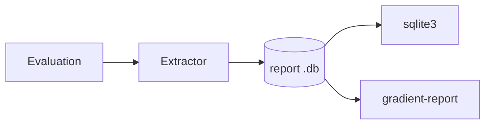

# Diagnostic Reports

A diagnostic report is one SQLite file with the tables the UI never shows: dispatch gates on `derivation_build`, the attempt history behind a self-heal loop, disconnect reasons, upstream probe metrics and the resolved server settings. Generating and attaching one is in [Report a Bug](../guides/diagnostic-report.md); this page covers what the file holds and how to read it.



## Code

| Part | Path | Role |
|---|---|---|
| Extractor | `backend/gradient-report` | Writes the SQLite file: `schema.rs` (tables, `SCHEMA_VERSION`), `extract.rs`, `redact.rs`, `logs.rs`, `config_snapshot.rs` |
| Inspector | `nix/tools/report-inspector` | The `gradient-report` tool: Python stdlib only, runs on any maintainer machine; pytest suite in `tests/`, run by the package build |

## Anonymisation

- Stable pseudonyms, not deletion: the same input maps to the same token within one report (`repo-a1b2`, `worker-7f3c`), and dependency reasoning still works.
- A fresh salt per report: two reports of one instance cannot be correlated. The salt is never written.
- Free text (build logs, commit messages) is rewritten against every pseudonym in one pass, shared across all logs; the cost grows with the report size, not size times package count.
- Nix store **hashes always stay**: they are one-way and let a maintainer check a path against a public cache.

| API parameter | Default without the parameter |
|---|---|
| `anonymize_identities` | `true` |
| `anonymize_packages` | `false` |
| `include_logs` | `true` |
| `include_instance` | `true`, needs `manageWorkers` |

The dialog always sends all four explicitly.

## Never Exported

- API keys, sessions, device-authorization records, worker token hashes, upstream cache keys, password hashes and forge credentials are absent, not redacted.
- Every exported column is named in the extractor: a table that later gains a secret column cannot start exporting it.
- `cached_path_signature` exports only whether a signature exists, never the signature.

## Scope

`report_manifest` records per table the rows included against the rows existing, the scope and the filter. A report without logs says so and never looks like an evaluation that had none.

| Scope | Tables |
|---|---|
| This evaluation only | The evaluation's own rows, `dispatched_job`, `dispatched_job_phase` |
| Shared anchors | `build_attempt`, `phase_event`, `derivation*`: rows made for other evaluations of the same derivation, older attempts included |
| Whole instance | `worker_registration`, `base_worker`, `upstream_metric` |
| This project | `project_base_worker` |
| Workers of this evaluation | `worker_connection`, `worker_sample`, from creation until finish or the report |

- Read the `scope` column before trusting a count.
- `worker_connection` and `worker_sample` carry no project: telemetry describes the worker.
- With a base-worker fleet `worker_registration` is empty; the names are in `base_worker`.

## Closure Boundary

The readiness counters count edges; the far end of every edge is in the file. An absent row then means the *instance* never had the path, not that the export skipped it.

| Table | Carries |
|---|---|
| `derivation`, `derivation_build`, `derivation_output` | The evaluation's derivations **and their direct dependencies** |
| `derivation_dependency` | The evaluation's own edges with `kind`, both ends exported |
| `cached_path` | Those derivations' outputs **and every path they reference** |
| `build_job` | The evaluation's jobs **and every job an exported attempt ran under** |

- One hop is enough: `unready_deps` counts one per build edge and reads the dependency's own anchor, outputs and cached paths. Deeper levels are summarised in the dependency's stored `unready_deps`.
- `missing_runtime_deps` is the same count over the runtime edges (`derivation_dependency.kind IN (1, 2)`).
- A dependency row without a `build_job` row is evidence, not work of its own; `why-stuck` tells the two apart this way.
- `build_job` reaches past the evaluation: the substitute-miss budget is scoped per `(anchor, evaluation)` through `build_attempt.build_job`.

## Queries

Any SQLite client opens the file.

**Substitute-miss loops** per anchor and evaluation:

```sh
sqlite3 report.db \
  'SELECT d.name, j.evaluation, count(*) AS misses
     FROM build_attempt a
     JOIN build_job j ON j.id = a.build_job
     JOIN derivation_build db ON db.id = a.derivation_build
     JOIN derivation d ON d.id = db.derivation
    WHERE a.reason = 0
    GROUP BY 1, 2 HAVING misses > 2 ORDER BY misses DESC'
```

**Where a job's time went:** `dispatched_job_phase` holds one row per span, nested through `parent_seq`; `phase` is the numeric discriminant, named on the [Job Board](../ui/job-board.md#job-inspection).

```sh
sqlite3 report.db \
  'SELECT j.worker_id, p.phase, p.end_ms - p.start_ms AS ms
     FROM dispatched_job_phase p
     JOIN dispatched_job j ON j.id = p.dispatched_job
    ORDER BY ms DESC LIMIT 20'
```

`dispatched_job.outcome`: `0` completed, `1` failed, `2` abandoned (disconnect, restart, overdue abort), null while running.

**Cached but not served:** the cache serves a path only with a `cached_path_signature` row for that cache and `signed = 1`. Join both before trusting `derivation_output.is_cached`:

```sh
sqlite3 report.db \
  'SELECT cp.package, s.cache_name, s.signed
     FROM cached_path cp
     LEFT JOIN cached_path_signature s ON s.cached_path = cp.id
    WHERE s.id IS NULL OR s.signed = 0'
```

**Unwhole anchors:** an anchor is *whole* (what `fetchable` and every dispatch gate read) when every output has a NAR and `missing_runtime_deps` is zero. Non-zero means no dispatch trusts the anchor; negative means a lost ripple.

```sh
sqlite3 report.db \
  'SELECT d.name, b.missing_runtime_deps
     FROM derivation_build b JOIN derivation d ON d.id = b.derivation
    WHERE b.missing_runtime_deps <> 0
    ORDER BY b.missing_runtime_deps DESC'
```

- `cached_path.references` is the narinfo `References:` line the count was built from, for checking a counter by hand. The server recounts table-wide on every consistency sweep and logs mismatches as `runtime_drift`.
- `commit` is a reserved word: query `"commit"` in quotes.

## Signs in the Data

| Shape | Meaning |
|---|---|
| Evaluation in `EvaluatingFlake` / `EvaluatingDerivation`, newest eval job has `finished_at` | The terminal report never landed; the `eval-completion-watchdog` pass re-drives the transition |
| `evaluation_input_update` row on an active evaluation | While active, no further input-update run starts for the task; a wedged one stops the flake updater |
| Anchor `Created`, `substitutable`, undemanded | Nothing will fetch the anchor; a cached output referencing the path stays unwhole |

## Inspector

`gradient-report` is on `PATH` in `nix develop` and runs as `nix run .#gradient-report`.

| Command | Shows |
|---|---|
| `summary` | Status, timings, build and failure counts (default) |
| `timeline` | Phase events, dispatches and attempts in order |
| `why-stuck` | Which gate holds each waiting anchor |
| `failed` | Failed attempts; `--log ATTEMPT` dumps one log |
| `workers` | Registration and connection history |
| `manifest` | What the report contains and what the report left out |
| `sql "QUERY"` | Raw access |
| `store-spec -o FILE` | A `gradient-daemon` store spec replaying the evaluation |

**`why-stuck`** is the first stop on a hung evaluation. For every anchor the evaluation drove that never finished, the command names the gate (`walked`, `demanded`, `unready_deps`), lists every dependency below that is not `fetchable`, and says when the only gate left is the `.drv` wholeness the report does not carry.

```text
vendor-registry: Queued, waiting on walked, unready_deps = 1
    dep openssl-3.6.3 is a stub: never walked
    dep curl-8.21.0 walked over 2 unwalked inputs
```

| Dependency line | Meaning |
|---|---|
| `not in this report` | The file lacks the row; a closed export has none, reports before schema 12 many |
| `is a stub: never walked` | A walk named the derivation but never read the derivation |
| `walked over N unwalked inputs` | `derivation.unwalked_inputs`: a subtree below was never recorded, as after a walk abandoned between batches |

- `demanded` sits outside the `(substitutable OR unready_deps = 0)` arm and stops at relays and finished builds: `ed-1.22.5: Created, waiting on demanded` is an anchor nothing will ever fetch.
- A stub or unwalked line points at the walk, not the build.

## Schema Versions

- The inspector reads exactly one schema (currently 17) and refuses every other; the message names both schemas.
- A schema bump changes `SCHEMA_VERSION` in `backend/gradient-report/src/schema.rs` and `SUPPORTED_SCHEMA` in `nix/tools/report-inspector/gradient_report/db.py` together; the inspector package fails to evaluate while the two differ.
- The schema moves on its own, not with the release (12 to 16 inside 1.3.0). Build the inspector from the revision that wrote the report: `nix build .#gradient-report`.
- A `nix develop` shell entered before a schema bump keeps the old inspector until re-entered.
- Reports before schema 17 carry no base-worker telemetry.
