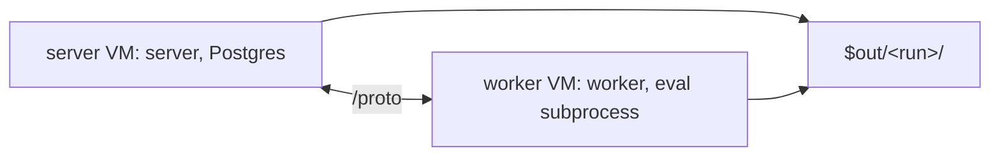

# Eval Benchmark

`gradient-evalbench` measures where an evaluation spends its time between the server and the eval worker. The benchmark is a NixOS VM test that evaluates the e2e hello flake four times and leaves one capture bundle per run, to open in a viewer and drill into.



## Running

```sh
nix build .#gradient-evalbench -L
cat result/summary.txt
```

- Not part of `nix flake check`: perf and strace make it slow and noisy.
- Built by Gradient, the evaluation page offers four downloads through `nix-support/hydra-build-products`: `evalbench.tar.gz` (the whole bundle), `summary.txt`, `summary.json` and `index.html` (the [report](#report)). The builder needs the `kvm` and `nixos-test` system features.
- The summarizer has a cheap check of its own: `nix build .#checks.x86_64-linux.evalbench-summarize`.

## Benchmark Passes

| Run | State before | Captures |
|---|---|---|
| `cold-clean` | Fresh `gradient` database, empty worker eval cache | Spans, pcaps, Postgres statistics |
| `warm-clean` | Same commit evaluated again | Spans, pcaps, Postgres statistics |
| `cold-instrumented` | Reset as for `cold-clean` | Spans, perf, strace, `auto_explain` |
| `warm-instrumented` | Same commit evaluated again | Spans, perf, strace, `auto_explain` |

- A cold reset drops and recreates the database, which the server re-provisions from `services.gradient.state`. The worker's Nix store keeps fetched sources.
- Captures run from the manual evaluation until the evaluation leaves `EvaluatingDerivation`; the run then waits for `Completed` before the next one starts.
- `summary.txt` reports the clean passes only: perf, strace and `auto_explain` distort timings.
- The test fails only when an evaluation fails or a capture file is missing. There are no timing thresholds.

## Report

`gradient-evalbench-inspector` renders a bundle as one self-contained HTML page, and each chart as its own SVG next to it. The benchmark renders its own bundle into `result/report/`; a downloaded bundle renders the same way:

```sh
nix run .#gradient-evalbench-inspector -- evalbench.tar.gz -o report
xdg-open report/index.html
```

- All passes: mode, evaluated seconds, traced wall time, `evaluation_metric`, and span totals side by side.
- Per run: the dispatch path (each step from the evaluate request to the worker's `job`, with the wait before it), job phase totals and a phase Gantt per dispatched job, a span timeline per process lane, a span flame graph (spans folded by nesting), span totals, `pg_stat_statements`, the `auto_explain` statements by total plan time and the slowest plans, and the perf flame graphs.
- Every bar carries its details as a hover title; `<run>/trace.json` is copied beside the page for Perfetto.

## Bundle

| Path | Open with | Shows |
|---|---|---|
| `summary.txt`, `summary.json` | Any editor | Per run: wall time, worker clock offset, `evaluation_metric`, spans by total time |
| `<run>/trace.json` | [ui.perfetto.dev](https://ui.perfetto.dev) | Server, worker and eval subprocess on one timeline |
| `<run>/trace/*.jsonl` | `jq` | Raw spans, one file per process |
| `<run>/proto.pcap` | Wireshark | Worker to server `/proto` traffic: round trips, frame sizes |
| `<run>/pg.pcap` | Wireshark (`pgsql` dissector) | Every statement of the server and its latency |
| `<run>/pg/pg_stat_statements.json` | `jq` | Top 100 statements of the `gradient` role by total time |
| `<run>/pg/job_phases.json` | `jq` | The worker's reported job phases (`dispatched_job_phase`) |
| `<run>/pg/auto_explain.log` | Any editor | Plans with `ANALYZE` of every statement, without per-node timing (instrumented passes) |
| `<run>/perf.data`, `<run>/flame.svg` | `perf report`, a browser | Server VM CPU profile (instrumented passes) |
| `<run>/worker/perf.data`, `<run>/worker/flame.svg` | `perf report`, a browser | Worker VM CPU profile, eval subprocess included |
| `<run>/worker/strace/worker.<pid>` | Any editor | Syscalls with timestamps and durations, one file per thread and child |
| `<run>/run.json` | `jq` | Evaluation id and seconds until the evaluation left `EvaluatingDerivation` |

## Spans

The benchmark sets `services.gradient.log.traceDir` and `services.gradient.worker.log.traceDir` ([Configuration](../reference/configuration.md)). Each process writes every closed `gradient*` span at `debug` or above as one JSON line, independent of the console log level.

```json
{"name":"flush","target":"gradient_graph::actor","ts_us":1759140000123456,"dur_us":8123,"pid":812,"process":"server","fields":{"batches":2,"rows":100}}
```

| Process | Spans |
|---|---|
| `server` | `dispatch_queued_evals`, `offer_jobs`, `on_request_job_chunk`, `record_scores`, `on_request_job`, `request_job`, `claim_dispatch`, `send_credentials`, `assign_job`, `job_event` (`kind`, `queue_wait_us`), `handle_eval_result`, `assess_cached`, `ingest`, `flush`, `ingest_one`, `commit_one`, `transact_once`, `apply_batch` and one span per batch step, `after_commit`, `known_derivations`, `eval_stream_completed` |
| `worker` | `on_job_offer`, `score_candidates`, `send_scores`, `request_job`, `job`, `fetch_repository` (`clone_and_checkout`, `run_input_update`, `archive_flake`, `prefetch_one`, `prefetch_flake_best_effort`, `missing_paths`), `evaluate_flake`, `evaluate_derivations`, `wave`, `parse_drv_wave`, `query_known_derivations`, `report_eval_result` |
| `eval` | `open`, `lock_flake`, `discover`, `plan_shards`, `resolve` (`attr`) |

- `ingest` minus its `flush` is the time a batch waited in the graph actor's mailbox.
- `job_event.queue_wait_us` is the time a report waited behind earlier reports of the same worker.

## Clock Alignment

Server and worker run on separate VMs with separate clocks. `summarize.py` moves worker and eval spans onto the server clock:

- Upstream pairs: the n-th `report_eval_result` of a job against the n-th `job_event` with `kind = eval_result` of the same job (receive time = start minus `queue_wait_us`).
- Downstream pairs: `assign_job` end against the worker's `job` start.
- Offset = (minimum upstream delay - minimum downstream delay) / 2, which makes the fastest message in each direction equally slow.
- A run without pairs in both directions stays unaligned (`offset 0`, marked `unaligned`).
