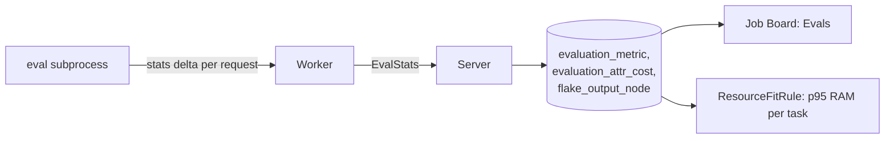

# Evaluation Metrics

Evaluation workers record Nix metrics per evaluation, the way builds record resource metrics. The numbers feed the Job Board's **Evals** tab and route RAM-heavy evaluations to big machines.

## Tables

| Table | Holds |
|---|---|
| `evaluation_metric` | Per evaluation: thunks, function calls, primop calls, lookups, allocated bytes, peak GC heap and RSS (MB), `total_eval_ms`, `worker_id`, and the phase columns `fetch_ms`, `eval_flake_ms`, `eval_drv_ms` |
| `evaluation_attr_cost` | Per entry point: thunks, function calls, wall clock and allocated bytes, bucketed by the wildcard target |
| `flake_output_node` | The walked flake-output tree: `path`, `parent`, `name`, `kind`, `is_derivation`, `drv_path` |

- The phase columns do not come from the Nix stats: they are summed from the job timeline's `fetch`, `eval_flake` and `eval_derivations` spans when the job reports its terminal message. They are 0 between `EvalStats` and completion, and stay 0 when the worker vanished before reporting. Phase names are on the [Job Board](../ui/job-board.md#job-inspection).
- Entry-point costs are aggregated in the resolver as each request completes.
- `flake_output_node` records only what the discovery walk visited; nothing extra is evaluated. The frontend renders the rows as a `nix flake show`-like tree.

## RAM Routing

A per-task rolling p95 of `peak_rss_mb` over the last 24 h feeds `ResourceFitRule` (see [Scoring](scheduler/scoring.md)). Tasks whose evaluations needed much RAM go to big-RAM workers; the prediction updates as evaluations finish, with no manual thresholds.

## Endpoints

| Endpoint | Returns |
|---|---|
| `GET /api/v1/board/evals/expensive-by-resource?metric=...&window_days=N` | Top evaluations by `time`, `rss`, `heap`, `thunks`, `fncalls` or `alloc`, project-scoped; `metric` is matched against a closed list |
| `GET /api/v1/evals/{evaluation}/flake-graph` | The walked flake-output tree of one evaluation |

## Overhead

- `GRADIENT_WORKER_EVAL_METRICS` (default `true`) gates capture; `false` skips the stats read entirely.
- Enabled, the cost is one cumulative-counter read per resolver request, diffed per worker; no `--count-calls`-style instrumentation.
