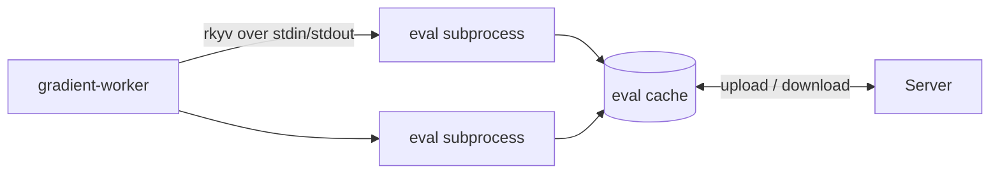

# Eval Worker Setup

Gradient is evaluating flakes in a pool of `--eval-subprocess` processes driving the embedded Nix C API. One evaluation is split into shards and fanned across the pool. The pool is sized to fit the host's memory. Results land in a persistent eval cache shared by the fleet. A repeat evaluation of the same locked flake is mostly cache hits.

## Subprocess IPC

- **Frames:** a `u32` little-endian length prefix plus an rkyv payload (`gradient-eval/src/ipc.rs`).
- **Version byte:** the subprocess is writing `EVAL_IPC_VERSION` (currently 6) before the first frame. A binary swapped mid-evaluation is failing the handshake instead of sending undecodable frames.
- **Streamed resolve:** `Resolve` is answering with one `ResolveItem` per attribute as soon as the attribute is resolved. `ResolveEnd` is following with the batch's warnings and stats delta.
- **Single responses:** every other request is one request, one response.
- **Shards:** `Plan` is splitting each include at its first wildcard.
    - A wildcard followed by more segments is yielding one sub-pattern per child (`packages.*.hello` -> `packages.x86_64-linux.hello`).
    - A trailing wildcard is yielding the unchanged pattern plus its child names (`only`), read without forcing any child.
    - The parent is listing those names in batches of `names / (pool * 4)` (at most 64).
    - `List` is limiting the first wildcard to the batch.
- **Deferred sets:** `List` is never forcing the children of a nested set under a trailing `*` (all checks of one system).
    - The set is coming back in `deferred` as a `#` shard over its children.
    - The parent is queueing those names in batches.
    - One heavy set is spreading across the pool instead of keeping one subprocess busy while the rest sit idle.
- **Warm walker:** a subprocess is keeping one walker (locked flake plus open eval cache) across consecutive requests for the same repository. A Plan / List / Resolve sequence is paying the lock and the cache open once.

## Parent Side

Files under `gradient-worker/src/worker_pool/`.

| File | Role |
|---|---|
| `transport.rs` | Subprocess handle, frame wire, typed requests. Setting `oom_score_adj` |
| `pool.rs` | Checkout and return with test-on-borrow |
| `memory.rs` | Pool-size budget, free-RAM guard, reaper |
| `resolver.rs` | Pooled fan-out and crash isolation |
| `eval_stats.rs` | Per-attribute evaluation statistics |
| `driver.rs` | The hidden `--eval-driver <file>` harness: JSONL requests through the real transport, JSON responses out. The NixOS VM test is driving both sides of the wire through the harness from Python |

## Memory Safety

Two layers bound evaluation memory.

| Layer | Option | Behavior |
|---|---|---|
| Pool sizing | `worker.eval.maxRss` (2 GiB) | `pool_size * maxRss` is staying within a host-RAM share. A subprocess over the cap is recycled **between** calls |
| Free-RAM reaper | `worker.system.minFreeRamMb` (`0` = 10% of RAM, clamped to 128 MiB - 1 GiB) | Sampling `MemAvailable` every 500 ms. A shortfall below the margin is triggering a SIGKILL of the largest evaluation subprocess with resident memory covering the whole shortfall. A 5 s wait is following |

- The recycle check is running after a call. One unit (a large aggregate, IFD chains, runaway recursion) can grow the Boehm heap past the cap within a call. The reaper is the guard against that peak.
- Nothing is killed when no evaluation is large enough to cover the shortfall. The pressure is then coming from elsewhere.
- A fixed 1 GiB floor on a 2 GiB host killed evaluations that were never the cause (#579).
- A killed subprocess is closing its pipe, and the evaluation is failing.
- One bounded failure is replacing a host OOM that could kill the worker and strand the job. The server is only registering a clean disconnect.
- The idle subprocesses shut down once an evaluation has resolved its attributes. Their heaps are not sitting through the closure walk.
- The next evaluation is starting fresh subprocesses.
- `acquire` is serialising evaluations under sustained pressure, always letting one proceed.
- Evaluation subprocesses are running with `oom_score_adj = 600` as the kernel's last resort.

## Compared to nix-eval-jobs

| | Gradient | nix-eval-jobs |
|---|---|---|
| Parallelism | Long-lived pool. One evaluation sharded across the pool | Short-lived children forked from a warm parent |
| Warmth across evaluations | Persistent eval cache per flake fingerprint | None. Copy-on-write warmth lasting one evaluation |
| Across machines | Fleet-shared `<fp>.sqlite` cache (pull and push). Staging a pulled blob is dropping the previous local `-wal` / `-shm` sidecars | None |
| Concurrent writers | Shards writing one cache without deadlock: WAL-append commits, one checkpoint at the end | Not applicable |
| Memory | Automatic pool sizing. A many-system flake is degrading to one shard and completing | Manual `--workers` and `--max-memory-size` |
| Pipeline | Discovery is writing rows, and build assignment is starting mid-evaluation. The closure walk is pruning server-known derivations | JSON job stream for the consumer (Hydra and similar) |
| Failure isolation | A bad attribute is becoming an error, and the evaluation is going on. A crash is keeping everything streamed and retrying the in-flight attribute | Per-job errors through the fork boundary |
| Compute across machines | Single-host pool today | Single host |

## Related

- [Evaluation Metrics](eval-metrics.md): the pool's per-evaluation records
- [Transfer](proto/transfer.md): eval cache uploads (`UploadObject::EvalCache`)
- [Configuration](../reference/configuration.md#worker): every worker option
