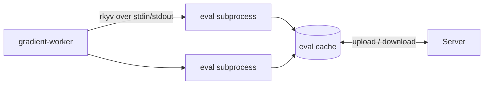

# Eval Worker Setup

Gradient evaluates flakes in a pool of `--eval-subprocess` processes that drive the embedded Nix C API. One evaluation is split into shards and fanned across the pool; the pool is sized to fit the host's memory. Results land in a persistent eval cache shared by the fleet: a repeat evaluation of the same locked flake is mostly cache hits.

## Subprocess IPC

- **Frames:** a `u32` little-endian length prefix plus an rkyv payload (`gradient-eval/src/ipc.rs`), the conventions of `/proto`.
- **Version byte:** the subprocess writes `EVAL_IPC_VERSION` (currently 5) before the first frame; a binary swapped mid-run fails the handshake instead of sending undecodable frames.
- **Streamed resolve:** `Resolve` answers with one `ResolveItem` per attribute as soon as the attribute resolves, then `ResolveEnd` with the batch's warnings and stats delta. Every other request is one request, one response.
- **Shards:** `Plan` splits each include at its first wildcard. A wildcard followed by more segments yields one sub-pattern per child (`packages.*.hello` -> `packages.x86_64-linux.hello`). A trailing wildcard yields the unchanged pattern plus its child names (`only`), read without forcing any child; the parent lists those names in batches of `names / (pool * 4)` (at most 64), and `List` limits the first wildcard to the batch.
- **Warm walker:** a subprocess keeps one walker (locked flake plus open eval cache) across consecutive requests for the same repository; a Plan / List / Resolve sequence pays the lock and the cache open once.

## Parent Side

`gradient-worker/src/worker_pool/`:

| File | Role |
|---|---|
| `transport.rs` | Subprocess handle, frame wire, typed requests; sets `oom_score_adj` |
| `pool.rs` | Checkout and return with test-on-borrow |
| `memory.rs` | Pool-size budget, free-RAM guard, reaper |
| `resolver.rs` | Pooled fan-out and crash isolation |
| `eval_stats.rs` | Per-attribute evaluation statistics |
| `driver.rs` | The hidden `--eval-driver <file>` harness: JSONL requests through the real transport, JSON responses out; the NixOS VM test drives both sides of the wire through the harness from Python |

## Memory Safety

Two layers bound evaluation memory.

| Layer | Option | Behavior |
|---|---|---|
| Pool sizing | `worker.eval.maxRss` (8 GiB) | `pool_size * maxRss` stays within a host-RAM share; a subprocess over the cap is recycled **between** calls |
| Free-RAM reaper | `worker.system.minFreeRamMb` (`0` = 10% of RAM, clamped to 128 MiB - 1 GiB) | Samples `MemAvailable` every 500 ms; below the margin, SIGKILLs the largest evaluation subprocess whose resident memory covers the whole shortfall, then waits 5 s |

- The recycle check runs after a call: one unit (a large aggregate, IFD chains, runaway recursion) can grow the Boehm heap past the cap within a call. The reaper is the guard against that peak.
- When no evaluation is large enough to cover the shortfall, the pressure comes from elsewhere and nothing is killed (#579: a fixed 1 GiB floor on a 2 GiB host killed evaluations that were never the cause).
- A killed subprocess closes its pipe and the evaluation fails. One bounded failure replaces a host OOM that could kill the worker and strand the job: the server only registers a clean disconnect.
- Under sustained pressure `acquire` serialises evaluations, always letting one proceed.
- Evaluation subprocesses run with `oom_score_adj = 600` as the kernel's last resort.

## Compared to nix-eval-jobs

| | Gradient | nix-eval-jobs |
|---|---|---|
| Parallelism | Long-lived pool; one evaluation sharded across the pool | Short-lived children forked from a warm parent |
| Warmth across runs | Persistent eval cache keyed by flake fingerprint | None; copy-on-write warmth lasts one run |
| Across machines | Fleet-shared `<fp>.sqlite` cache (pull and push). Staging a pulled blob drops the previous local `-wal` / `-shm` sidecars | None |
| Concurrent writers | Shards write one cache without deadlock: WAL-append commits, one checkpoint at the end | Not applicable |
| Memory | Automatic pool sizing; a many-system flake degrades to one shard and completes | Manual `--workers` and `--max-memory-size` |
| Pipeline | Discovery writes rows and dispatch starts mid-evaluation; the closure walk prunes server-known derivations | JSON job stream for the consumer (Hydra and similar) |
| Failure isolation | A bad attribute becomes an error and the evaluation goes on; a crash keeps everything streamed and retries the in-flight attribute | Per-job errors through the fork boundary |
| Compute across machines | Single-host pool today | Single host |

## Related

- [Evaluation Metrics](eval-metrics.md): what the pool records per evaluation
- [Transfer](proto/transfer.md): eval cache uploads (`UploadObject::EvalCache`)
- [Configuration](../reference/configuration.md#worker): every worker option
