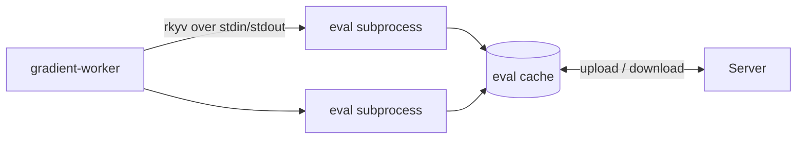

# Eval Worker Setup

Flake evaluations take place in a pool of `--eval-subprocess` processes driving the embedded Nix C API. One evaluation is split into shards and spread across the pool. The pool is sized to fit the host's memory. Results land in a persistent eval cache shared by the fleet. A repeat evaluation of the same locked flake is mostly cache hits.

## Subprocess IPC

- **Frames:** a `u32` little-endian length prefix plus an rkyv payload (`gradient-eval/src/ipc.rs`).
- **Version byte:** subprocesses write `EVAL_IPC_VERSION` (currently 10) before the first frame. A binary swapped mid-evaluation can no longer pass the handshake and send undecodable frames.
- **Responses:** request and response pair up. `Stats` ticks and [build requests](#import-from-derivation) can arrive before the response. `List` responses hold the derivation path of each attribute found, resolved in the subprocess that forced the attribute.
- **Shards:** `Plan` will split each include at its first wildcard.
    - A wildcard followed by more segments will yield one sub-pattern per child (`packages.*.hello` -> `packages.x86_64-linux.hello`).
    - A trailing wildcard will yield the unchanged pattern plus its child names (`only`), read without forcing any child.
    - The parent can list those names in batches of `names / (pool * 4)` (at most 64).
    - `List` will limit the first wildcard to the batch.
- **Deferred sets:** `List` will never force the children of a nested set under a trailing `*` (all checks of one system).
    - The set will come back in `deferred` as a `#` shard over its children.
    - The parent can queue those names in batches.
    - One heavy set will spread across the pool instead of keeping one subprocess busy while the rest sit idle.
- **Warm walker:** A subprocess can keep one walker (locked flake plus open eval cache) across consecutive requests for the same repository. A Plan / List sequence can pay for the lock and the cache open only once.

## Import From Derivation

An import from a derivation (IFD) needs a build in the middle of an evaluation. Subprocesses never build through the local daemon. The parent must request a Gradient build from the server instead.

| Frame | Direction | Content |
|---|---|---|
| `NeedsBuild` | subprocess -> parent | `derived_paths`: `.drv` paths with their outputs (`/nix/store/<hash>-x.drv^out`) |
| `BuildDone` | parent -> subprocess | `error`: empty after a successful build |

- The patched Nix of Gradient can hand an import to a realise hook instead of the local daemon.
- The hook in the subprocess must send `NeedsBuild` and block until `BuildDone` arrives.
- A different request during the wait is a protocol error. Subprocesses then stop reading and exit.
- Nix can raise the `error` of `BuildDone` as the error of the import. Later attributes with the same import receive the same error.

### Import Builder (`gradient-worker/src/executor/import.rs`)

1. Record the closure, with the imported derivation as the entry point `other.<system>.<name>` and `ifd` set. Repeated names within a job end with `-<first 8 hash characters>`.
2. Send [`ImportRequest`](proto/messages.md) and wait for `ImportResult`.
3. Pull the outputs and their closure from the Gradient cache.
4. Answer `BuildDone`, with `import from derivation '<name>' failed: build <id> <status>` after a failure.

- Requests for the same `.drv` from different subprocesses share the wait and the answer.
- Fingerprint, checkpoint, input fetch and the `--eval-driver` harness refuse imports with `import from derivation is not available during <call>`.

## Parent Side

Files under `gradient-worker/src/worker_pool/`.

| File | Role |
|---|---|
| `transport.rs` | Subprocess handle, frame wire, typed requests. Setting `oom_score_adj` |
| `pool.rs` | Checkout and return with test-on-borrow |
| `memory.rs` | Pool-size budget, free-RAM guard, reaper |
| `resolver.rs` | Pooled fan-out and crash isolation |
| `eval_stats.rs` | Per-attribute evaluation statistics |
| `driver.rs` | The hidden `--eval-driver <file>` harness: JSONL requests through the real transport, JSON responses out. The NixOS VM test can drive both sides of the wire through the harness from Python |

## Memory Safety

Two layers bound evaluation memory.

| Layer | Option | Behavior |
|---|---|---|
| Pool sizing | `worker.eval.maxRss` (2 GiB) | `pool_size * maxRss` must stay within a host-RAM share. A subprocess over the cap is recycled **between** calls |
| Free-RAM reaper | `worker.system.minFreeRamMb` (`0` = 10% of RAM, clamped to 128 MiB - 1 GiB) | Sampling `MemAvailable` every 500 ms. A shortfall below the margin will trigger a SIGKILL of the largest evaluation subprocess with resident memory covering the whole shortfall. A 5 s wait will follow |

- The recycle check will happen after a call. One unit (a large aggregate, IFD chains, runaway recursion) can grow the Boehm heap past the cap within a call. The reaper is the guard against that peak.
- Nothing is killed when no evaluation is large enough to cover the shortfall. The pressure is then coming from elsewhere.
- A fixed 1 GiB floor on a 2 GiB host killed evaluations that were never the cause (#579).
- A killed subprocess will close its pipe, and the evaluation will fail.
- One bounded failure will replace a host OOM that could kill the worker and strand the job. The server will only register a clean disconnect.
- The idle subprocesses shut down once an evaluation has resolved its attributes. Their heaps are not sitting through the closure walk.
- The next evaluation will start fresh subprocesses.
- `acquire` will serialise evaluations under sustained pressure, always letting one proceed.
- Evaluation subprocesses are running with `oom_score_adj = 600` as the kernel's last resort.

## Compared to nix-eval-jobs

| | Gradient | nix-eval-jobs |
|---|---|---|
| Parallelism | Long-lived pool. One evaluation sharded across the pool | Short-lived children forked from a warm parent |
| Warmth across evaluations | Persistent eval cache per flake fingerprint | None. Copy-on-write warmth lasting one evaluation |
| Across machines | Fleet-shared `<fp>.sqlite` cache (pull and push). Staging a pulled blob will drop the previous local `-wal` / `-shm` sidecars | None |
| Concurrent writers | Shards writing a shared cache, each write in an immediate transaction of its own, and a checkpoint at the end | Not applicable |
| Memory | Automatic pool sizing. A many-system flake can degrade to one shard and still complete | Manual `--workers` and `--max-memory-size` |
| Pipeline | Discovery writes rows, and build assignment starts mid-evaluation. The closure walk skips server-known derivations | JSON job stream for the consumer (Hydra and similar) |
| Failure isolation | A bad attribute will become an error, and the evaluation will go on. A crashed batch comes back attribute by attribute, down to the attribute that sank the subprocess | Per-job errors through the fork boundary |
| Compute across machines | Single-host pool today | Single host |

## Related

- [Evaluation Metrics](eval-metrics.md): the pool's per-evaluation records
- [Transfer](proto/transfer.md): upload of the eval cache (`UploadObject::EvalCache`)
- [Configuration](../reference/configuration.md#worker): every worker option
