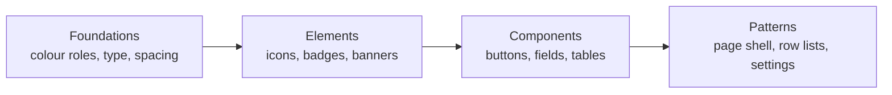

# Frontend Style Guide

The frontend is shipping its own design system page at `/styleguide`: every shared primitive, colour role and layout pattern, live. A new feature is reusing a primitive before building a new one.



## The Page

- Lazy-loaded at `/styleguide`, deliberately linked from nowhere, without an auth guard. No production data on the page.
- Source: `frontend/src/app/features/styleguide/`, one component per section page.

| Section | Contents |
|---|---|
| Overview | The rules below |
| Foundations | Colour roles, type scale, spacing, border radius |
| Elements | Icons, logo, badges, copy fields, read-only rows, message banners, tables, feedback, evaluation status, star button, status icon, charts, toasts |
| Components | Buttons, form field, name with availability check, selection, panel switcher, table, overlays |
| Patterns | Page shell, row list, index cards, card grid, settings, sections with an action, settings destinations, danger zone |

## Rules

- Any store path, hash, key, ID or URL is a `gr-copy-field`, never a bare code span.
- Colour is coming from semantic roles. No hex outside the palette, and no component reading a palette token directly.
- New shared classes go into the design system, never into a component stylesheet.
- Content shapes are `gr-row-list` or `gr-card-grid`, never named per entity.
- Every element is staying legible in both themes. Nothing is hard-coding black or white.
- Text is sitting at most one step from body: 16px interactive, 14px secondary, 12px badges only.

## Shared UI Package

`@gradient/ui` is a pnpm workspace package at `frontend/packages/ui`. Gradient and the frontend of [`gradient-proxy`](architecture.md) for servers.gradient.ci are both building on the package.

| Entry | Content |
|---|---|
| `@gradient/ui/ui` | Generic primitives, listed under [`gr-ui`](#gr-ui) |
| `@gradient/ui/chrome` | `gr-header` and `gr-footer`, configured through brand, nav and footer link inputs plus a `[slot=lang]` |
| `@gradient/ui/tokens` | Colour tokens from `tokens.ts` |
| `@gradient/ui/styles/*` | SCSS partials `variables`, `themes`, `grids` and the global `base` styles |

- Primitives go into the package only when they import nothing from `@core`, `@shared` or `@features`. An ESLint rule is blocking such imports inside `packages/ui`.
- `pnpm tokens:generate` and `pnpm tokens:check` are delegating to the package. `ng test` is covering the package specs too.
- The `gradient-proxy` frontend is linking the package with `link:../../frontend/packages/ui`.

## `gr-ui`

Generic primitives live in `frontend/packages/ui/src/ui/`, built on `@angular/cdk`. The Gradient-specific ones (`gr-eval-status-badge`, `gr-status-icon`, `gr-metric-chart`, `gr-star-button`, `gr-label-help`) live in `frontend/src/app/shared/ui/`. Each layer is imported from its own barrel.

```ts
import { FormFieldComponent, PageLayoutComponent, SettingsSectionComponent } from '@gradient/ui/ui';
import { MetricChartComponent } from '@shared/ui';
```

| Group | Selectors |
|---|---|
| Actions | `button[grButton]`, `a[grButton]`, `gr-star-button`, `gr-menu` |
| Forms | `gr-form-field`, `input[grInput]`, `textarea[grInput]`, `select[grInput]`, `gr-password-input`, `gr-name-field`, `gr-select`, `gr-select-button`, `gr-checkbox`, `gr-autocomplete`, `gr-label-help` |
| Display | `gr-badge`, `gr-eval-status-badge`, `gr-status-icon`, `gr-icon`, `gr-logo`, `gr-copy-field`, `gr-field-row`, `gr-stat-card`, `gr-metric-chart`, `gr-table`, `gr-divider` |
| Feedback | `gr-message-banner`, `gr-toast` (with `MessageService`), `gr-loading-spinner`, `gr-empty-state` |
| Overlays | `gr-dialog`, `gr-popover`, `[grTooltip]` |
| Layout | `gr-page-layout`, `gr-settings-section`, `gr-row-list` / `gr-row`, `gr-card-grid`, `gr-nav-card`, `gr-tab-switch`, `[grInView]` |

- `gr-page-layout`: title and subtitle header, breadcrumb, optional `[slot=actions]` buttons and `[slot=banner]`, then the content.
- `gr-settings-section`: a titled section with an optional description, inside a card unless `[card]="false"`.

## Grid Utilities

`frontend/packages/ui/src/styles/_grids.scss`, registered globally in `src/styles.scss`.

| Class | Layout |
|---|---|
| `.gr-grid-stats` | Auto-fit grid of stat cards, 220px minimum |
| `.gr-grid-form` | Two-column form, one column below `$breakpoint-md`. `.gr-grid-form__full` is spanning both |
| `.gr-grid-cards` | Auto-fill grid of cards, 280px minimum |
| `.gr-grid-rows` | Label, value, actions rows |
| `.gr-form-actions` | Row of form buttons. `--end` is aligning right |

## Related

- [Contributing](contributing.md#angular-and-typescript): dependency and lockfile rules
