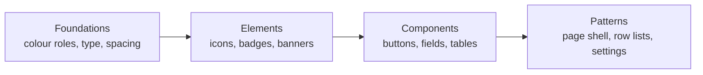

# Frontend Style Guide

The frontend is shipping its own design system page at `/styleguide`: every shared primitive, colour role and layout pattern, live. A new feature reuses a primitive before building a new one.



## The Page

- Lazy-loaded at `/styleguide`, deliberately linked from nowhere, without an auth guard; shows no production data.
- Source: `frontend/src/app/features/styleguide/`, one component per section page.

| Section | Shows |
|---|---|
| Overview | The rules below |
| Foundations | Colour roles, type scale, spacing, border radius |
| Elements | Icons, logo, badges, copy fields, read-only rows, message banners, tables, feedback, evaluation status, star button, status icon, charts, toasts |
| Components | Buttons, form field, name with availability check, selection, panel switcher, table, overlays |
| Patterns | Page shell, row list, index cards, card grid, settings, sections with an action, settings destinations, danger zone |

## Rules

- Any store path, hash, key, ID or URL is a `gr-copy-field`, never a bare code span.
- Colour comes from semantic roles: no hex outside the palette, and no component reads a palette token directly.
- New shared classes go into the design system, never into a component stylesheet.
- Content shapes are `gr-row-list` or `gr-card-grid`, never named per entity.
- Every element stays legible in both themes; nothing hard-codes black or white.
- Text sits at most one step from body: 16px interactive, 14px secondary, 12px badges only.

## `gr-ui`

`frontend/src/app/shared/ui/`, built on `@angular/cdk`, imported from the barrel:

```ts
import { FormFieldComponent, PageLayoutComponent, SettingsSectionComponent } from '@shared/ui';
```

| Group | Selectors |
|---|---|
| Actions | `button[grButton]`, `a[grButton]`, `gr-star-button`, `gr-menu` |
| Forms | `gr-form-field`, `input[grInput]`, `textarea[grInput]`, `select[grInput]`, `gr-password-input`, `gr-name-field`, `gr-select`, `gr-select-button`, `gr-checkbox`, `gr-autocomplete`, `gr-label-help` |
| Display | `gr-badge`, `gr-eval-status-badge`, `gr-status-icon`, `gr-icon`, `gr-logo`, `gr-copy-field`, `gr-field-row`, `gr-stat-card`, `gr-metric-chart`, `gr-table`, `gr-divider` |
| Feedback | `gr-message-banner`, `gr-toast` (with `MessageService`), `gr-loading-spinner`, `gr-empty-state` |
| Overlays | `gr-dialog`, `gr-popover`, `[grTooltip]` |
| Layout | `gr-page-layout`, `gr-settings-section`, `gr-row-list` / `gr-row`, `gr-card-grid`, `gr-nav-card`, `gr-tab-switch`, `[grInView]` |

- `gr-page-layout`: title and subtitle header, breadcrumb, optional `[slot=actions]` buttons and `[slot=banner]`, then the content.
- `gr-settings-section`: a titled section with an optional description, inside a card unless `[card]="false"`.

## Grid Utilities

`frontend/src/app/styles/_grids.scss`, registered globally in `src/styles.scss`.

| Class | Layout |
|---|---|
| `.gr-grid-stats` | Auto-fit grid of stat cards, 220px minimum |
| `.gr-grid-form` | Two-column form, one column below `$breakpoint-md`; `.gr-grid-form__full` spans both |
| `.gr-grid-cards` | Auto-fill grid of cards, 280px minimum |
| `.gr-grid-rows` | Label, value, actions rows |
| `.gr-form-actions` | Row of form buttons; `--end` aligns right |

## Related

- [Contributing](contributing.md#angular-and-typescript): dependency and lockfile rules
