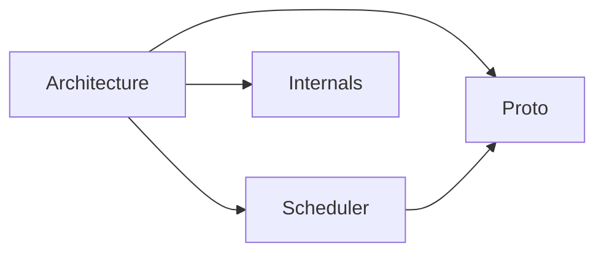

# Contributors

How Gradient is built, for anyone changing the code. Start with the architecture, then read the part that matches the change.

## Start Here

-   :material-sitemap: **[Architecture](architecture.md)**

    Crates, binaries and how server, workers and the database fit together.

-   :material-source-pull: **[Contributing](contributing.md)**

    Licensing, development setup, workflow and code conventions.

-   :material-test-tube: **[Tests](tests.md)**

    Where tests live, how to run them and the shared harness.

## Core

-   :material-graph: **[Scheduler](scheduler/index.md)**

    Shared builds, start counters, upstream substitution, cache closure and scoring.

-   :material-lan-connect: **[Proto](proto/index.md)**

    The worker protocol on `/proto`: handshake, assignment, jobs, transfers and federation.

-   :material-code-braces: **[Internals](internals/index.md)**

    Git host webhooks, NAR storage, cache serving, graph queries and authentication.

-   :material-database-arrow-up: **[Migrations](migrations.md)**

    Writing, registering and retiring database migrations.

## Evaluation

-   :material-cpu-64-bit: **[Eval Worker Setup](eval-worker.md)**

    The evaluation subprocess pool, discovery sharding and the shared eval cache.

-   :material-chart-line: **[Evaluation Metrics](eval-metrics.md)**

    Per-evaluation Nix metrics, how they are stored and shown on the Job Board.

## Debugging and UI

-   :material-file-search: **[Diagnostic Reports](diagnostic-reports.md)**

    The report file, its scopes and the `gradient-report` inspector.

-   :material-palette: **[Frontend Style Guide](frontend-style-guide.md)**

    The style guide page with the form, layout and grid primitives of the web UI.

