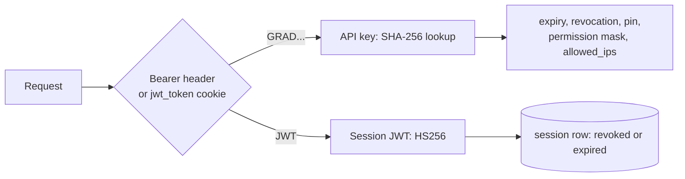
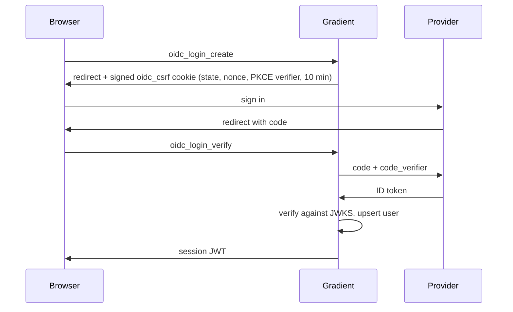

<!--
SPDX-FileCopyrightText: 2026 Wavelens GmbH <info@wavelens.io>
SPDX-License-Identifier: AGPL-3.0-only
-->

# Authentication

HTTP requests prove their identity with session JWTs, API keys, download tokens or OIDC sign-in. Worker authentication on `/proto` is covered on [Connection](../proto/connection.md).

## Tokens

| Token | Format | Lifetime | Minted by |
|---|---|---|---|
| Session JWT | HS256 with `GRADIENT_SECRETS_JWT_FILE`. Claims `{ exp, iat, id, jti }`, with `jti` naming the `session` row | 24 h, 30 days with `remember_me` | `create_session_and_token` |
| API key | 64 random alphanumeric characters, stored as SHA-256 hex, returned with a `GRAD` prefix | `expires_at` or none | API key endpoints |
| Download token | HS256 JWT with `derivation` and `evaluation` claims | 1 h | `encode_download_token` |

- Every request must check the session row for revocation and expiry.
- API keys carry `expires_at`, `revoked_at`, `allowed_ips`, a permission mask and an optional project or cache pin.
- The server will stamp `api.last_used_at` and `session.last_used_at` at most once a minute (`LAST_USED_STAMP_INTERVAL`).
- A failed stamp can only produce a log line, never a fatal error.

## OIDC

- PKCE must use S256.
- Endpoints come from `<discoveryUrl>/.well-known/openid-configuration`.
- `oidc_login_verify` will return the user.
- The same endpoint will mint the session.

## Related

- [API](../../reference/api.md): the header and API key usage
- [Set Up Single Sign-On](../../guides/sso.md): provider configuration
