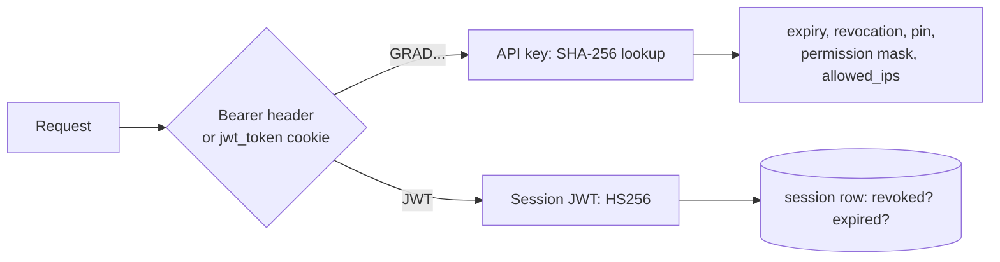
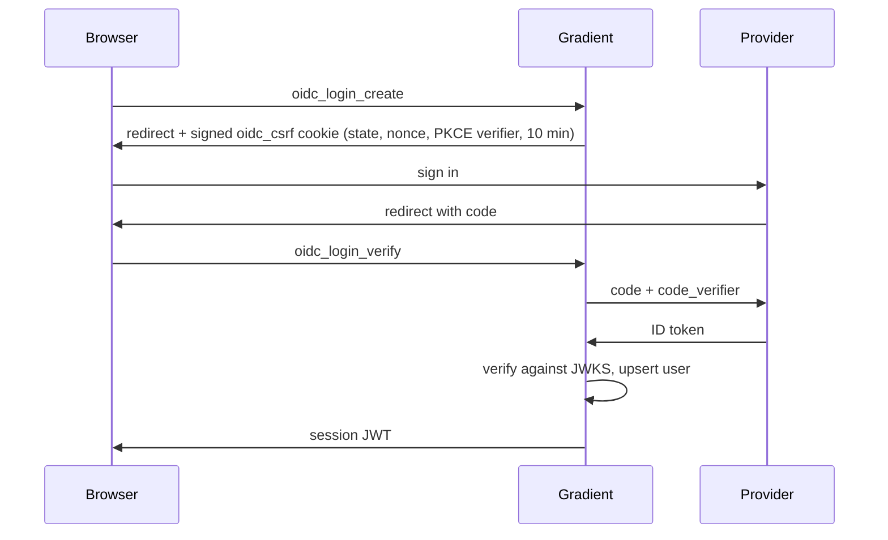

# Authentication

How HTTP requests prove who they are: session JWTs, API keys, download tokens and OIDC sign-in. Worker authentication on `/proto` is on [Connection](../proto/connection.md).

## Tokens

| Token | Format | Lifetime | Minted by |
|---|---|---|---|
| Session JWT | HS256 with `GRADIENT_SECRETS_JWT_FILE`; claims `{ exp, iat, id, jti }`, `jti` the `session` row | 24 h, 30 days with `remember_me` | `create_session_and_token` |
| API key | 64 random alphanumeric characters, stored as SHA-256 hex, returned with a `GRAD` prefix | `expires_at` or none | API key endpoints |
| Download token | HS256 JWT with `derivation` and `evaluation` claims | 1 h | `encode_download_token` |

- Each request checks the session row for revocation and expiry.
- An API key carries `expires_at`, `revoked_at`, an optional project or cache pin, a permission mask and `allowed_ips`.
- `api.last_used_at` and `session.last_used_at` are stamped at most once a minute (`LAST_USED_STAMP_INTERVAL`); a failed stamp is logged, never fatal.

## OIDC

- PKCE uses S256.
- Endpoints come from `<discoveryUrl>/.well-known/openid-configuration`.
- `oidc_login_verify` returns the user; the endpoint mints the session.

## Related

- [API](../../reference/api.md): the header and API key usage
- [Set Up Single Sign-On](../../guides/sso.md): provider configuration
