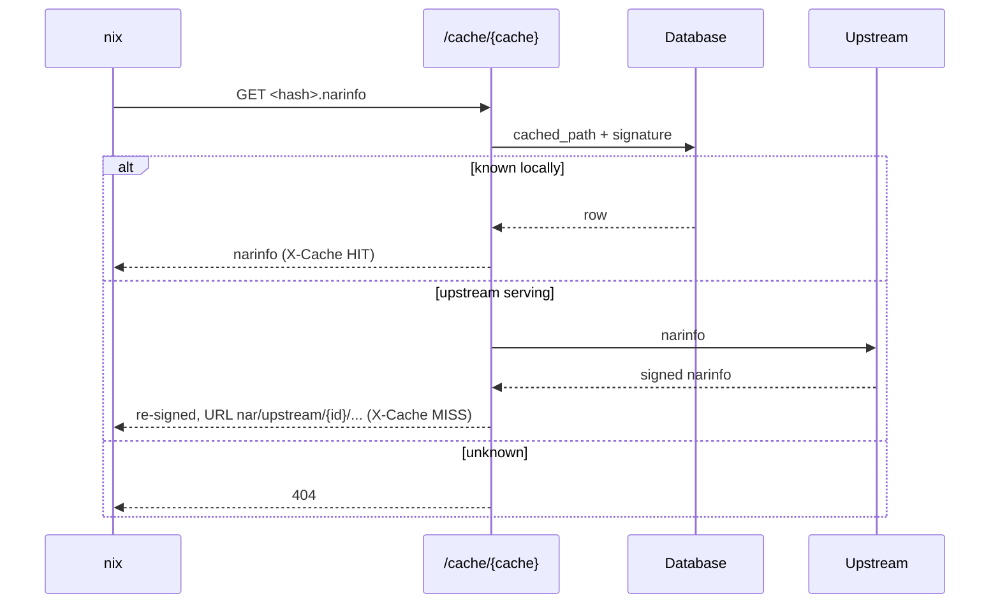

# Cache Serving

The `/cache/{cache}/` route is answering Nix requests. This page is covering signatures, narinfo from the database, pull-through from upstream caches, debug info and status codes for clients. [Cache Closure](../scheduler/cache-closure.md) is covering access and complete closures.



## Signing

- **Keys:** One Ed25519 key per cache, encrypted with the crypt secret. `format_cache_key` is returning the decrypted private key. `format_cache_public_key` is returning the `<host>-<name>:<base64>` public key.
- **Signer:** The server is signing, never the worker. `sign_into_caches` (`gradient-graph/src/nar.rs`) is signing inside the NAR commit, for worker and REST uploads alike.
- **Signatures:** A commit is writing the `cached_path_signature` row of every subscribed cache. The same statement is signing each row with the cache's key. The sign sweep (`sign_missing_signatures` in `gradient-cache/src/cacher/sign_sweep.rs`) is filling rows inserted by a later subscription. The sweep is also filling rows a commit left unsigned.

## Narinfo

The server is building `GET /cache/{cache}/<hash>.narinfo` from the database only. The server is never re-packing or re-hashing a NAR.

| Source | Fields |
|---|---|
| `derivation_output` | Output of a known derivation |
| `cached_path` | Sizes, hashes, references, `CA:` for content-addressed paths. Fallback for `.drv` files and standalone paths |
| `cached_path_signature` | `Sig:` lines, and the access gate |

### Pull-Through

- The server is rewriting the `URL:` of an upstream narinfo to `nar/upstream/{id}/...`.
- The server is re-signing an upstream narinfo only after verifying the upstream signature.
- `X-Cache` is answering `HIT` for a local narinfo and `MISS` for an upstream one.

## Debug Info

**Response:** `GET /cache/{cache}/debuginfo/{build_id}` is mirroring Nix's `index-debug-info`.

```json
{"archive": "../nar/<file_hash>.nar.zst", "member": "lib/debug/.build-id/<xx>/<yy>.debug"}
```

- `archive` is relative to the requested key.
- The server is accepting both spellings, `<build-id>` (Hydra) and `<build-id>.debug` (`nix copy`).
- The signature join is the access gate.
- The `debug_info` index is coming from the NARs of paths ending in `-debug` (`separateDebugInfo` outputs).
- An upload is walking its own NAR on a detached task.
- `cached_path.debug_info_indexed` is marking a scanned NAR. The `debug-index` sweep is reading each `file_hash` at most once.
- A miss is falling through to the upstream caches, with `archive` rewritten through `nar/upstream/{id}/...`.
- The server is refusing an `archive` that is absolute or escaping the upstream root.

## Status Codes

| Case | Answer |
|---|---|
| Unknown key | `404`, never another `4xx`. Substituters and debuginfod clients treat other codes as hard errors instead of trying the next source |
| Disabled cache | `400` |
| Private cache without credentials | `401` |
