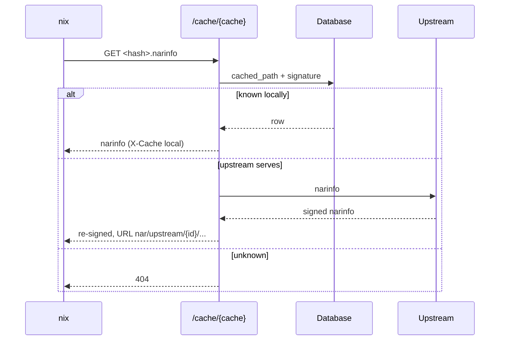

# Cache Serving

How `/cache/{cache}/` answers Nix: signatures, narinfo from the database, pull-through from upstreams, debug info and the status codes clients depend on. Access and wholeness are on [Cache Closure](../scheduler/cache-closure.md).



## Signing

- **Keys:** one Ed25519 key per cache, encrypted with the crypt secret. `format_cache_key` returns the decrypted private key; `format_cache_public_key` the `<host>-<name>:<base64>` public key.
- **The server signs**, never the worker: `gradient_proto::signing::sign_cached_path`, on a NAR commit and on a REST upload.
- **Signatures:** a commit writes the `cached_path_signature` row of every subscribed cache, signed with the cache's key in the same statement. The sign sweep (`sign_missing_signatures` in `gradient-cache/src/cacher/sign_sweep.rs`) fills the rows a later subscription inserts and any a commit left unsigned.

## Narinfo

`GET /cache/{cache}/<hash>.narinfo` is built from the database only; the server never re-packs or re-hashes a NAR.

| Source | Fields |
|---|---|
| `derivation_output` | Output of a known derivation |
| `cached_path` | Sizes, hashes, references, `CA:` for content-addressed paths; the fallback for `.drv` files and standalone paths |
| `cached_path_signature` | `Sig:` lines, and the access gate |

**Pull-through:** an upstream narinfo gets `URL:` rewritten to `nar/upstream/{id}/...` and is re-signed only after the upstream signature verifies; `X-Cache` tells local from upstream.

## Debug Info

`GET /cache/{cache}/debuginfo/{build_id}` mirrors Nix's `index-debug-info`:

```json
{"archive": "../nar/<file_hash>.nar.zst", "member": "lib/debug/.build-id/<xx>/<yy>.debug"}
```

- `archive` is relative to the requested key. Both spellings are accepted: `<build-id>` (Hydra) and `<build-id>.debug` (`nix copy`). The signature join is the access gate.
- The `debug_info` index comes from the NARs of paths ending in `-debug` (`separateDebugInfo` outputs). An upload walks its own NAR on a detached task; `cached_path.debug_info_indexed` marks a scanned NAR, and the `debug-index` sweep reads each `file_hash` at most once.
- A miss falls through to the upstreams with `archive` rewritten through `nar/upstream/{id}/...`; an `archive` that is absolute or escapes the upstream root is refused.

## Status Codes

| Case | Answer |
|---|---|
| Unknown key | `404`, never another `4xx`: substituters and debuginfod clients treat other codes as hard errors instead of trying the next source |
| Disabled cache | `400` |
| Private cache without credentials | `401` |
