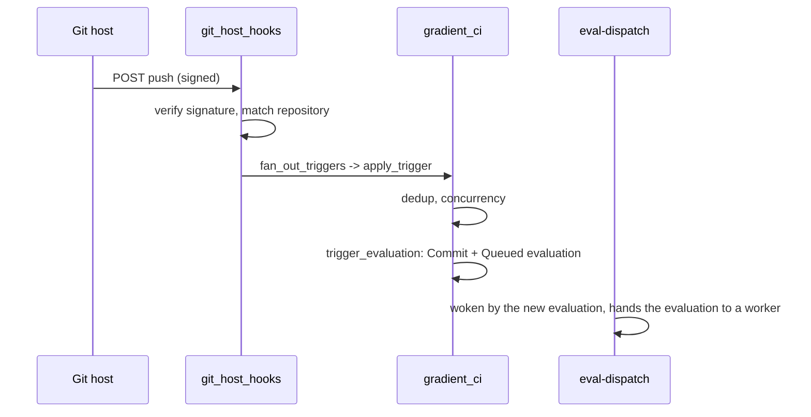

# Git Host Webhooks

`gradient-web/src/endpoints/git_host_hooks/` receives Git host events. The routes carry no session; each delivery proves itself with the Git host's signature, and a push ends as a `Queued` evaluation.

## Routes

| Route | Verification |
|---|---|
| `POST /api/v1/hooks/github` | `X-Hub-Signature-256` against `GRADIENT_GITHUB_APP_WEBHOOK_SECRET_FILE`; `503` until the App is fully configured |
| `POST /api/v1/hooks/{git_host}/{project}/{integration_name}` | `gitea` / `forgejo`: HMAC from `X-Forgejo-Signature`, then `X-Gitea-Signature`. `gitlab`: `X-Gitlab-Token` compared in constant time. `github` answers `400` |

- The generic route finds the integration by `(project, inbound, name)`, without `git_host_type`: one inbound row serves all three Git hosts.
- The secret is decrypted with the crypt file; `allowed_ips` rejects other sources with `403`.
- GitHub `installation` / `installation_repositories` events upsert or clear `github_installation` and seed the `github-<login>` integration pair (`github-<installation_id>` without a login).

## GitHub App Events

| Event | Handler |
|---|---|
| `push` | Push chain below |
| `pull_request` | Pull request triggers |
| `release` | `route_github_app_release`: triggers with `releases_only` |
| `check_run` | `approval::handle_github_check_run` |
| `pull_request_review` | `approval::handle_pull_request_review` |
| `issue_comment` | `commands::handle_issue_comment`: comment commands |
| `installation`, `installation_repositories` | `handle_github_installation` |

## Push Chain

| Step | Code | Does |
|---|---|---|
| 1 | `fan_out_triggers` (`git_host_hooks/fanout.rs`) | Active `task_trigger` rows of type `ReporterPush` whose branch and tag globs match |
| 2 | `normalize_repo_url`, `event_repo_matches_task` | Strips `.git` and a trailing `/`, rewrites `git@` URLs; compares lowercased `owner/repo`, ignoring the host |
| 3 | `gradient_ci::apply_trigger` | Dedup and concurrency: aborts the running evaluation or parks the new one in `Waiting`; a violation of `uq_evaluation_one_active_per_task` maps to `SkippedConcurrency` |
| 4 | `gradient_ci::trigger::trigger_evaluation` | Inserts the `Commit` row and a `Queued` evaluation, sets `task.force_evaluation`, resets `last_check_at` |
| 5 | `eval-dispatch` | Woken by the created evaluation (`record_evaluation_created`), offers the evaluation to workers; the 5 s tick is the fallback |

## Related

- [Connect GitHub](../../guides/github.md): the setup side
- [Events and Webhooks](../../reference/events.md): outbound events
