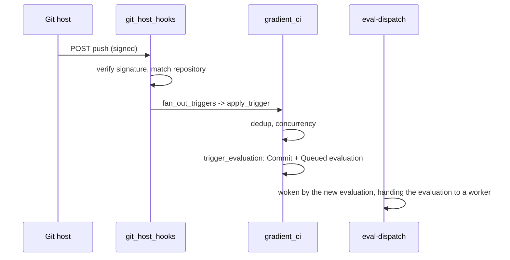

<!--
SPDX-FileCopyrightText: 2026 Wavelens GmbH <info@wavelens.io>
SPDX-License-Identifier: AGPL-3.0-only
-->

# Git Host Webhooks

Git hosts send events to the endpoints in `gradient-web/src/endpoints/git_host_hooks/`. These routes use no session. Each request must prove its origin through the Git host's signature before the endpoint acts on it. A push event results in a `Queued` evaluation.

```mermaid
sequenceDiagram
    participant F as Git host
    participant H as git_host_hooks
    participant C as gradient_ci
    participant S as eval-dispatch
    F->>H: POST push (signed)
    H->>H: verify signature, match repository
    H->>C: fan_out_triggers -> apply_trigger
    C->>C: dedup, concurrency
    C->>C: trigger_evaluation: Commit + Queued evaluation
    S->>S: woken by the new evaluation, handing the evaluation to a worker
```

## Routes

| Route | Verification |
|---|---|
| `POST /api/v1/hooks/github` | `X-Hub-Signature-256` checked against `GRADIENT_GITHUB_APP_WEBHOOK_SECRET_FILE`. `503` until the App is fully configured |
| `POST /api/v1/hooks/{git_host}/{project}/{integration_name}` | `gitea` / `forgejo`: HMAC from `X-Forgejo-Signature`, then `X-Gitea-Signature`. `gitlab`: `X-Gitlab-Token` compared in constant time. `github` answers `400` |

- The generic route finds an integration by `(project, inbound, name)`, with no need for `git_host_type`.
- A single inbound row can serve all three Git hosts.
- The crypt file handles secret decryption on the server.
- Requests from other sources fail `allowed_ips` with `403`.
- GitHub `installation` / `installation_repositories` events upsert or clear `github_installation` and seed the `github-<login>` integration pair (`github-<installation_id>` when no login is present).

## GitHub App Events

GitHub App webhooks reach the following handlers:

| Event | Handler |
|---|---|
| `push` | Push chain below |
| `pull_request` | Pull request triggers |
| `release` | `route_github_app_release`: triggers with `releases_only` |
| `check_run` | `approval::handle_github_check_run` |
| `pull_request_review` | `approval::handle_pull_request_review` |
| `issue_comment` | `commands::handle_issue_comment`: comment commands |
| `installation`, `installation_repositories` | `handle_github_installation` |

## Push Chain

| Step | Code | Action |
|---|---|---|
| 1 | `fan_out_triggers` (`git_host_hooks/fanout.rs`) | Selects active `task_trigger` rows of type `ReporterPush` where the branch and tag globs match the push |
| 2 | `normalize_repo_url`, `event_repo_matches_task` | Strips a trailing `/` and `.git`, rewrites `git@` URLs. Compares `owner/repo` in lowercase and ignores the host |
| 3 | `gradient_ci::apply_trigger` | Applies dedup and concurrency rules. A running evaluation can be aborted, or the new one parks in `Waiting`. A violation of `uq_evaluation_one_active_per_task` maps to `SkippedConcurrency` |
| 4 | `gradient_ci::trigger::trigger_evaluation` | Inserts the `Commit` row and a `Queued` evaluation, sets `task.force_evaluation`, and resets `last_check_at` |
| 5 | `eval-dispatch` | Gets woken through `record_evaluation_created` and offers the evaluation to workers. A 5 s tick serves as the fallback |

## Related

- [Connect GitHub](../../guides/github.md) covers the initial setup
- [Events and Webhooks](../../reference/events.md) documents outbound events
