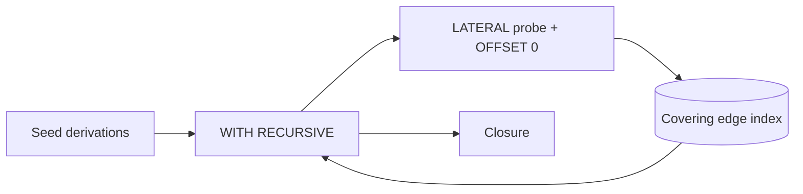
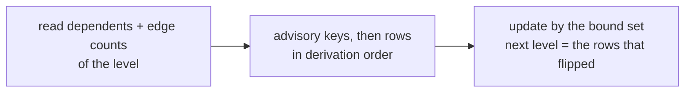

# Graph Queries

How the dependency graph is read in SQL: recursive walks, the fence that keeps them fast, the indexes behind them, the counter ripples, the instance metrics and the graph API.



## Walks

`gradient-db/src/graph_sql.rs` generates the shared walks. Callers pass a seed and a direction and get a `WITH RECURSIVE` prelude; walks run under `begin_walk`, which sets `work_mem = '64MB'`.

| Walk | Generator | Fenced |
|---|---|---|
| Build closure, failure cascade | `dependency_closure_cte` | Yes |
| Runtime closure (`kind IN (1, 2)`) | `runtime_closure_cte` | Yes |
| GC keep-set | `live_cached_paths_cte` | Yes |
| Walk completeness | `walk_completeness.rs` (hand-written) | Yes |
| Runtime recount | `runtime_readiness.rs`, `recount_sql` | No |
| Task board dependency counts | `task_board.rs`, `DEP_COUNTS_SQL` | No |

## The `OFFSET 0` Fence

```sql
WITH RECURSIVE closure(derivation) AS (
    SELECT unnest($1::uuid[])
  UNION
    SELECT s.next FROM closure c, LATERAL (
      SELECT e.dependency AS next FROM derivation_dependency e
      WHERE e.derivation = c.derivation OFFSET 0) s)
```

- Postgres estimates a recursive working table at ten times the seed: 348 870 rows estimated against 2 439 actual on a 44 000-node closure.
- At that estimate a merge join over the whole edge index looks cheaper than a nested loop, and the planner rescans four million edges per iteration.
- `OFFSET 0` stops the pull-up; a correlated lateral can only run as a nested loop with an index lookup per row.

| Walk (production) | Plain join | Fenced |
|---|---|---|
| Evaluation closure, 43 898 nodes | 5 278 ms | 955 ms |
| GC keep-set, 315 155 nodes | 40 069 ms | 9 746 ms |

**`UNION`, not `UNION ALL`:** the set operator deduplicates the frontier each iteration. The dependents walk emits 940 000 rows for 68 000 distinct nodes; `UNION ALL` grows exponentially with depth on diamond graphs.

## Indexes

| Index | Shape | Serves |
|---|---|---|
| `derivation_dependency_pkey` | `(derivation, dependency)` | Walks down; the pair is the key, no surrogate |
| `idx-derivation_dependency-reverse-pair` | `(dependency, derivation)` | Walks up |
| `idx-derivation_dependency-runtime` | `(dependency) INCLUDE (derivation) WHERE kind IN (1, 2)` | The wholeness ripple, from a dependency to the anchors counting it |
| `idx-build_job-created_at`, `idx-entry_point-created_at` | `created_at INCLUDE (derivation)` | The GC freshness seed |

All edge indexes are covering: walks are index-only. The GC freshness seed's cutoff is the candidate scan's start; the seed matches almost nothing and must not scan to find that out.

## Counter Ripples

A ripple moves `missing_runtime_deps` (or `derivation.unwalked_inputs`) up the graph in one call of a SQL function (`ripple_missing_runtime_deps`, `ripple_unwalked_inputs`), each level in three steps inside it:



Deriving the set inside the update left the planner without a small driver: a sequential scan of `cached_path` that took row locks in physical order and deadlocked NAR commits against maintenance about every six minutes. Locking the bound set in `derivation` order first removes both. A level per statement then cost the batch that walked the bootstrap leaves 163 round trips, which the function folds into one.

## Instance Metrics

Every 30 s (`GRADIENT_METRICS_INSTANCE_INTERVAL_SECS`) the instance pass averages nine `derivation_metric` values and four `dispatched_job` values over 5 min, 1 h and 24 h windows.

- `missing_nar_size`, `missing_count` and `dependency_count` are columns on `dispatched_job`, carried by `idx-dispatched_job-build-window` next to `ready_at`: the aggregate is an index-only scan.
- Reading them out of the `job_context` jsonb measured 1.94M buffers and 1.6 s for 449k rows in production.
- The columns are not backfilled: `AVG` skips nulls the way the jsonb read skipped a missing key, and no window exceeds a day.

## Graph API

`GET /builds/{build}/graph` (`gradient-web/src/endpoints/builds/graph.rs`) walks `derivation_dependency` breadth-first and maps each derivation to its `build_job` in the same evaluation.

| Aspect | Behavior |
|---|---|
| Frontier | `BuildJobId`s; a dependency without a `build_job` in the evaluation is dropped |
| Cap | 500 nodes, soft, checked before each wave |
| Cost | About five queries per wave: follows the depth, not the node count |
| Edges | No `kind` filter: runtime edges appear too. `DependencyEdge { source, target }`: `source` is built before `target` |
| Neighbours | `GET /builds/{build}/dependencies` lists direct dependencies |

## SQL/PGQ

PostgreSQL 19's SQL/PGQ (`GRAPH_TABLE`) is not used: the first implementation matches fixed-length patterns only, and every walk here has unbounded depth.

- `derivation` and `derivation_dependency` already have the vertex and edge table shape `CREATE PROPERTY GRAPH` needs.
- A switch touches `graph_sql.rs` and the hand-written walks above.
- Revisit when quantified path patterns land.
