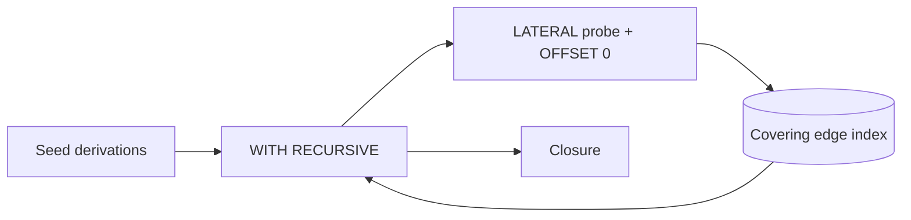
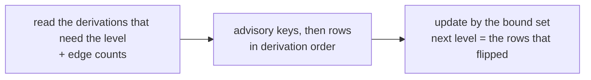

# Graph Queries

SQL reads of the dependency graph, covering recursive walks, the fence keeping them fast, their indexes, counter ripples, instance metrics and the graph API.



## Walks

`gradient-db/src/graph/walks.rs` is generating the shared walks. Callers pass a seed and a direction and receive a `WITH RECURSIVE` prelude. Walks are running under `begin_walk`, which is setting `work_mem = '64MB'`.

| Walk | Generator | Fenced |
|---|---|---|
| Build closure, failure cascade | `dependency_closure_cte` | Yes |
| Runtime closure (`kind IN (1, 2)`) | `runtime_closure_cte` | Yes |
| GC keep-set | `live_cached_paths_cte` | Yes |
| Walk completeness | `graph/walk_completeness.rs` (hand-written) | Yes |
| Runtime recount | `graph/runtime_can_start.rs`, `recount_sql` | No |
| Task board dependency counts | `task_board/mod.rs`, `DEP_COUNTS_SQL` | No |

## The `OFFSET 0` Fence

```sql
WITH RECURSIVE closure(derivation) AS (
    SELECT unnest($1::uuid[])
  UNION
    SELECT s.next FROM closure c, LATERAL (
      SELECT e.dependency AS next FROM derivation_dependency e
      WHERE e.derivation = c.derivation OFFSET 0) s)
```

- Postgres is estimating a recursive working table at ten times the seed.
- A 44 000-node closure got 348 870 rows estimated against 2 439 actual.
- A merge join over the whole edge index is looking cheaper than a nested loop at that estimate.
- The planner is then rescanning four million edges per iteration.
- `OFFSET 0` is stopping the pull-up.
- A correlated lateral can only run as a nested loop with an index lookup per row.

| Walk (production) | Plain join | Fenced |
|---|---|---|
| Evaluation closure, 43 898 nodes | 5 278 ms | 955 ms |
| GC keep-set, 315 155 nodes | 40 069 ms | 9 746 ms |

**`UNION`, not `UNION ALL`:** The set operator is deduplicating the frontier each iteration. The walk up to the derivations needing a node is emitting 940 000 rows for 68 000 distinct nodes. `UNION ALL` is growing exponentially with depth on diamond graphs.

## Indexes

| Index | Shape | Use |
|---|---|---|
| `derivation_dependency_pkey` | `(derivation, dependency)` | Walks down. The pair is the key, no surrogate |
| `idx-derivation_dependency-reverse-pair` | `(dependency, derivation)` | Walks up |
| `idx-derivation_dependency-runtime` | `(dependency) INCLUDE (derivation) WHERE kind IN (1, 2)` | The complete-closure ripple, from a dependency to the shared builds counting that dependency |
| `idx-build_job-created_at`, `idx-entry_point-created_at` | `created_at INCLUDE (derivation)` | The GC freshness seed |

All edge indexes are covering, and walks are index-only. The cutoff of the GC freshness seed is the start of the candidate scan. The seed is matching almost nothing and must not scan to find that out.

## Counter Ripples

A ripple is moving `missing_runtime_deps` (or `derivation.unwalked_inputs`) up the graph in one call of a SQL function. The functions are `ripple_missing_runtime_deps` and `ripple_unwalked_inputs`. Each level is taking three steps inside the function.



Deriving the set inside the update left the planner without a small driver. The result was a sequential scan of `cached_path`, taking row locks in physical order. That scan deadlocked NAR commits against maintenance about every six minutes. Locking the bound set in `derivation` order first is removing both problems. A level per statement then cost 163 round trips for the batch walking the bootstrap leaves. The function is folding those round trips into one.

## Instance Metrics

The instance pass is averaging nine `derivation_metric` values and four `dispatched_job` values over 5 min, 1 h and 24 h windows. The pass is repeating every 30 s (`GRADIENT_METRICS_INSTANCE_INTERVAL_SECS`).

- `missing_nar_size`, `missing_count` and `dependency_count` are columns on `dispatched_job`.
- `idx-dispatched_job-build-window` is carrying these columns next to `ready_at`, and the aggregate is an index-only scan.
- Reading these values out of the `job_context` jsonb measured 1.94M buffers and 1.6 s for 449k rows in production.
- The columns are not backfilled.
- `AVG` is skipping nulls the way the jsonb read skipped a missing key.
- No window is exceeding a day.

## Graph API

`GET /builds/{build}/graph` (`gradient-web/src/endpoints/builds/graph.rs`) is walking `derivation_dependency` breadth-first from the build's derivation.

| Aspect | Behavior |
|---|---|
| Frontier | `DerivationId`s. An evaluation is listing only the derivations of its own walk and their direct inputs, and the walk is ignoring `build_job` for that reason |
| Nodes | Derivation id, status of the shared build, and `build`: the `build_job` of the same evaluation, or null |
| Cap | 500 nodes. The walk is still reading the edges of every kept node |
| Cost | One query per wave, plus three for the nodes |
| Edges | No `kind` filter, and runtime dependencies appear too. `DependencyEdge { source, target }`: `source` is first in build order, `target` second |

## SQL/PGQ

Gradient is not using the SQL/PGQ of PostgreSQL 19 (`GRAPH_TABLE`). The first implementation is matching fixed-length patterns only. Every walk here is of unbounded depth.

- `derivation` and `derivation_dependency` already have the vertex and edge table shape required by `CREATE PROPERTY GRAPH`.
- A switch would touch `graph/walks.rs` and the hand-written walks above.
- Revisit when quantified path patterns land.
