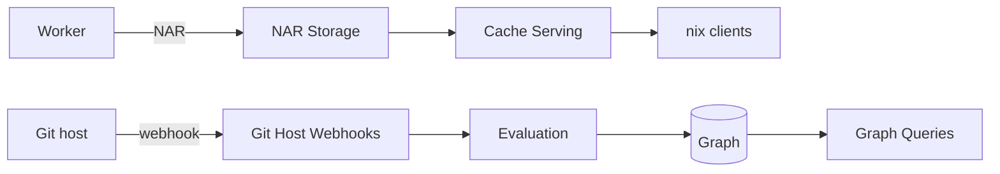

# Internals

Implementation details outside the scheduler and the protocol. The pages are covering Git host events, NAR storage and serving, SQL graph queries and request authentication. Paths are relative to `backend/`.

-   :material-webhook: **[Git Host Webhooks](git-host-webhooks.md)**

    Hook routes, signature checks and the chain from a push to a queued evaluation.

-   :material-harddisk: **[NAR Storage](nar-storage.md)**

    Object layout, idempotent writes, bucket requirements, closure rows and the deep GC.

-   :material-cloud-upload: **[Cache Serving](cache-serving.md)**

    Signing, narinfo, pull-through, debug info and the status codes under `/cache/`.

-   :material-graph-outline: **[Graph Queries](graph-queries.md)**

    Recursive walks, the `OFFSET 0` fence, indexes, counter updates, metrics and the graph API.

-   :material-key: **[Authentication](authentication.md)**

    Sessions, API keys, download tokens and OIDC.

## Covered Elsewhere

| Topic | Page |
|---|---|
| Evaluation steps, fetch and walk | [Jobs](../proto/jobs.md), [Eval Worker Setup](../eval-worker.md) |
| Batch import, shared builds | [Shared Builds](../scheduler/shared-builds.md) |
| Queueing, start conditions, failure cascade | [Queueing and Counters](../scheduler/queueing-and-counters.md) |
| Offers, assignment, scoring | [Capabilities and Assignment](../proto/capabilities-and-dispatch.md), [Scoring](../scheduler/scoring.md) |
| Uploads and downloads | [Transfer](../proto/transfer.md) |
| Complete closures, cache access | [Cache Closure](../scheduler/cache-closure.md) |
| Worker registration and auth | [Connection](../proto/connection.md) |
| Statuses | [Evaluations and Builds](../../concepts/evaluations-and-builds.md) |
