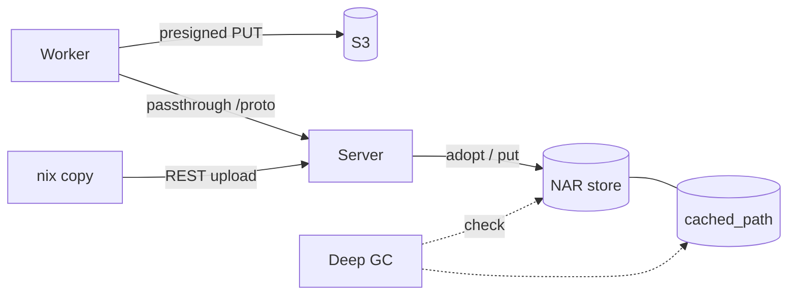

# NAR Storage

Where NAR objects live, how they are written, and how storage and database are kept in step. Serving NARs is on [Cache Serving](cache-serving.md).



## Layout

```text
${baseDir}/nars/<2 chars>/<rest>.nar.zst
```

- Named by the **store-path hash**: a presigned upload URL exists before the worker knows the content hash.
- The narinfo advertises `nar/<file_hash>.nar.zst`; `resolve_effective_hash_db` maps the file hash back to the key.
- `last_fetched_at` and `fetch_count` on `cached_path` feed eviction.

## Writes

| Path | Write |
|---|---|
| Presigned upload (S3) | The worker writes to S3 directly; the server completes multipart on `UploadFinished` |
| Passthrough (local storage) | Every upload streams through the server; the commit checks length and SHA-256 and moves the file in with `adopt_file` |
| REST upload (`nix copy`) | `import_nar_reader` -> `put_nar_idempotent`: skipped when `cached_path` records the same `file_hash` and a `HEAD` finds the object |

!!! warning "Bucket Requirements"
    - No object versioning (nor object lock or replication, which force versioning): Gradient assumes overwrite on PUT, and a versioned bucket keeps one copy per re-upload that no S3 GC reclaims.
    - An `AbortIncompleteMultipartUpload` lifecycle rule (e.g. 7 days): NARs over 1 GiB go up as multipart, and a worker that dies mid-upload leaves the parts behind.

## Build Logs

Build logs share the NAR backend (`gradient-storage/src/log.rs`), sharded by the last byte of the `BuildAttemptId`, the random tail of a UUIDv7:

```text
logs/<last 2 chars>/<attempt>.log                  # live log
logs/<last 2 chars>/<attempt>/chunk_<n>.zst        # finalized
```

- **Live:** appended to `${baseDir}/logs/...` while the attempt is active, also with S3 (S3 has no append).
- **Finalized:** `finalize_build_log` appends the live file as zstd chunks after any earlier chunks, indexes them in `build_log_chunk` and drops the live file. With S3 the chunks go to `<prefix>logs/...` only.
- **Finalize Triggers:** the shared build turning terminal, a new attempt replacing the latest one (abort, lost worker, retry) and an upstream log arriving after the build (log substitution). Every trigger queues a `LogFinalize` pending delivery (`pending_delivery` row) for the attempt.
- **Missing Chunks:** a chunk whose object is gone renders as one `[log chunk unavailable]` line per indexed line, and a re-finalize keeps one such line in its place.
- **Reclaimed:** with their derivation by the orphan-derivation GC; logs without a `build_attempt` row by the [deep GC](#deep-gc) log pass.

## Storage Migrations

Layout changes of NAR, log and blob storage come as storage migrations, the storage counterpart of the database migrations (`gradient-cache/src/cacher/storage_migrations/`).

- **Units:** a migration lists its units in ascending order; each unit is idempotent and starts over in full when a restart cuts it short.
- **Ledger:** `storage_migration` holds one row per migration: `checkpoint` names the last finished unit, `applied_at` marks the migration done.
- **Order:** pending migrations run in registry order, one unit per `gc.deepPaceMs`, and before any [deep GC](#deep-gc) unit: the deep GC reads only the current layout.
- **Readers:** a migration that moves live objects keeps the old location readable until the migration is applied.

| Migration | Units | Change |
|---|---|---|
| `m20261001_000000_shard_build_logs` | `local`, `s3` | Flat pre-shard `logs/<attempt>.log` and `logs/<attempt>/` entries move into their shard on local disk, and are deleted with their `build_log_chunk` rows on S3 |

## Deep GC

The deep GC checks every storage backend against the database, one unit at a time (`gradient-cache/src/cacher/deep_gc/`). A round walks every unit once, in ascending key order.

| Unit | Removes |
|---|---|
| `blobs` | `build-request-blobs/...` objects and `build_request_blob` rows without a partner |
| `logs/<xx>` | Logs of one shard, named by `BuildAttemptId`, without a `build_attempt` row; an attempt without a log is legitimate |
| `nars/<xx>` | One of the 1024 two-character NAR shards: objects past `gc.narUploadGraceHours` without a keeping row, and confirmed `cached_path` rows of the shard (an index range on `hash`) whose object is gone. Evicting stale live paths is maintenance's job |
| `partials` | Unfinished uploads under `nar-partial`, `nar-upload-partial` and `source-upload-partial` older than `nar.partialTtlSecs`, and directories left empty by the older nested layout. No other sweep walks these roots: a walk on a session or request path stalls that path behind the filesystem |

- **Rounds:** an `admin_task` row, `kind = deep_gc`, `pending` -> `running` -> `completed`. The partial unique index `admin_task_one_active_per_kind` allows one active round.
- **Background:** a round starts `gc.deepIntervalSecs` after the last one finished (`0` disables background rounds) and processes one unit per `gc.deepPaceMs`.
- **Requested:** `POST /api/v1/admin/maintenance/deep-gc` (superuser, `202`) starts a round, or sends the active one back to its first unit. A requested round processes its units back to back.
- **Checkpoint:** `admin_task.checkpoint` names the last finished unit and `progress` the running report, read at `GET /api/v1/admin/tasks[/{task_id}]`. A server restart resumes the round after its checkpoint.
- **Restart Race:** a checkpoint is saved only while `started_at` still matches the round that took the unit; a `POST` in between resets `started_at` and wins.
- **Failure** of a unit leaves the checkpoint in place; the next tick retries the same unit.
