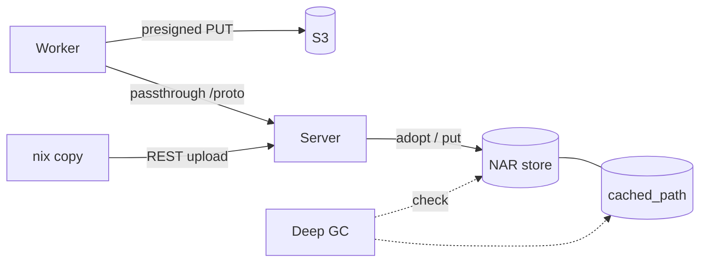

# NAR Storage

NAR object locations, NAR writes and the sync between storage and database. [Cache Serving](cache-serving.md) is covering NAR serving.



## Layout

```text
${baseDir}/nars/<2 chars>/<rest>.nar.zst
```

- Named by the **store-path hash**.
- The server is presigning upload URLs before the worker has the content hash.
- The narinfo is advertising `nar/<file_hash>.nar.zst`.
- `resolve_effective_hash_db` is mapping the file hash back to the key.
- `last_fetched_at` and `fetch_count` on `cached_path` feed eviction.

## Writes

| Path | Write |
|---|---|
| Presigned upload (S3) | The worker is writing to S3 directly. The server is completing multipart on `UploadFinished` |
| Passthrough (local storage) | Every upload is streaming through the server. The commit is checking length and SHA-256, then moving the file in with `adopt_file` |
| REST upload (`nix copy`) | `import_nar_reader` -> `put_nar_idempotent`: skipped when `cached_path` is recording the same `file_hash` and a `HEAD` is finding the object |

!!! warning "Bucket Requirements"
    - No object versioning, object lock or replication. Object lock and replication force versioning.
    - Gradient is assuming overwrite on PUT. A versioned bucket is keeping one copy per re-upload, and no S3 GC is reclaiming those copies.
    - An `AbortIncompleteMultipartUpload` lifecycle rule (e.g. 7 days). NARs over 1 GiB go up as multipart. A worker dying mid-upload is leaving the parts behind.

## Build Logs

Build logs share the NAR backend (`gradient-storage/src/log.rs`). The shard is the last byte of the `BuildAttemptId`, the random tail of a UUIDv7.

```text
logs/<last 2 chars>/<attempt>.log                  # live log
logs/<last 2 chars>/<attempt>/chunk_<n>.zst        # finalized
```

- **Live:** appended to `${baseDir}/logs/...` while the attempt is active, also with S3 (S3 has no append).
- **Finalized:** `finalize_build_log` is appending the live file as zstd chunks after any earlier chunks. The function is indexing the chunks in `build_log_chunk` and dropping the live file. The chunks go only to `<prefix>logs/...` with S3.
- **Finalize Triggers:** The shared build turning terminal. A new attempt replacing the latest one (abort, lost worker, retry). An upstream log arriving after the build (log substitution). Every trigger is queuing a `LogFinalize` pending delivery (`pending_delivery` row) for the attempt.
- **Missing Chunks:** A chunk with a missing object is rendering as one `[log chunk unavailable]` line per indexed line. A re-finalize is keeping one such line in its place.
- **Reclaimed:** The orphan-derivation GC is reclaiming logs together with their derivation. The [deep GC](#deep-gc) log pass is reclaiming logs without a `build_attempt` row.

## Storage Migrations

Layout changes of NAR, log and blob storage come as storage migrations, the storage counterpart of the database migrations (`gradient-cache/src/cacher/storage_migrations/`).

- **Units:** A migration is listing its units in ascending order. Each unit is idempotent and is running again in full after a restart interrupted the unit.
- **Ledger:** `storage_migration` is holding one row per migration. `checkpoint` is naming the last finished unit. `applied_at` is marking the migration as done.
- **Order:** Pending migrations are running in registry order, one unit per `gc.deepPaceMs`. Pending migrations are running before any [deep GC](#deep-gc) unit. The deep GC is reading only the current layout.
- **Readers:** A migration moving live objects is keeping the old location readable until the migration is complete.

| Migration | Units | Change |
|---|---|---|
| `m20261001_000000_shard_build_logs` | `local`, `s3` | Flat pre-shard `logs/<attempt>.log` and `logs/<attempt>/` entries move into their shard on local disk. The migration is deleting these entries with their `build_log_chunk` rows on S3 |

## Deep GC

The deep GC is checking every storage backend against the database, one unit at a time (`gradient-cache/src/cacher/deep_gc/`). A round is walking every unit once, in ascending key order.

| Unit | Removed |
|---|---|
| `blobs` | `build-request-blobs/...` objects and `build_request_blob` rows without a partner |
| `logs/<xx>` | Logs of one shard, named by `BuildAttemptId`, without a `build_attempt` row. An attempt without a log is legitimate |
| `nars/<xx>` | One of the 1024 two-character NAR shards. Objects past `gc.narUploadGraceHours` without a keeping row. Confirmed `cached_path` rows of the shard (an index range on `hash`) with a missing object. Maintenance is evicting stale live paths |
| `partials` | Unfinished uploads under `nar-partial`, `nar-upload-partial` and `source-upload-partial` older than `nar.partialTtlSecs`, and directories left empty by the older nested layout. No other sweep is walking these roots. A walk on a session or request path would stall that path behind the filesystem |

- **Rounds:** an `admin_task` row, `kind = deep_gc`, `pending` -> `running` -> `completed`. The partial unique index `admin_task_one_active_per_kind` is allowing one active round.
- **Background:** A round is starting `gc.deepIntervalSecs` after the last round finished. `0` is disabling background rounds. A background round is running one unit per `gc.deepPaceMs`.
- **Requested:** `POST /api/v1/admin/maintenance/deep-gc` (superuser, `202`) is starting a round. A `POST` during an active round is sending that round back to its first unit. A requested round is running its units back to back.
- **Checkpoint:** `admin_task.checkpoint` is naming the last finished unit. `progress` is holding the running report. `GET /api/v1/admin/tasks[/{task_id}]` is reading both. A server restart is resuming the round after its checkpoint.
- **Restart Race:** The server is saving a checkpoint only while `started_at` is still matching the round that took the unit. A `POST` in between is resetting `started_at` and winning.
- **Failure:** A failed unit is leaving the checkpoint in place. The next tick is retrying the same unit.
