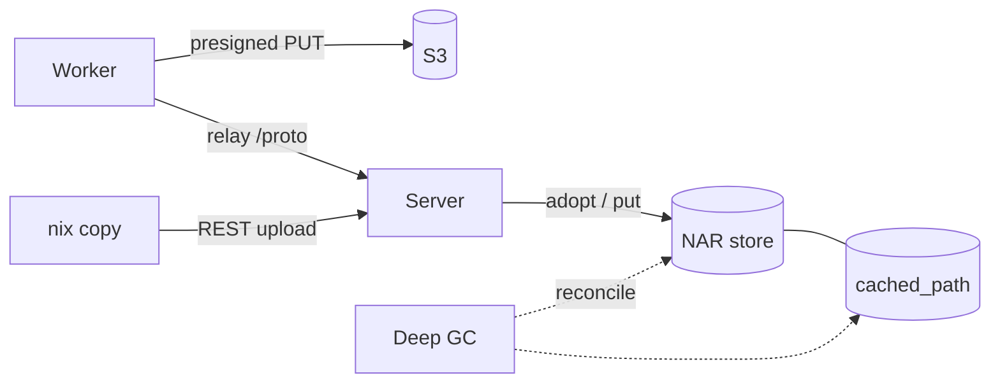

# NAR Storage

Where NAR objects live, how they are written, and how storage and database are kept in step. Serving them is on [Cache Serving](cache-serving.md).



## Layout

```text
${baseDir}/nars/<2 chars>/<rest>.nar.zst
```

- Keyed by the **store-path hash**: a presigned upload URL exists before the worker knows the content hash.
- The narinfo advertises `nar/<file_hash>.nar.zst`; `resolve_effective_hash_db` maps the file hash back to the key.
- `last_fetched_at` and `fetch_count` on `cached_path` feed eviction.

## Writes

| Path | Write |
|---|---|
| Presigned upload (S3) | The worker writes to S3 directly; the server completes multipart on `UploadFinished` |
| Relay (local storage) | Every upload streams through the server; the commit checks length and SHA-256 and moves the file in with `adopt_file` |
| REST upload (`nix copy`) | `ingest_nar_reader` -> `put_nar_idempotent`: skipped when `cached_path` records the same `file_hash` and a `HEAD` finds the object |

!!! warning "Bucket Requirements"
    - No object versioning (nor object lock or replication, which force versioning): Gradient assumes overwrite on PUT, and a versioned bucket keeps one copy per re-upload that no S3 GC reclaims.
    - An `AbortIncompleteMultipartUpload` lifecycle rule (e.g. 7 days): NARs over 1 GiB go up as multipart, and a worker that dies mid-upload leaves the parts behind.

## Build Logs

Build logs share the NAR backend (`gradient-storage/src/log.rs`), sharded by the last byte of the `BuildAttemptId`, the random tail of a UUIDv7:

```text
logs/<last 2 chars>/<attempt>.log                  # live log
logs/<last 2 chars>/<attempt>/chunk_<n>.zst        # finalized
```

- **Live:** appended to `${baseDir}/logs/...` while the attempt runs, also with S3 (S3 has no append).
- **Finalized:** `finalize_build_log` appends the live file as zstd chunks after any earlier chunks, indexes them in `build_log_chunk` and drops the live file. With S3 the chunks go to `<prefix>logs/...` only.
- **Finalize Triggers:** the anchor turning terminal, a new attempt replacing the latest one (abort, lost worker, retry) and an upstream log arriving after the build (log substitution). Every trigger queues a `LogFinalize` outbox row for the attempt.
- **Reclaimed:** with their derivation by the orphan-derivation GC; logs without a `build_attempt` row by the [deep GC](#deep-gc) log pass.

## Deep GC

`POST /api/v1/admin/maintenance/deep-gc` (superuser, `202`) reconciles every storage backend against the database in three passes (`gradient-cache/src/cacher/deep_gc.rs`).

| Pass | Removes |
|---|---|
| NAR | `cleanup_orphaned_cache_files`: objects without `cached_path` rows and rows without objects. Evicting stale live paths is maintenance's job |
| Blob | `build-request-blobs/...` objects and `build_request_blob` rows without a partner |
| Log | Logs keyed by `BuildAttemptId` without a `build_attempt` row; an attempt without a log is legitimate |

- **Tracking:** an `admin_task` row, `kind = deep_gc`, `pending` -> `running` -> `completed` / `failed`. The partial unique index `admin_task_one_active_per_kind` allows one active task; a second `POST` answers `409`.
- **Progress** is flushed between passes to `admin_task.progress`, read at `GET /api/v1/admin/tasks[/{task_id}]`.
- **Failure** of a pass stops the sweep and keeps the partial report.
- **Restart** marks every non-terminal task `failed` before the web layer serves; each pass is idempotent, a new `POST` starts over.
