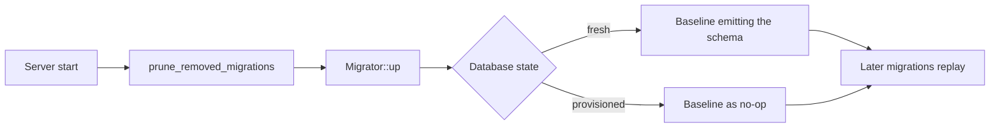

# Database Migrations

Gradient is using [SeaORM migrations](https://www.sea-ql.org/SeaORM/docs/migration/setting-up-migration/). Files live in `backend/gradient-migration/src/`, registered in its `lib.rs`. Every server start is applying the ones not yet in `seaql_migrations`.

## Adding a Migration

1. A new file `mYYYYMMDD_NNNNNN_<name>.rs` in `backend/gradient-migration/src/`, registered in `lib.rs`.
2. The matching entity in `backend/gradient-entity/src/`.
3. A `down()` that is a real inverse, or an explicit `Err(DbErr::Migration("... is irreversible"))` for a lossy change. A silent no-op `down()` is not allowed. Such a `down()` would be claiming a reversibility missing from the migration.

## Baseline

`m20241101_000000_baseline` is replacing the 151 migrations before globalization (`m20241107_135027_create_table_user` to `m20260619_000001_drop_cached_path_store_path`, #478).

| Database | Baseline behavior |
|---|---|
| Fresh | Emitting the schema left by that chain: a cleaned `pg_dump` of the real chain, verified by dump diff, plus the constant `cache_role` seed rows |
| Already provisioned | Detecting the schema and doing nothing. `prune_removed_migrations` is dropping the deleted files' `seaql_migrations` rows |

**Upgrade floor:** a database must be at or past `m20260619_010000_globalize_derivation` before upgrading to a release with the baseline. A database stuck earlier is upgrading through an older release first.

### Regenerating After a Future Squash

1. Run the full chain into a scratch PostgreSQL: `initdb`, then `DATABASE_URL=... cargo run -p gradient-migration -- up -n <boundary>`.
2. `pg_dump --schema-only --no-owner --no-privileges --exclude-table=seaql_migrations`.
3. Strip the psql `\restrict` and `SET` prelude and re-append constant seed rows.
4. Verify with a schema and data dump diff between a full-chain database and a baseline database.

## Cancelling Pairs

Some columns are added in one release and dropped in a later one. Such a column is leaving an `add_X` / `drop_X` pair every new install is running for nothing. Such pairs are removed under the rules below.

### Removal Conditions

Both conditions must hold.

- The release with `drop_X` is out, plus at least one later minor release on top of that release. Live installs are getting a window to apply the drop.
- No migration between the two is touching `X` in a way the removal would change. `rg -n "<ColumnName>|<column_name>" backend/gradient-migration/` is checking this.

### Removal Limits

- The removal must not edit the original `create_table_*` migration of the table. Such an edit would change the schema of every install path.
- Intermediate migrations may change only mechanically, e.g. dropping a column declaration the `drop_X` would remove anyway.

### Existing Installs

- Existing installs keep `seaql_migrations` rows for deleted files. SeaORM is rejecting these rows ("Applied migrations not found in migration list").
- `prune_removed_migrations` (`backend/gradient-db/src/connection/mod.rs`) is deleting every row not in `Migrator::migrations()` before `Migrator::up`. The function is logging the pruned versions at `info`.
- Deleting the file and its `lib.rs` entry is the whole change.

## Retired Pairs

| Pair | Issue | Notes |
|---|---|---|
| `add_has_artefacts_to_build_output` / `drop_has_artefacts_from_derivation_output` | #71 | Also removed the column re-declaration in `m20260408_000000_split_build_into_derivation` |
| `add_github_app_enabled_to_project` / `drop_github_app_enabled_from_project` | #71 | Only the two pair files referenced the column |
