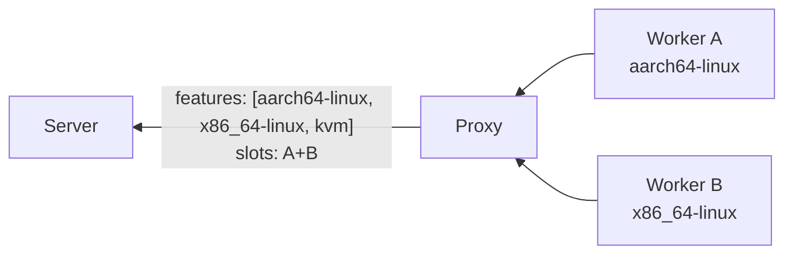
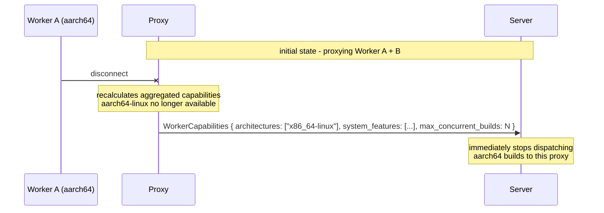
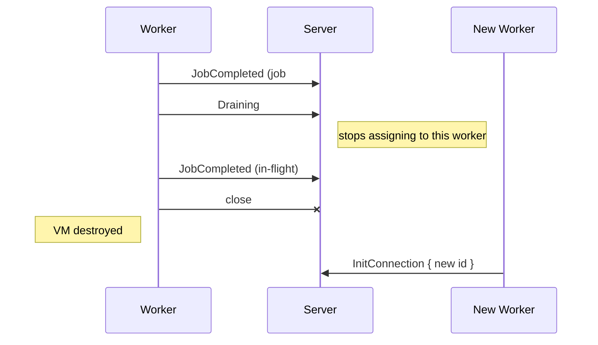
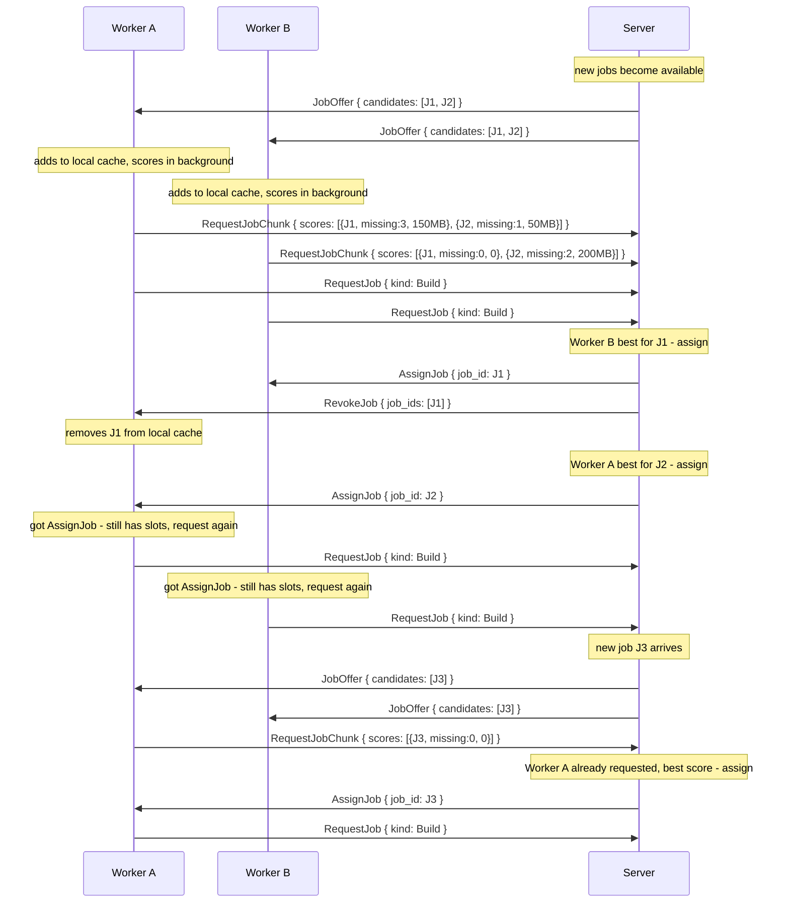
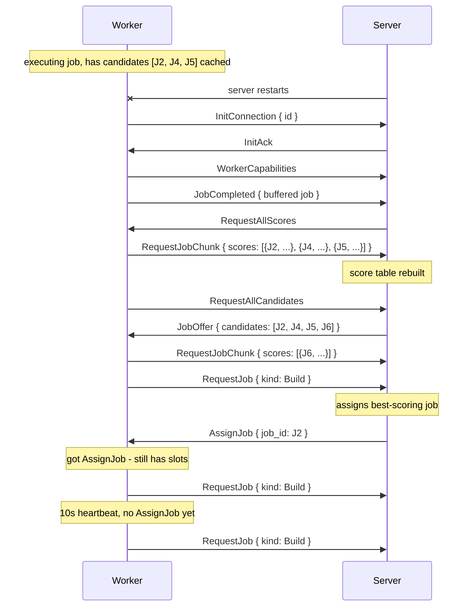

# Capabilities and Dispatch

What a worker advertises, how the server picks a job for it, and how dispatch priority works.

## Capability Advertisement

After a successful handshake, workers with the `build` capability negotiated send `WorkerCapabilities`. Workers without `build` (e.g. eval-only workers) never send this message.

```rust
WorkerCapabilities {
    architectures: Vec<String>,         // Nix system strings, e.g. ["x86_64-linux", "aarch64-linux"]
    system_features: Vec<String>,       // Nix system features, e.g. ["kvm", "big-parallel"]
    max_concurrent_builds: u32,         // how many parallel builds this worker accepts
    cpu_count: u32,                     // logical CPUs available to the worker
    ram_total_mb: u64,                  // total physical RAM in MiB
    cpu_core_score: u32,                // relative single-core performance (higher is faster)
}
```

The static hardware fields (`cpu_count`, `ram_total_mb`, `cpu_core_score`) are reported once with the capabilities and feed the scheduler's resource-aware scoring rules.

Architectures are free-form strings (e.g. `"x86_64-linux"`, `"aarch64-linux"`) - not an enum. Custom or unusual platforms (e.g. `"riscv64-linux"`) can be advertised without any code changes.

The reference worker (`gradient-worker`) auto-detects both fields at startup: `architectures` defaults to the host system (`std::env::consts::ARCH` + OS, with `macos` mapped to `darwin`), and `system_features` defaults to the daemon's resolved set read from `nix config show system-features` - which includes the CPU-derived `gccarch-*` levels a static config can't enumerate. Both are overridable via env vars / CLI flags:

```text
GRADIENT_WORKER_SYSTEM_ARCHITECTURES=x86_64-linux,aarch64-linux,builtin
GRADIENT_WORKER_SYSTEM_FEATURES=kvm,big-parallel,nixos-test
```

When set, each **replaces** its auto-detected default entirely (so e.g. setting `GRADIENT_WORKER_SYSTEM_ARCHITECTURES` on an aarch64 host without including `aarch64-linux` refuses all native builds - list every system you want to accept). Leave `GRADIENT_WORKER_SYSTEM_FEATURES` unset so the worker advertises exactly what its daemon can build; the dispatcher then never routes a `gccarch-skylake`- or `kvm`-requiring build to a worker whose daemon can't run it.

When the server dispatches a build, it checks that the build's target architecture is present in the worker's `architectures` and all `required_features` are present in the worker's `system_features`. For example, a build targeting `aarch64-linux` with `required_features: ["kvm"]` requires a worker with `"aarch64-linux"` in `architectures` and `"kvm"` in `system_features`. Builds whose `architecture` is the special string `"builtin"` (e.g. `builtin:fetchurl`) are always assignable, regardless of the worker's `architectures` list.

**Federation proxy behavior:** a proxy with `federate` enabled connects upstream as a single worker. It **aggregates** the capabilities of all its downstream workers:

 - `GradientCapabilities` (in `InitConnection`) - OR of all downstream workers' capabilities (if any worker can build, the proxy advertises `build`)
 - `system_features` - union of all downstream features (sorted by total capacity)
 - `max_concurrent_builds` - sum of all downstream workers' slots

The upstream server sees the proxy as one powerful worker. The proxy handles internal job routing to its downstream workers transparently.



The server uses these to match `RequestJobChunk` to queued builds. A worker that does not send capabilities will only receive `FlakeJob`s, never `BuildJob`s.

### Capability Updates

`WorkerCapabilities` can be re-sent **at any point during the connection** to update the server's view. The server replaces the previous values immediately. This is the primary mechanism for proxies to keep the upstream server in sync when their downstream worker pool changes.

**Example - downstream worker disconnects from a proxy:**



The server's handler processes mid-connection `WorkerCapabilities` identically to the initial send - it calls `scheduler.update_worker_capabilities()` which atomically replaces the worker's entry in the pool. Any pending build offers for architectures or features no longer advertised are revoked.

Re-sending `WorkerCapabilities` does **not** require reconnecting and does **not** interrupt in-flight jobs. Only future job offers are affected.

### Live Metrics Heartbeat

While `WorkerCapabilities` carries the worker's *static* hardware profile, `WorkerMetrics` is a periodic heartbeat carrying its *current* resource utilisation. The scheduler stores the latest report per worker and feeds it into resource-aware scoring rules so jobs prefer workers with spare capacity.

```rust
WorkerMetrics {
    cpu_usage_pct: f32,                 // current CPU load, 0.0-100.0
    ram_free_mb: u64,                   // currently free RAM in MiB
    disk_speed_mbps: Option<f32>,       // measured build-dir disk throughput (MB/s), if known
    network_speed_mbps: Option<f32>,    // measured worker<->server throughput (Mbps), if known
}
```

The server replaces the previous values immediately on each heartbeat; a worker that never reports metrics is scored against zeroed dynamic fields (its static caps still apply). The reference worker emits `WorkerMetrics` on its ~10 s heartbeat tick, sampling host load off the dispatch thread. `disk_speed_mbps` and `network_speed_mbps` are passive EWMAs: disk from per-build cgroup `io.stat` over build wall-time, network from real NAR transfer bytes over time. Both stay `None` until the first build / NAR transfer.

**Liveness.** The 10 s heartbeat doubles as the server's liveness signal: the connection's reader stamps each worker's `last_seen` the moment a frame arrives, before the handler runs, and keeps stamping it every 5 s while that frame is being handled, because the reader takes the next frame only after the reply and the worker's heartbeat sits unread behind it; liveness therefore measures the connection rather than how long a handler is taking, and a watchdog (`worker_liveness_loop`) unregisters any worker silent past `worker_heartbeat_timeout_secs` (default 120 s), re-queuing its in-flight jobs via the normal `unregister_worker` path. Without this, a worker that dies without a clean TCP close - a hard OOM-kill, a frozen host, or a network partition leaving the socket half-open - would stay "connected" and its eval/build jobs would sit non-terminal forever. A graceful disconnect is still handled immediately on connection close; the watchdog only covers the silent-death case.

### Ephemeral Workers

Workers can run in ephemeral VMs (e.g. RAM-only, no persistent disk). To prevent resource leaks and state accumulation, workers can decide internally when to stop accepting work (e.g. after N jobs, or based on memory pressure). When ready to recycle, the worker sends `Draining`, waits for in-flight jobs to finish, then disconnects cleanly. The VM can then be destroyed and a fresh one spawned.



The server treats `Draining` as "do not assign new jobs to this worker". The worker is free to disconnect once all in-flight jobs complete.

The reference worker takes this path on SIGINT/SIGTERM: the first signal sends
`Draining`, keeps the session open until every in-flight job has reported, then
flushes the writer queue and exits. Jobs still running after
`drainTimeoutSecs` (default 600 s) are aborted and re-queued server-side, and a
second signal skips the wait entirely. The unit's `TimeoutStopSec` is derived
from the budget so systemd never SIGKILLs a build that is about to finish.

---

## Job Dispatch

Job dispatch uses **eager push + pull-based claiming**. The server pushes **new** job candidates to eligible workers as they become available. Workers keep all received candidates in memory, score them against the local Nix store, and send back only **new or changed** scores. The server also keeps all scores in memory per worker. Both sides maintain a persistent view of the candidate/score state, enabling efficient delta-based communication and seamless recovery after server restarts.

The "new candidates available" signal is a level-triggered `watch` generation counter (`Scheduler::job_notify`) bumped on every enqueue, so a bump fired while a session is busy serving NAR/job traffic is still observed on its next loop iteration - an edge-triggered `Notify` would drop it and starve deep build chains of `JobOffer`s.

`build_dispatch_loop` runs on a 5s timer but is also kicked reactively (`Scheduler::dispatch_kick`, `notify_one`) when a job completes **and leaves its worker idle**, so the dependents it unblocks are enqueued and offered immediately. Without this, a serial dependency chain (e.g. the stdenv bootstrap) advances only one level per 5s tick. The idle gate avoids redundant passes while a worker is still busy (e.g. completing 1 of 8 concurrent builds) - that worker keeps pulling on its own and the timer covers the rest.

Closing the loop on the worker side: after scoring a fresh `JobOffer` the worker sends a capacity-gated `RequestJob` (not just on its 10s heartbeat). Scoring is what clears the server's rescore gate, so the worker's post-completion `RequestJob` would otherwise race ahead of its own scores, miss, and idle until the next heartbeat - collapsing a serial chain to one level per ~10s.

`RequestJob` reads nothing but the tracker: the scheduler scores its pending candidates for the worker and claims the winner in Postgres by inserting its `dispatched_job` row, arbitrated by a unique index on the open job key (see [Scheduler](../../scheduler.md)). A claim another instance won, or whose anchor moved since the job was assembled, inserts nothing; the job leaves the tracker and the next best is claimed, up to three per request. `AssignJob` leaves only after the claim, so a worker that reports at once (a substitute, an immediate failure) always finds its record; a request whose claim errors gets no job and asks again. A build's open `build_attempt` is written by the `Dispatched` transition awaited on that same path, but warn-only inside it, so it is not part of the guarantee. That await is capped at half `worker_heartbeat_timeout_secs`, because the session reads one frame at a time and a wait longer than the deadline would leave the worker's heartbeats unread until the liveness pass unregisters it mid-assignment. A worker that rejects the assignment closes the row again on its way back to pending.

Jobs are scoped to the worker's authorized peers - a worker only receives candidates from peers (projects, caches) it has successfully authenticated against.

### Dispatch Flow



### How It Works

 1. **`JobOffer`** (server -> workers, delta-only) - the server pushes only **new** candidates that the worker hasn't seen yet. Workers accumulate candidates in a persistent local cache. Each candidate includes `required_paths` (with optional `CacheInfo` for paths in the server's cache) so workers can score locally. Candidates are paginated at **1 000 entries per message**; `is_final: true` on `JobListChunk` marks the end of the initial list. The server dispatches builds immediately after three events: evaluation result (new builds queued), build completion (dependent builds unlocked), and build failure (cascade frees blocked builds). A background dispatch loop (5-second interval) acts as a safety net.
 2. **Workers score in the background** - on receiving `JobOffer`, the worker adds candidates to its local cache and scores them against the local Nix store. Scores are kept in memory. After a build completes (populating store paths), the worker re-scores affected candidates whose `required_paths` overlap with the new outputs.
 3. **`RequestJobChunk`** (worker -> server, delta-only) - the worker sends only **new or changed** scores. A score changes when a path becomes available in the local store (e.g. after a build). The server accumulates scores per worker in memory. Scores are paginated at **1 000 entries per message**; `is_final: true` marks the last chunk in each scoring pass. An empty chunk with `is_final: true` signals the end of a pass when no scores changed.
 4. **`RequestJob`** (worker -> server, pull-based) - the worker signals it has capacity for **one** job. `kind` specifies whether it wants a `FlakeJob` or `BuildJob`. The server either responds with `AssignJob` immediately (if a matching job with good scores exists) or marks internally that this worker needs a job and assigns one when available. On receiving `AssignJob`, the worker immediately sends another `RequestJob` if it still has capacity - this naturally fills all available slots. Workers also re-send `RequestJob` every **10 seconds** as a heartbeat if no `AssignJob` arrived, ensuring the server recovers the "worker needs work" state after a restart without persistent storage.

 5. **`AssignJob`** (server -> winning worker) - the server compares scores across all workers that have requested a job. Lowest `missing_nar_size` wins (fewest bytes to download). Ties are broken by `missing_count`, then by fewest assigned jobs. The server may assign as soon as it sees an optimal score (e.g. `missing_nar_size: 0`).
 6. **`RevokeJob`** (server -> losing workers) - all other workers that had this candidate in their cache are told to remove it. Workers delete the candidate and its score from their local cache.

### Initial Sync

Both sides persist candidate/score state in memory across the connection. On every new connection (including reconnects after a server restart), two startup-only messages perform the initial state sync:

 - **`RequestAllCandidates`** (worker -> server) - sent **once** by the worker immediately after the handshake completes. The server responds with a paginated `JobListChunk` stream (1 000 entries per message, `is_final: true` on the last) containing all active candidates for this worker. All subsequent candidate updates arrive as delta `JobOffer` messages - `RequestAllCandidates` is not sent again on the same connection.
 - **`RequestAllScores`** (server -> worker) - sent **once** by the server during handshake completion to rebuild its in-memory score table. The worker responds with a paginated `RequestJobChunk` stream of all scores from its local cache (`is_final: true` on the last chunk; an empty chunk with `is_final: true` when no scores are cached). All subsequent score updates arrive as delta `RequestJobChunk` messages - `RequestAllScores` is not sent again on the same connection.



```rust
// Server -> Worker (pushed eagerly, delta-only - only new candidates; paginated at 1 000)
JobOffer {
    candidates: Vec<JobCandidate>,
}

JobCandidate {
    job_id: Uuid,
    required_paths: Vec<RequiredPath>,  // store paths needed (worker scores against these)
    drv_paths: Vec<String>,             // .drv paths for build candidates; empty for eval jobs
    output_paths: Vec<String>,          // output store paths of every build; empty for eval jobs
}

RequiredPath {
    path: String,                       // /nix/store/xxx-name
    cache_info: Option<CacheInfo>,      // present when the path is in the server's binary cache
}

CacheInfo {
    file_size: u64,                     // compressed NAR size on disk (bytes)
    nar_size: u64,                      // uncompressed NAR size (bytes)
}

// Server -> Worker (after assignment to another worker)
RevokeJob {
    job_ids: Vec<Uuid>,
}

// Server -> Worker (startup-only - sent once at handshake completion; ask worker to re-send all scores)
RequestAllScores,

// Worker -> Server (delta-only - only new or changed scores; paginated at 1 000)
RequestJobChunk {
    scores: Vec<CandidateScore>,        // batch of new/changed scores
    is_final: bool,                     // true on the last chunk of each scoring pass
}

// Worker -> Server (pull-based - "I have capacity for one job")
// Sent again immediately after AssignJob if worker still has slots.
// Re-sent every 10s as heartbeat if no AssignJob arrived.
RequestJob {
    kind: JobKind,                      // FlakeJob or BuildJob
}

enum JobKind { Flake, Build }

// Worker -> Server (startup-only - sent once at handshake completion; ask server to re-send all active candidates)
RequestAllCandidates,

CandidateScore {
    job_id: Uuid,
    missing_count: u32,                 // number of required_paths not in local store
    missing_nar_size: u64,              // total uncompressed NAR size of missing paths (bytes)
                                        // derived from CacheInfo.nar_size; 0 when unavailable
    outputs_present: bool,              // every output_path is in the local store: the job only uploads
}
```

### Benefits

 - **No scoring round-trip at request time** - workers pre-score candidates as offers arrive and stream score deltas continuously.
 - **Minimal bandwidth** - only new candidates and changed scores are sent. After initial sync, traffic is proportional to changes, not total candidate count.
 - **Early assignment** - server can assign as soon as it sees an optimal score (e.g. `missing: 0`) without waiting for all workers to finish scoring.
 - **Optimal assignment** - server sees all workers' scores before deciding. A worker that already has 90% of the closure cached (lower `missing_nar_size`) gets the job over one that needs everything.
 - **Large build trees handled incrementally** - as evaluation discovers derivations in batches (`EvalResult`), the server pushes new `JobOffer`s immediately. Workers start scoring while evaluation is still in progress.
 - **Re-scoring after builds** - when a build completes and populates the worker's store, affected candidate scores automatically improve. The worker sends updated scores, potentially claiming jobs it previously scored poorly on.
 - **Seamless server restart** - `RequestAllScores` + `RequestAllCandidates` at connection startup rebuild state without re-evaluating everything from scratch. Both are startup-only; all subsequent updates are delta-only.

### Edge Cases

 - **Single eligible worker:** server skips scoring and sends `AssignJob` directly with the `JobOffer` - no `RequestJobChunk`/`RevokeJob` overhead.
 - **Worker disconnects with cached offers:** the server drops the worker's score entries from memory. On reconnect, `RequestAllScores` rebuilds them.
 - **Stale scores:** if a worker's store changes between scoring and `RequestJobChunk` (e.g. another job populated paths), the worker detects the change and sends an updated score. The server always uses the latest score per worker.

---

## Scheduling Priority

The server assigns jobs based on priority. Workers do not need to know the priority - it is purely server-side.

**Evaluation queue:** FIFO by `created_at`, up to `max_concurrent_evaluations` (default: 10) in parallel. `force_evaluation` tasks are picked up immediately.

**Build queue:** ordered by:

 1. Dependency count descending - builds with more dependents (integration builds) start first
 2. `updated_at` ascending - older builds drain first

Builds are only eligible when all dependency builds are `Completed` or `Substituted`. The server matches eligible builds to `RequestJobChunk` by checking that the build's target system and required features are all present in the worker's `system_features`.
