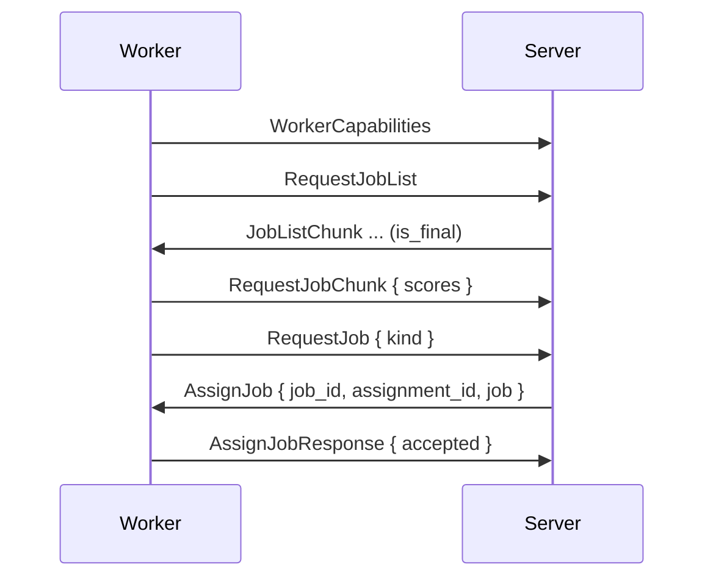

# Capabilities and Assignment

Worker capabilities, job offers and the server's job choice for each free slot. Assignment is pull-based. The server will only assign a job in answer to `RequestJob`.

## Capabilities

Workers with the `build` capability send `WorkerCapabilities` after the handshake. Workers without `build` never get build jobs.

| Field | Meaning | Worker default |
|---|---|---|
| `architectures` | Nix systems the worker can build, free-form strings | The host system (`macos` reported as `darwin`) |
| `system_features` | Nix system features | `nix config show system-features` of the local daemon |
| `max_concurrent_builds` | Build slots | `GRADIENT_WORKER_BUILD_MAX_CONCURRENT` (1) |
| `cpu_count`, `ram_total_mb` | Hardware | Detected |
| `cpu_core_score` | Relative single-core speed | A startup micro-benchmark, or `GRADIENT_WORKER_SYSTEM_CPU_CORE_SCORE` |
| `zone` | Locality label for cluster placement. Unset workers share one implicit zone | `GRADIENT_WORKER_ZONE`, unset |
| `endpoint` | Address listed for this worker in a cluster roster | `GRADIENT_WORKER_ENDPOINT`, unset |

- `GRADIENT_WORKER_SYSTEM_ARCHITECTURES` and `GRADIENT_WORKER_SYSTEM_FEATURES` replace the detected lists.
- An override must list every system and feature the worker should accept.
- A build can match a worker when the worker's `architectures` contain the build's system and its `system_features` contain every required feature.
- Every `builtin` build will skip the system check.
- A later `WorkerCapabilities` will replace the fields and trigger job assignment. Running jobs and existing offers stay.

## Metrics and Liveness

- The `WorkerMetrics` fields (`cpu_usage_pct`, `ram_free_mb`, `disk_speed_mbps`, `upload_speed_mbps`, `download_speed_mbps`, `build_peak_ram_mb`) travel with the 10 s heartbeat.
- Workers without metrics get unknown values in scoring.
- The server will mark a worker as seen on every message.
- The `worker_liveness_pass` will drop workers silent for `proto.workerHeartbeatTimeoutSecs` (120 s, `0` disabling the check).
- A worker's own `Draining` will stop new assignments.
- Workers send `Draining` on `SIGTERM` and abort every running job. See [Worker Stop](jobs.md#worker-stop).

## Offers

| Message | When |
|---|---|
| `JobListChunk` | Answer to `RequestJobList`: the full candidate list in pages of 1 000, the last one `is_final` |
| `JobOffer` | Candidates not sent to this worker yet, up to 1 000 each. The server is offering a requeued job again |

- Candidates are evaluations or build jobs the worker is authorized for and can run.
- The fields `required_paths` (with NAR sizes when cached), `drv_paths` and `output_paths` are part of every `JobCandidate` message.
- A build candidate and its `BuildJob` also carry a `requirement` with the Nix system and the required system features. Evaluation candidates carry no requirement.
- Workers keep no candidate cache.
- Workers score every offered candidate against the local store.
- The worker will send the answer in `RequestJobChunk` with the fields `missing_count`, `missing_nar_size` and `outputs_present` set.

## Assignment

- Workers send `RequestJob { kind }` for each free slot.
- Workers repeat the request after every `AssignJob` while slots remain, and every 10 s while idle.
- The server will remember an unanswered request as an idle slot for [cluster placement](../scheduler/clusters.md#tracking), not as a queued request.
- The server will score every pending job of that kind for this worker on each `RequestJob` message.
- The [scheduling policy](../../reference/scheduler-policies.md) can provide the score, and the server will pick the highest. Ties go to the smaller job ID.
- Nothing below the assignment floor of 0 is handed out.
- The server will claim the winner with a new `dispatched_job` row.
- A lost race can move the server on to the next job, up to 3 times.
- The `AssignJob` message will go out only after the claim.
- The claim's ID is `AssignJob.assignment_id`, and every report must echo the ID.
- Reports are the messages `JobUpdate`, `JobCompleted`, `JobFailed`, `BuildProgress` and `EvalProgress` from the worker.
- The server will drop reports with a stale ID.
- Workers answer with an `AssignJobResponse` message.
- The server will re-queue a declined job (worker draining or full) and offer the job again.
- An `AssignJob` with `cluster` set is one member of a [cluster job](../scheduler/clusters.md).
- The server will push such a job instead of answering a `RequestJob` message.
- The worker will hold the slot and run nothing until the `StartCluster` message.
- The worker will free the slot after `cluster.hold_secs` without a `StartCluster` message.

## Candidate Sources

| Kind | Pool Entry |
|---|---|
| Evaluation | Each `Queued` evaluation without an open assignment, every 5 s. The worker is limiting itself with `GRADIENT_WORKER_EVAL_MAX_CONCURRENT` (1) |
| Build | From the set of builds that can start. Entry on a kick (a build that can now start, a capability change, a finished job) or every 5 s. A full resync every 60 s |
