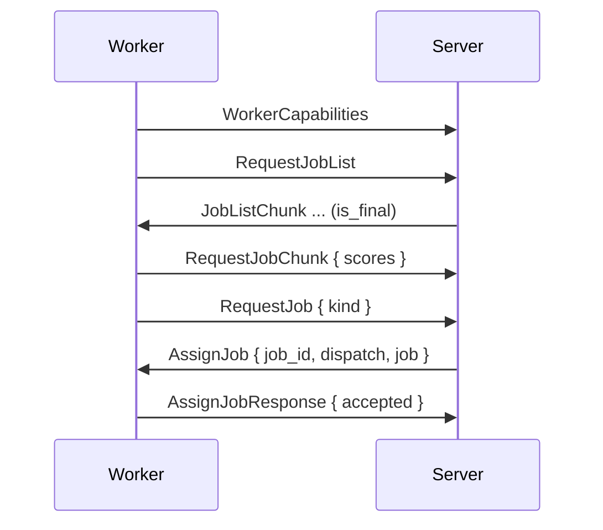

# Capabilities and Dispatch

What a worker advertises, how offers reach the worker, and how the server picks the job for each free slot. Assignment is pull-based: the server only assigns in answer to `RequestJob`.

## Capabilities

Workers with the `build` capability send `WorkerCapabilities` after the handshake; workers without `build` never get build jobs.

| Field | Meaning | Worker default |
|---|---|---|
| `architectures` | Nix systems the worker builds, free-form strings | The host system (`macos` reported as `darwin`) |
| `system_features` | Nix system features | `nix config show system-features` of the local daemon |
| `max_concurrent_builds` | Build slots | `GRADIENT_WORKER_BUILD_MAX_CONCURRENT` (1) |
| `cpu_count`, `ram_total_mb` | Hardware | Detected |
| `cpu_core_score` | Relative single-core speed | A startup micro-benchmark, or `GRADIENT_WORKER_SYSTEM_CPU_CORE_SCORE` |

- `GRADIENT_WORKER_SYSTEM_ARCHITECTURES` and `GRADIENT_WORKER_SYSTEM_FEATURES` replace the detected lists; an override has to list every system and feature the worker should accept.
- A build matches a worker when the build's system is in `architectures` and every required feature is in `system_features`. A `builtin` build skips the system check.
- A later `WorkerCapabilities` replaces the fields and triggers dispatch; running jobs and existing offers stay.

## Metrics and Liveness

- `WorkerMetrics` (`cpu_usage_pct`, `ram_free_mb`, `disk_speed_mbps`, `network_speed_mbps`) rides the 10 s heartbeat; a worker without metrics scores with unknown values.
- The server marks a worker seen on every message; `worker_liveness_pass` drops workers silent for `proto.workerHeartbeatTimeoutSecs` (120 s, `0` disables).
- A worker's own `Draining` stops new assignments. On `SIGTERM` the worker drains for up to 600 s; a second signal aborts.

## Offers

| Message | When |
|---|---|
| `JobListChunk` | Answer to `RequestJobList`: the full candidate list in pages of 1 000, the last one `is_final` |
| `JobOffer` | New candidates since the last message, up to 1 000 each |

- Candidates are evaluations and builds the worker is authorized for and can run.
- A `JobCandidate` carries `required_paths` (with NAR sizes when cached), `drv_paths` and `output_paths`.
- The worker scores each candidate against its local store and sends changed scores in `RequestJobChunk`: `missing_count`, `missing_nar_size`, `outputs_present`.

## Assignment

- The worker sends `RequestJob { kind }` for each free slot, again after every `AssignJob` while slots remain, and every 10 s while idle. The server keeps no memory of an unanswered request.
- On `RequestJob`, the server scores every pending job of that kind for this worker with the [scheduling policy](../../reference/scheduler-policies.md) and picks the highest; ties go to the smaller job ID. Nothing below the dispatch floor of 0 is handed out.
- The winner is claimed by inserting a `dispatched_job` row; a lost race tries the next job, up to 3 times. `AssignJob` goes out only after the claim.
- `AssignJob.dispatch` is the claim's ID. Every report (`JobUpdate`, `JobCompleted`, `JobFailed`, `BuildProgress`) echoes the ID, and reports with a stale ID are dropped.
- The worker answers `AssignJobResponse`; a declined job (worker draining or full) is re-queued and offered again.

## Candidate Sources

| Kind | Enters the pool |
|---|---|
| Evaluation | Every 5 s: each `Queued` evaluation without an open dispatch; the worker limits itself with `GRADIENT_WORKER_EVAL_MAX_CONCURRENT` (1) |
| Build | From the ready set, on a kick (a build turned ready, a capability change, a finished job) or every 5 s, with a full resync every 60 s |

## Unused Messages

`RevokeJob`, `RequestAllScores` and `RequestAllCandidates` are defined but never sent by the server or the reference worker. The worker's candidate cache is therefore never pruned for jobs taken by others during a connection.
