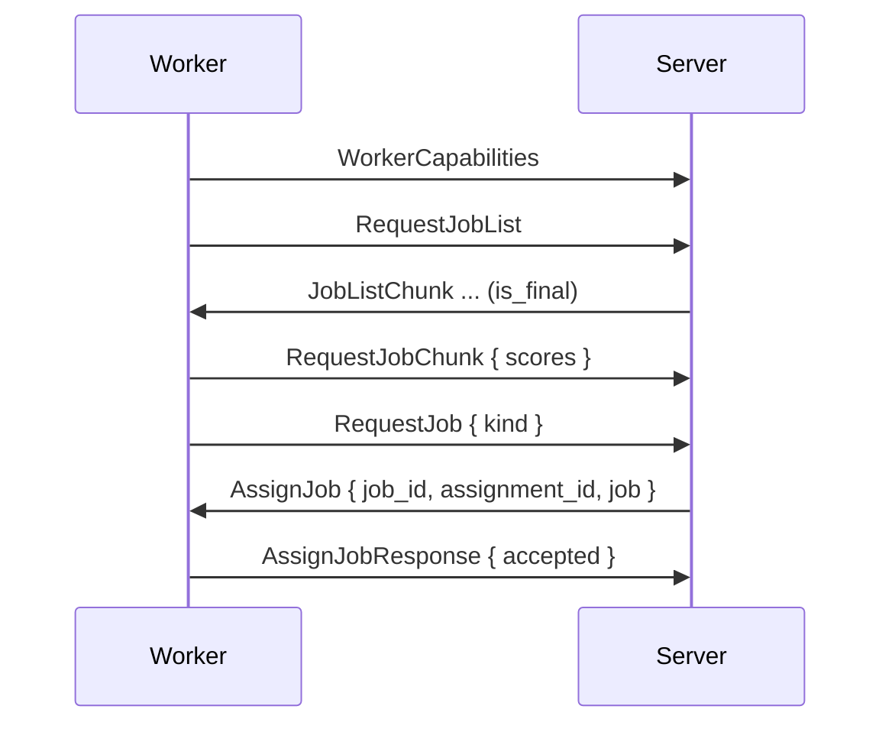

# Capabilities and Assignment

Worker capabilities, job offers and the server's job choice for each free slot. Assignment is pull-based. The server is only assigning a job in answer to `RequestJob`.

## Capabilities

Workers with the `build` capability send `WorkerCapabilities` after the handshake. Workers without `build` never get build jobs.

| Field | Meaning | Worker default |
|---|---|---|
| `architectures` | Nix systems the worker can build, free-form strings | The host system (`macos` reported as `darwin`) |
| `system_features` | Nix system features | `nix config show system-features` of the local daemon |
| `max_concurrent_builds` | Build slots | `GRADIENT_WORKER_BUILD_MAX_CONCURRENT` (1) |
| `cpu_count`, `ram_total_mb` | Hardware | Detected |
| `cpu_core_score` | Relative single-core speed | A startup micro-benchmark, or `GRADIENT_WORKER_SYSTEM_CPU_CORE_SCORE` |
| `zone` | Locality label for cluster placement. Unset workers share one implicit zone | `GRADIENT_WORKER_ZONE`, unset |
| `endpoint` | Address listed for this worker in a cluster roster | `GRADIENT_WORKER_ENDPOINT`, unset |

- `GRADIENT_WORKER_SYSTEM_ARCHITECTURES` and `GRADIENT_WORKER_SYSTEM_FEATURES` replace the detected lists.
- An override must list every system and feature the worker should accept.
- A build is matching a worker when the build's system is in `architectures` and every required feature is in `system_features`.
- A `builtin` build is skipping the system check.
- A later `WorkerCapabilities` is replacing the fields and triggering job assignment. Running jobs and existing offers stay.

## Metrics and Liveness

- `WorkerMetrics` (`cpu_usage_pct`, `ram_free_mb`, `disk_speed_mbps`, `network_speed_mbps`) is riding the 10 s heartbeat.
- Scoring is using unknown values for a worker without metrics.
- The server is marking a worker as seen on every message.
- `worker_liveness_pass` is dropping workers silent for `proto.workerHeartbeatTimeoutSecs` (120 s, `0` disabling the check).
- A worker's own `Draining` is stopping new assignments.
- The worker is draining for up to 600 s after `SIGTERM`. A second signal is aborting the drain.

## Offers

| Message | When |
|---|---|
| `JobListChunk` | Answer to `RequestJobList`: the full candidate list in pages of 1 000, the last one `is_final` |
| `JobOffer` | Candidates not sent to this worker yet, up to 1 000 each. The server is offering a requeued job again |

- Candidates are evaluations and builds the worker is authorized for and can run.
- A `JobCandidate` is carrying `required_paths` (with NAR sizes when cached), `drv_paths` and `output_paths`.
- The worker is keeping no candidate cache.
- The worker is scoring every offered candidate against the local store.
- `RequestJobChunk` is carrying the answer with `missing_count`, `missing_nar_size` and `outputs_present`.

## Assignment

- The worker is sending `RequestJob { kind }` for each free slot.
- The worker is repeating the request after every `AssignJob` while slots remain, and every 10 s while idle.
- The server is remembering an unanswered request as an idle slot for [cluster placement](../scheduler/clusters.md#tracking), not as a queued request.
- The server is scoring every pending job of that kind for this worker on `RequestJob`.
- The [scheduling policy](../../reference/scheduler-policies.md) is providing the score, and the server is picking the highest. Ties go to the smaller job ID.
- The server is handing out nothing below the assignment floor of 0.
- The server is claiming the winner by inserting a `dispatched_job` row.
- A lost race is moving on to the next job, up to 3 times.
- `AssignJob` is going out only after the claim.
- `AssignJob.assignment_id` is the claim's ID. Every report (`JobUpdate`, `JobCompleted`, `JobFailed`, `BuildProgress`) is echoing the ID. The server is dropping reports with a stale ID.
- The worker is answering with `AssignJobResponse`.
- The server is re-queuing a declined job (worker draining or full) and offering the job again.
- An `AssignJob` with `cluster` set is one member of a [cluster job](../scheduler/clusters.md). The server is pushing such a job instead of answering a `RequestJob`. The worker is holding the slot, running nothing until `StartCluster`. The worker is freeing the slot after `cluster.hold_secs` without a `StartCluster`.

## Candidate Sources

| Kind | Pool Entry |
|---|---|
| Evaluation | Each `Queued` evaluation without an open assignment, every 5 s. The worker is limiting itself with `GRADIENT_WORKER_EVAL_MAX_CONCURRENT` (1) |
| Build | From the set of builds that can start. Entry on a kick (a build that can now start, a capability change, a finished job) or every 5 s. A full resync every 60 s |
