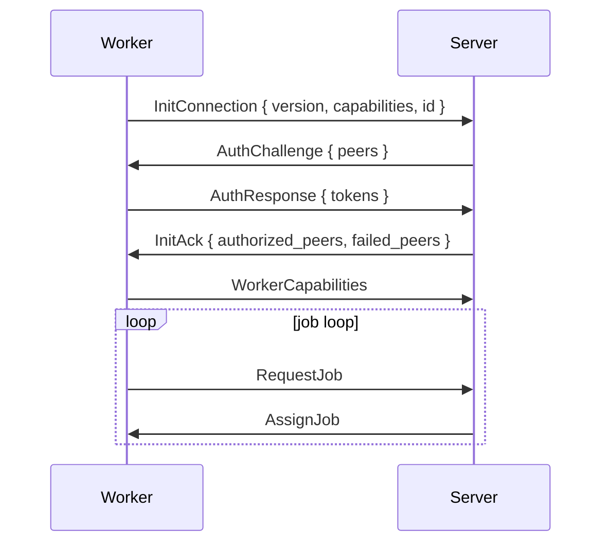
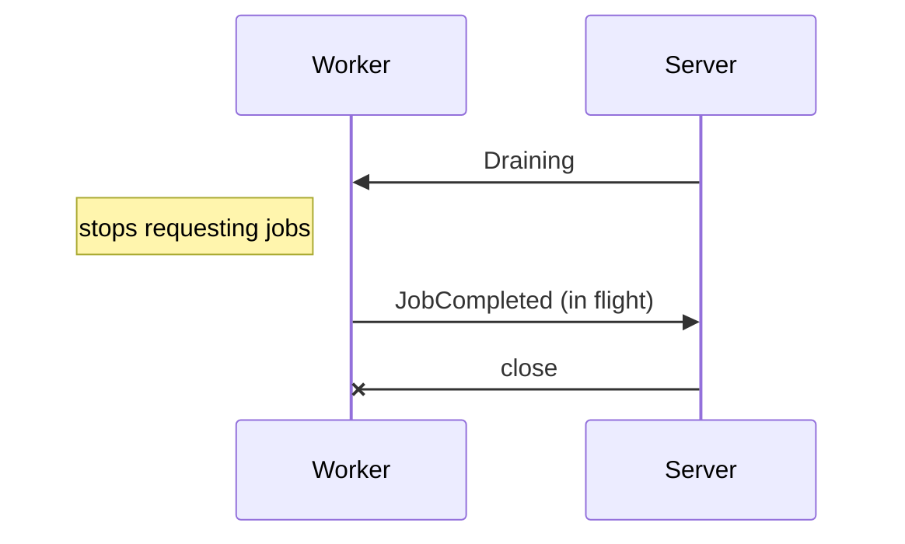

# Connection

Workers talk to the server over one WebSocket at `/proto`, with binary [rkyv](https://rkyv.org/) frames. A session passes through **handshake -> authorization -> capabilities -> job loop**.

## Handshake

| Step | Message | Content |
|---|---|---|
| 1 | `InitConnection` | `version`, `capabilities`, the worker's persistent `id` |
| 2 | `AuthChallenge` | The peers that registered this worker ID |
| 3 | `AuthResponse` | One token per challenged peer the worker holds |
| 4 | `InitAck` or `Reject` | Authorized peers, failed peers with reasons |

The worker ID lives in `/var/lib/gradient-worker/worker-id`. The server uses the ID to match reconnects, reject duplicates and label the worker in the UI and logs.

The server rejects a session in these cases; the worker never rejects the server.

| Code | Reason |
|---|---|
| `400` | Wrong protocol version, or an unexpected message during the handshake |
| `401` | `no valid peer tokens provided` |
| `403` | `unknown worker`, `worker is deactivated`, `base worker not enabled by any project`, or the server is not accepting connections |
| `495` | `project has no cache subscribed`: every authorized project lacks a cache |
| `496` | `worker already connected` |

## Capabilities

A capability is active only when both sides support the capability; `core` and `cache` are set by the server alone.

| Capability | Meaning |
|---|---|
| `core` | The server side of the protocol; always on for the server, off for workers |
| `cache` | Serves as a binary cache; always on for the server |
| `fetch` | Clones repositories and prefetches flake inputs |
| `eval` | Evaluates flakes |
| `build` | Builds derivations with Nix |
| `federate` | Reserved: negotiated in the handshake, no behavior yet |

New features are gated by capability flags, not by version numbers.

## Authorization

A **peer** is anything that registers a worker: a project, a cache or a proxy. Both sides consent: the peer registers the worker ID, the worker holds the peer's token.

1. A peer registers the worker ID; the server generates a token for that pair.
2. The worker's peers file (`services.gradient.worker.peersFile`) holds `peer_id:token` lines.
3. On connect, the server challenges for every registering peer and checks each token on its own.

| Peer | Authorization grants |
|---|---|
| Project | Jobs from the project's tasks |
| Cache | Serving and pulling from the cache |
| Proxy | Membership in the proxy's worker pool |

- Some failed tokens keep the session with the rest; only all failing rejects.
- A project without a cache subscription moves to `failed_peers`; if no peer remains, the reply is `495`.
- **Reauth** adds peers without reconnecting: the server sends `AuthChallenge` when a peer registers the worker, the worker sends `ReauthRequest` when its peers file changes. Both end in `AuthUpdate`; reauth never revokes granted peers.
- One connection per worker ID: a second connection is rejected with `496`.
- A connection silent for `proto.workerHeartbeatTimeoutSecs` (120 s) is dropped.
- A project's worker list shows a worker as live only when the worker authenticated for that project.

## Build Timeouts

Each `BuildSpec` carries `timeout_secs` and `max_silent_secs`: the derivation's own `timeout` and `maxSilent`, else `build.defaultTimeoutSecs` (14400) and `build.defaultMaxSilentSecs` (3600). `0` disables a limit. A build past a limit ends as `FailedTimeout`. Evaluations have no timeout.

## Server Restart

A restart loses work in flight, never a queued job.

| Side | Behavior |
|---|---|
| Worker | Aborts every running job and reconnects with backoff (1 s, doubling up to 60 s) |
| Worker | Sends a full handshake, then `RequestJobList` and one `RequestJob` per kind |
| Server | Drops every report whose `job_id` and `assignment_id` the current session did not hand out |
| Server | Before any session opens, `recover_interrupted_work` closes open assignments, aborts running attempts, re-queues `Building` builds and re-evaluates interrupted evaluations |

## Graceful Shutdown

- On `SIGTERM` the server sends `Draining`, assigns nothing more and closes each session once the worker is idle, after 20 s at the latest.
- Startup recovery re-queues whatever the cut-off interrupted.
- `Draining` ends the session, never the worker process: the worker reconnects once the server is back.

## Versioning

`PROTO_VERSION` is `22` and rises with every breaking wire change; both sides must match exactly. The check lives once, in `session::handshake::on_init_connection`, for every session kind.

## Cache Sessions

`/cache/{cache}/proto` offers the same frames as a read-only session for one cache.

| Aspect | Rule |
|---|---|
| Public cache | No credentials, unless `proto.anonymousCache.enable` is off |
| Private cache | `Authorization: GRAD<key>` on the upgrade request |
| Handshake | `InitConnection`, then `InitAck` with no peers; no challenge |
| Allowed | `CacheQuery` in `Normal` or `Pull` mode, `NarRequest`; everything else is rejected with `403` |
| Limits | `proto.anonymousCache.maxConnectionsPerIp` (32) anonymous connections per IP; every session counts against `proto.maxConnections` (256) |
| Idle | Closed after 120 s without a NAR transfer |

## Implementation

- One pure handshake state machine in `gradient-wire/src/session/handshake.rs` drives every session: the server takes `as_authority`, the worker `as_peer`, the cache session reuses the version gate.
- `session/frame.rs` splits each socket into a typed reader and a writer with a control lane and a bulk lane. Control goes first; a bulk batch holds at most 256 KiB, and a full bulk queue never blocks control replies.
- Frames are validated where the socket put them; chunk payloads (`NarPush`, `UploadChunk`, `EvalCacheChunk`, `LogChunk`) reach the handler as slices of the frame, without a copy.
- `client::dial` disables Nagle's algorithm on every socket: small control frames go out without waiting for a delayed ACK.
